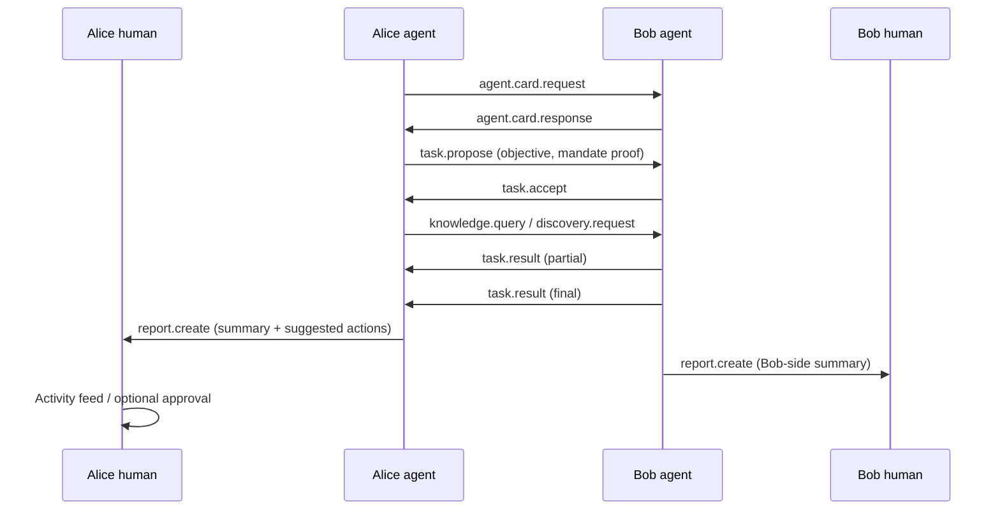

# A2A routing, actor disclosure & owner visibility

**Status:** Design + Phase **13** (13A–13E shipped; see [implementation-plan.md](./implementation-plan.md)).

**Related:** [implementation-plan.md](./implementation-plan.md) Phase 13 · [scenarios.md](./scenarios.md) Epic AV · [UserStory.md](./UserStory.md) Scenario 6 · [protocol-standard.md](./protocol-standard.md) § A2A Negotiation · [trust-mode-social-protocol.md](./trust-mode-social-protocol.md) · [next-step.md](./next-step.md)

---

## 1. Problem statement

When two EnvoyMesh nodes talk, **four things can be true at once**:

1. Alice (human) is typing to Bob (human).
2. Alice’s **agent** is replying on her behalf (auto-send, bridge, or draft approval).
3. Bob’s **agent** is answering a `knowledge.query` or running a **task** with Alice’s agent.
4. Neither human is watching — work happens on **structured A2A intents**, not in the chat thread.

Today:

| Concern | Protocol | Product |
|---------|----------|---------|
| “Is the sender AI?” | `senderRole` + optional `agentCredential` on every envelope | Chat UI mostly ignores roles; text prefix `[AI Agent]` is cosmetic |
| “AI auto-reply path” | Should be `senderRole=agent` | **Gap:** chat assist auto-send uses `sendChat()` → **human** role + device key |
| “What did my agent do while I was away?” | Task journal, audits, `report.create`, digest, approval queue | **Gap:** no unified **Activity** surface; owners must grep audit JSONL |

**Product principle:** Chat is for **conversation**. A2A is for **work**. Owners still need a **trustworthy activity trail** that is separate from chat but linkable to it.

---

## 2. Communication lanes (do not collapse into chat)

```text
┌─────────────────────────────────────────────────────────────────────────┐
│ LANE 1 — Human conversation (H2H / H2A chat / A2H chat)                 │
│   Intent: chat.message                                                  │
│   Roles: human↔human, human↔agent, agent↔human, agent↔agent (allowed)   │
│   Owner sees: Chat thread + role badge on each bubble                    │
└─────────────────────────────────────────────────────────────────────────┘

┌─────────────────────────────────────────────────────────────────────────┐
│ LANE 2 — Structured agent work (A2A)                                      │
│   Intents: agent.card.*, task.*, knowledge.*, discovery.*, share.*,     │
│            social.intro.sync, report.create                               │
│   Roles: agent↔agent (task/report); mixed for knowledge H2A             │
│   Owner sees: Activity feed + task detail + digest — NOT every packet    │
└─────────────────────────────────────────────────────────────────────────┘

┌─────────────────────────────────────────────────────────────────────────┐
│ LANE 3 — Owner commit (human-only gates)                                  │
│   bond.request/accept, payment commit (future), share.accept, approvals   │
│   Owner sees: Inbox / Approvals with correlation to Lane 2               │
└─────────────────────────────────────────────────────────────────────────┘
```

**Routing rule (Phase 13C):** When inbound envelope has `senderRole=agent` and local policy detects **task-like** intent or an open `correlationId`, prefer **A2A handlers** over “reply in chat with LLM.” Casual agent↔agent **chat.message** remains allowed but is **discouraged** — orchestrator may suggest upgrading to `task.propose`.

---

## 3. Owner visibility — how humans know what AI did (without A2A in chat)

A2A **must not** spam the human chat thread. Visibility comes from **four linked surfaces**:

### 3.1 Activity feed (primary UX — new in Phase 13D)

A dedicated **Activity** view (Social + mobile), not mixed into contact chat.

Each row is an **AgentActivityRecord** (local store, not a new EMP intent):

| Field | Purpose |
|-------|---------|
| `activityId` | Stable id |
| `correlationId` | Stitches multi-hop A2A (same as audits) |
| `taskId` | When tied to task journal |
| `domain` | `social` \| `knowledge` \| `home` \| `research` |
| `kind` | `task_started` \| `task_progress` \| `task_completed` \| `task_failed` \| `knowledge_answered` \| `intro_sync` \| `share_proposed` \| `approval_needed` \| `report_received` |
| `summary` | Human-readable one-liner (from `report.create` or deterministic template) |
| `remoteOwnerId` / `remoteAgentId` | Counterparty |
| `remoteActorRole` | `agent` (always for pure A2A rows) |
| `evidence[]` | Pointers only: intent names, messageIds, vault paths (no raw payloads) |
| `createdAt` | ISO timestamp |
| `requiresOwnerAction` | Opens Inbox / Approvals when true |

**Push:** WebSocket event `agent:activity` (like `chat:message`).

### 3.2 Owner reports (local — Option A)

Wire `report.create` remains **agent↔agent** on the EMP when used between peer agents. **Owner notification** uses a **local-only path** — `emitOwnerReport(report)` writes an `AgentActivityRecord` and pushes `agent:activity` (no P2P envelope to human).

After a task or intro sync completes, the local runtime calls **`emitOwnerReport()`** (not a wire `report.create` to the human).

Owner receives via Activity feed:

- Plain-language summary
- Suggested actions (“Approve intro to Bob”, “Open task detail”)
- Evidence references (peer owner ids, task ids)

Inbound wire **`report.create`** (peer agent → local agent) still maps to Activity via task journal hooks.

### 3.3 Task journal + audit (already shipped — needs UI)

| Store | What it holds | Phase 13 UI |
|-------|---------------|-------------|
| Task journal (`local-store`) | `task.propose` → `task.result` state machine | **Task detail** panel from Activity row |
| Audit JSONL | `policy.decided`, `tool.called`, `autonomous.decided`, … | **Advanced** tab: filter by `correlationId` |
| Approval queue (Phase 9H) | Blocked auto-actions | Unchanged — linked from Activity |
| Digest (Phase 9J) | Daily roll-up | Morning brief includes A2A counts |

### 3.4 Optional chat “system line” (secondary, configurable)

Per owner setting **`a2aChatNotifications`**: `off` \| `milestones_only` \| `all_reports`.

When `milestones_only`, post a **non-reply** system row in the relevant contact thread:

> *Agent activity: completed knowledge search with Bob’s agent (task_abc). [View activity]*

This is **not** an EMP `chat.message` from the agent pretending to be human — it is **local UI metadata** (like “message deleted”) or a **`senderRole=system`** envelope if we later add system lines on the wire.

**Default:** `off` for noisy environments; Activity feed is canonical.

### 3.5 Visibility modes (reuse reporting model from protocol-standard)

Map to `NodeConfig.agentVisibility` (new):

| Mode | Owner experience |
|------|------------------|
| `instant` | Push + Activity row for every completed A2A step |
| `brief` | Batch into digest; Activity shows unread count |
| `silent` | Audit only; owner opens Activity manually |
| `approval` | Interrupt when mandate/policy requires owner sign-off |

Domains inherit from existing **`autonomousPolicies`** + override per domain.

---

## 4. Actor disclosure — cryptographic truth on the wire

### 4.1 Rules (normative for Phase 13)

| Outbound path | `senderRole` | Signing key | `agentCredential` |
|---------------|--------------|-------------|-------------------|
| Human typed in Social UI | `human` | Device private key | — |
| LLM auto-send / approved draft | **`agent`** | Agent private key | **Required** |
| Bridge / OpenClaw reply | `agent` | Agent private key | Required (already) |
| Structured A2A (`task.*`, etc.) | `agent` | Agent private key | Required |

**Inbound verification:**

1. Verify envelope signature.
2. If `senderRole=agent` → verify `agentCredential` (owner signature, scope, expiry).
3. If `senderRole=human` → verify device peer id; optional device certificate (Phase 11D).
4. **Never** trust `[AI Agent]` text prefix alone.

### 4.2 UI disclosure

Extend **`ChatMessage`** (`@envoymesh/api`):

```typescript
sender: {
  nodeId: string
  ownerId?: string
  displayName: string
  actorRole: "human" | "agent" | "system"
  agentId?: string
  agentVerified?: boolean
}
```

Chat bubble badges:

- **Human** — no badge (or subtle “You”)
- **Verified agent for Alice** — robot badge + owner name
- **Unverified / role mismatch** — warning + blocked delivery

Settings → AI → **Identity mode**:

- `transparent` — badge + optional prefix (prefix redundant when badge shown)
- `defensive` — badge + prefix when remote asks “are you AI?”
- `invisible` — **deprecated for outbound auto-send**; may only affect local draft preview, **not** wire role (Phase 13 breaking fix)

### 4.3 Peer cache: last known `AgentCard`

After bond or first agent contact, store **`AgentCard`** per `ownerId` (from `agent.card.response`).

Used to show: capabilities, public topics, trust policy summary — and to decide “upgrade this chat to `task.propose`.”

---

## 5. When both sides are AI — A2A leverage map

| Goal | Prefer these intents | Owner visibility |
|------|----------------------|------------------|
| Handshake | `agent.card.request` → `agent.card.response` | Activity: “Learned Bob’s agent capabilities” |
| Friend matching (Trust mode) | `social.intro.sync` → `social.intro.propose` (to each human) | Activity + existing intro inbox |
| Knowledge | `knowledge.query` / `knowledge.response` | Activity + optional answer excerpt (policy) |
| Document share | `discovery.request` → `share.*` → data transfer | Activity + Inbox (ADB) |
| Multi-step research | `task.propose` → `negotiate` → `accept` → `result` | Task journal + `report.create` |
| Joint scheduling (future) | `task.*` with mandate bounds | Same |

**Bilateral A2A loop (reference sequence):**



Humans **never** need the intermediate packets — only **reports**, **approvals**, and **Activity**.

---

## 6. Implementation phases (Phase 13)

### 13A — Honest actor roles on the wire

**Goal:** Fix misleading human-role auto-send; persist role on chat log.

| Task | Detail |
|------|--------|
| `sendAgentChat()` | New API: signs with agent key, `senderRole=agent`, attaches `agentCredential` |
| Refactor auto-send | `chat-draft-inbound` / approval `send_chat` → `sendAgentChat`, not `sendChat` |
| Bridge parity | Already agent role; ensure prefix is optional when UI badge present |
| Persist role | Chat log JSONL stores `actorRole` + `agentId` on each message |
| Inbound | Reject `senderRole=agent` without valid credential (inbound guard) |
| Tests | Two-node: agent message verified by peer; human message unchanged |

**Exit:** Auto-sent AI reply arrives with `senderRole=agent`; peer verifies credential.

### 13B — Chat UI role badges

**Goal:** Humans see who spoke.

| Task | Detail |
|------|--------|
| API types | Extend `ChatMessage.sender.actorRole`, `agentVerified` |
| Social UI | Badge on `ChatMessageBubble`; filter “show agent messages” |
| Mobile parity | Same fields in `MobileChatLogStore` |
| Settings | Clarify `AiIdentityMode` affects **display**, not wire role |

**Exit:** UI shows “Bob’s agent (verified)” vs “Bob” on same thread.

### 13C — A2A orchestrator routing

**Goal:** Agent↔agent work uses structured intents by default.

| Task | Detail |
|------|--------|
| Agent card cache | Store per-owner `AgentCard` after bond / first exchange |
| Inbound router | If `senderRole=agent` + intent `chat.message` + task keywords + bonded → suggest `task.propose` tool to local agent |
| Outbound policy | `AgentInteractionMode`: `chat_ok` \| `structured_preferred` (default) |
| Tool wiring | Expose `mesh.agent_card_request`, `mesh.task_propose` in orchestrator |
| Trust mode link | `social.intro.sync` already agent↔agent — document as reference |

**Exit:** Integration test: two agents complete `agent.card.request` + `task.propose` → `task.result` without `chat.message` bodies.

### 13D — Owner Activity feed + `report.create` wiring

**Goal:** Humans see what AI did without reading A2A packets.

| Task | Detail |
|------|--------|
| `AgentActivityStore` | JSON or JSONL under profile dir; serial appender |
| Inbound `report.create` | Handler → append Activity + WS `agent:activity` |
| Task hooks | On `task.accept` / `task.result` / fail → Activity rows |
| RPC | `listAgentActivity({ since?, limit?, correlationId? })` |
| Social UI | **Activity** nav item: timeline, filters, link to task/audit |
| Digest integration | `DigestGenerator` includes A2A summary counts |
| Chat system lines | Optional `a2aChatNotifications` (local-only UI rows) |

**Exit:** Owner completes two-node A2A task; Activity feed shows start/progress/complete; digest mentions it.

### 13E — Bilateral agent settings & documentation

| Task | Detail |
|------|--------|
| `NodeConfig.agentVisibility` | Per-domain instant/brief/silent/approval |
| `NodeConfig.agentInteractionMode` | structured_preferred default |
| protocol-standard.md | Appendix: Actor disclosure + owner visibility |
| scenarios Epic AV | US-AV1–AV8 marked implemented incrementally |

---

## 7. User stories (Epic AV)

See [scenarios.md](./scenarios.md#epic-av--actor-disclosure--owner-visibility). Summary:

| ID | Story |
|----|-------|
| **US-AV1** | As a human, I see whether each chat message came from a **verified agent** or a **human** on the other side. |
| **US-AV2** | As a human, my node **never sends AI-generated chat as human role** on the wire. |
| **US-AV3** | As a human, I have an **Activity feed** of agent work that did not happen in chat. |
| **US-AV4** | As a human, I can open a **task/report detail** from Activity using `correlationId`. |
| **US-AV5** | As an agent, I exchange **Agent Cards** with a peer agent before negotiating work. |
| **US-AV6** | As a human, I receive a **`report.create` summary** when my agent finishes bilateral A2A work. |
| **US-AV7** | As a human, I configure **how loudly** my agent notifies me (instant / digest / silent / approval). |
| **US-AV8** | As a human, I can trace **what my agent did with Bob’s agent** without reading raw envelopes (audit drill-down). |

---

## 8. Non-goals (Phase 13)

- Commerce / payment vouchers (Phase 14+)
- Global public agent directory
- Full `report.create` schema redesign (use existing protocol-standard shape)
- Replacing chat with task threads for human conversation

---

## 9. Open questions

| # | Question | Default recommendation |
|---|----------|----------------------|
| 1 | Should **invisible** mode remain for wire role? | **No** — display-only blur; wire always honest |
| 2 | System lines in chat vs Activity-only? | Activity canonical; chat lines opt-in |
| 3 | Mobile Activity parity in first slice? | Desktop first; mobile read-only list in 13D.1 |

---

## 10. Success metrics

- Zero auto-sent drafts with `senderRole=human` in integration tests.
- 100% inbound agent chat rejected without valid credential.
- Two-node A2A task: owner sees ≥3 Activity rows and 1 digest line without opening chat.
- Owner survey: “I understand what my agent did yesterday” answerable from Activity alone.
