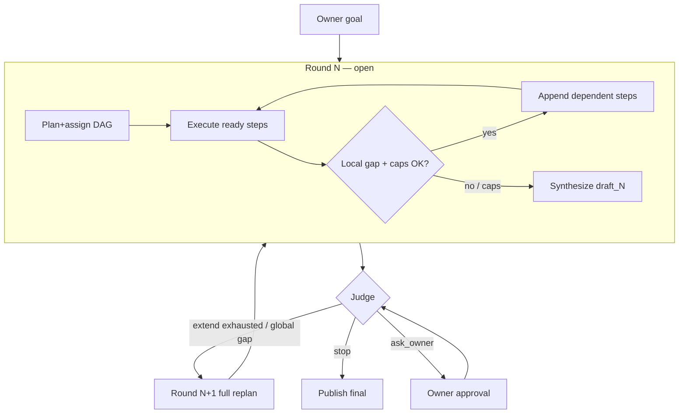

# Team jobs — Multi-round iteration (A ∩ B)

> Design for Assigner-owned refinement loops on Team jobs.
> Status: **47A–47D shipped** (outer B + intra-round A extend + judge/UX + handoff/observe).
>
> Related: [`agent-network-plan-assign.md`](./agent-network-plan-assign.md) (one-shot plan+assign),
> [`agent-network-guide.md`](./agent-network-guide.md) (product model),
> [`agent_network.md`](./agent_network.md) (wire / collaboration layer),
> [`implementation-plan.md`](./implementation-plan.md) Phase 47.

## 1. Problem

Today a Team job is **one-shot**:

```text
goal → plan+assign once → DAG execute → concatenate once → publish report
```

Parent steps already feed children via `prior[subtaskId]` inside that DAG
(`enrichSubtaskWithParentContext` in `chain-orchestrator.ts`). That is **not** a
whole-job refinement loop.

Operators need something closer to a single agent loop:

- Round produces a **middle draft**
- Next round (or a small graph extension) uses that draft as **input**
- Stop when good enough, budget/deadline hits, or the owner says stop

## 2. What we are *not* redesigning

These existing “round” mechanisms stay as they are — **wrong layer** for content iteration:

| Mechanism | Field / location | Purpose |
|-----------|------------------|---------|
| Bid negotiation | `negotiationRound` (≤3) | Cost / worker selection |
| Stall reassign | `reassignCount` ≤ 1 | Swap stalled worker to backup |
| Budget rebalance | `rebalancePolicy` | Raise ceiling / re-evaluate **unawarded** bids |
| Worker partial `seq` | `ChainSubtaskPartial.seq` | Progress streaming within one step |
| Graph rewrite merge | `task.chain.merge` / merge helpers | Collapse/replace subtasks mid-chain — **not** the outer iteration loop |

**Naming rule:** product and code must say **`iterationRound`** (and UI “Round N”), never overload “bid round” or “negotiation round.”

## 3. Chosen model: mix A and B

| Letter | Name | Meaning |
|--------|------|---------|
| **B — Outer iteration** | Seal round → synthesize draft → (optional) full replan | Clean drafts, agent-loop metaphor |
| **A — Intra-round extend** | Append a few dependent steps **without** resealing | Cheap local fixes |

**Hard line:** A never deletes or rewrites finished steps. B never mutates a sealed round’s graph; it opens a **new** subtask set under the same `chainId`.

```text
goal₀ (immutable)
  → Round 1: plan+assign → execute
       └─ while open: optional APPEND 1..K child steps (A, capped)
     → synthesize draft₁ → Judge
  → Round 2: plan+assign(goal₀, prior=draft₁, critique) → …   (B)
  → …
  → Final report = last accepted draft  (single publishChainReport)
```



### When Assigner chooses A vs B

| Critique shape | Action |
|----------------|--------|
| Local (“step 3 needs a cite / one more calc”) | **A — extend** if `extendsInRound < max` **and round still open** (before seal) |
| Global (“wrong approach”, merge contradicts goal) | **B — new round** if `round < maxRounds` |
| Either would blow remaining budget/deadline | **stop** (or `ask_owner`) |
| Stall / wrong peer | Existing **stall reassign** (not A/B) |

Post-seal judge must **not** return `extend` (round is closed). Map any stray `extend` to `continue` or `stop` per remaining caps.

## 4. State and config

### 4.1 Side-state on `ChainState` (`iteration`)

Lives on the Assigner’s in-memory `ChainState` for that `chainId` (same place as
`subtasks` / `awards` / `partials`). Persist with existing chain side-state if/when
that path is durable; v1 may be process-local like today’s active chains.

```ts
iteration: {
  round: number                    // 1-based; current open or last sealed
  maxRounds: number
  extendsInRound: number           // count of A append batches this round
  maxExtendsInRound: number
  /** Subtask IDs belonging to each sealed round (immutable after seal). */
  sealedByRound: Record<number, string[]>
  /** IDs in the currently open round (mutates only via plan or A-append). */
  openRoundSubtaskIds: string[]
  drafts: Array<{
    round: number
    summary: string
    artifactRef?: string
    confidence?: number
    judge?: {
      decision: "continue" | "stop" | "ask_owner" | "extend"
      reason: string
      suggestedExtendObjectives?: string[]
    }
  }>
  stopReason?:
    | "max_rounds"
    | "judge_stop"
    | "owner_stop"
    | "budget"
    | "deadline"
    | "no_workers"
}
```

Same **`chainId`** for the whole job (Assigner handoff and audit correlation stay intact).

### 4.2 Defaults (product)

| Knob | Default | Notes |
|------|---------|--------|
| `iterationMaxRounds` | **`1`** | Today’s behavior until UI opts in |
| `extendMaxStepsPerRound` | **`2`** | Hard cap on total new steps from A per round |
| `extendMaxDepth` | chain depth policy | Appended steps must not exceed existing max depth |
| `iterationJudgeMode` | `"llm"` | Also `"always_stop"`, `"owner"` |
| `iterationCarryMode` | `"summary"` | `"full_draft"` \| `"structured"` later |
| `extendRequiresAssigner` | `true` | Workers do not freely spawn graph |
| `extendOnlyAfterPartial` | `true` | Append only after some final partial in-round |

Expose on Team job start + Settings → Team job defaults (`chainDefaults` /
start-from-goal options). Mandate `maxChainCostUsd` must leave headroom for
another plan+execute **and** another synthesize before **continue** or **extend**.

## 5. Lifecycle hooks (runtime)

### 5.0 Fit to today’s one-shot pipeline

Current Assigner path (plan+assign → `launchChain` → `advanceReadySubtasks` /
stall → `synthesizeChain` → `publishChainReport`) stays the **inner** round
engine. Phase 47 adds an **outer loop controller** on the Assigner (around
`_runChainGoal` / auto-orchestrator), not a rewrite of bid/stall/rebalance.

Critical compatibility rules vs current code:

| Current behavior | Iteration requirement |
|------------------|------------------------|
| `synthesizeChain` walks **all** `state.awards` + `partials` | Scope to `openRoundSubtaskIds` (or sealed set for that draft) |
| `publishChainReport` is **one-shot** (`state.published`) | Interim drafts **must not** publish; only judge `stop` / terminal stop publishes once |
| `ledger.finalize` runs inside publish | Do not finalize on draft synthesize; keep ledger open across rounds until final publish |
| `task.chain.merge` deletes/replaces subtask IDs | **Forbidden** as the B mechanism; seal + new IDs only |
| Stall / `reassignCount` keyed by subtaskId | Stall tracker must ignore sealed IDs; never re-award sealed work |

### 5.1 Inside a round (unchanged core + A)

1. `planChain` / plan+assign (existing), tag new IDs into `openRoundSubtaskIds` and `iteration.round`
2. `launchChain` / `advanceReadySubtasks` / stall reassign (existing), only for open-round IDs
3. **Extend path (new, 47B):** Assigner decides append → register new `ChainSubtask`s with `dependsOn` on completed open-round IDs → mini-assign from soft roster → propose only new ready roots  
   - Reuse `enrichSubtaskWithParentContext` for parent → child text  
   - Finished steps **immutable**; bump `extendsInRound`; enforce `extendMaxStepsPerRound` / depth  
4. When no open/awarded work left in the open round and no further extend → **synthesize draft** (prefer real merge when enabled; concatenate acceptable for v1) into `iteration.drafts` — **no** `publishChainReport`

### 5.2 Seal and outer loop (B)

1. **Seal** round: copy `openRoundSubtaskIds` → `sealedByRound[round]`; clear open set; reset `extendsInRound` for the next round  
2. **Judge** (LLM or rules): `stop` | `continue` | `ask_owner` (not `extend` after seal)  
3. If `continue` and `round < maxRounds` and budget/deadline OK:  
   - Increment `iteration.round`  
   - New `planChain` with prompt carrying `goal₀`, prior draft, critique, `round/maxRounds`  
   - Prefer incremental steps; hard rule in prompt: do not redo solved sub-goals unless critique requires it  
   - New subtask IDs only; do not resurrect sealed IDs in stall tracker / awards  
4. If `stop` (or caps / budget / deadline):  
   - Build final report from last draft (+ optional round timeline sections)  
   - **Then** `publishChainReport` once  

### 5.3 Assigner handoff

Iteration state lives on the Assigner’s chain state for that `chainId`. Remote
Assigner after `task.chain.handoff` owns the loop. Handoff carries
`iterationMaxRounds` / judge / extend knobs and optional `iterationState` wire
blob for mid-job rehydrate. Local UIs observe via `chain:state` + `chain:iteration`
WS events (Assigner node); observer peer id is recorded from the handoff sender.

## 6. Protocol (phased)

| Phase | Wire | Notes |
|-------|------|-------|
| 47A | **None required** | Assigner-local loop + audit events |
| 47B | Optional `task.chain.extend` | Or local-only append with audit |
| 47C | Local WS + heuristics / owner UI | Team jobs progress + ask_owner |
| 47D | Handoff knobs + `iterationState` blob; `chain:iteration` WS | Remote Assigner keeps the loop |

Do **not** reuse `task.chain.merge` as the outer loop (different semantics: merge
rewrites the live graph; B seals and adds a new graph under the same `chainId`).

### Suggested audit events (v1)

- `chain.iteration.round_started`
- `chain.iteration.extend`
- `chain.iteration.sealed`
- `chain.iteration.judge`
- `chain.iteration.stopped`

## 7. Prompts

### Plan+assign (round N>1)

Add to [`buildPlanAssignPrompt`](../apps/node/src/chain-plan-assign.ts):

- Immutable owner goal
- `iteration.round` / `maxRounds`
- Prior draft (per `iterationCarryMode`)
- Judge critique / gaps
- Rule: prefer steps that **consume** prior draft; avoid full redo

### Judge

Input: goal, draft, round/max, remaining budget/deadline, optional extend room left (pre-seal only).  
Output JSON: `{ decision, reason, suggestedExtendObjectives? }`.

## 8. UX

- Progress: `Round 2/3 · extended +1 · waiting on …`
- Report: Draft 1 / Draft 2 / Final (accordion) — timeline from `iteration.drafts`
- Start dialog: “Allow up to N refinement rounds” (hidden or off when N=1)
- Settings → Team job defaults: max rounds, extend cap, judge mode
- Owner stop / `ask_owner` approval surfaces on Team jobs detail

## 9. Risks and mitigations

| Risk | Mitigation |
|------|------------|
| Cost explosion | `maxRounds`, extend caps, budget preflight before continue/extend |
| Spaghetti live graph | A only appends; no rewrite of finals; seal before B |
| Stall tracker wakes old steps | Seal ignores sealed IDs; never re-award sealed work |
| Double publish / ledger finalize mid-loop | Drafts never call `publishChainReport`; finalize only on terminal publish |
| Synthesize mixes rounds | Scope contributions to open/sealed-round ID set |
| Mandate too tight for loop | Document that `maxRounds>1` needs headroom; optional reject-start if ceiling too low |
| Doc/code confusion with bid rounds | Explicit naming + this doc |
| Judge always continues | Cap + diminishing-returns language in judge prompt; owner mode |
| Handoff loses loop state | 47D: carry `iteration` on handoff / side-state rehydrate |

## 10. Testing strategy (shipped)

| Layer | Cases | Status |
|-------|--------|--------|
| Unit | Seal/extend caps; judge parse; plan prompt includes prior; budget gate; synthesize scoped to round IDs; publish only once; Draft/Final report sections; sealed stall skip; owner continue; `ask_owner`→stop when no rounds left; wire blob | `chain-iteration.test.ts`, `chain-orchestrator.test.ts` |
| Mock / libp2p E2E | `always_stop` + `maxRounds=2` (one draft publish); owner Accept; owner Continue → **two drafts + one publish** (Draft/Final headings) | `chain-iteration-e2e.test.ts` |
| Handoff E2E | Remote Assigner inherits `iterationMaxRounds=2`; mid-job `iterationState` rehydrates drafts/round on Assigner | `chain-assigner-handoff-e2e.test.ts` |
| Extend | One append under cap; reject over-cap; sealed dependsOn (unit); depth clamp | unit |
| Regression | `iterationMaxRounds=1` three-home smoke unchanged | `chain-plan-assign-three-home-e2e.test.ts` |
| Stall | Stall reassign open round; sealed IDs never heartbeated/reassigned | unit + `chain-stall-reassign-e2e.test.ts` |

Prefer `always_stop` / `owner` judge modes in CI E2E — do not wait on live LLM multi-round by default.

Run iteration E2E: `RUN_E2E=1 npx vitest run apps/node/test/chain-iteration-e2e.test.ts`

## 11. Implementation order (see Phase 47)

1. **47A — B only:** `iteration` on `ChainState` + defaults + Assigner-local outer loop (`maxRounds`), round-scoped synthesize, drafts, judge stop/continue, single final publish  
2. **47B — A:** capped extend inside open round  
3. **47C — Judge policy + UX:** extend vs continue heuristics; Team jobs UI timeline / round progress  
4. **47D — Wire/handoff polish:** events + remote Assigner iteration visibility / handoff blob ← **done**

## 12. Open questions (defaults proposed)

| # | Question | Proposed default |
|---|----------|------------------|
| 1 | Default `iterationMaxRounds` in production UI | `1` (opt-in to 2–3) |
| 2 | Same `chainId` vs child chain per round | **Same `chainId`** |
| 3 | Judge default | **`llm`**, with optional ask_owner when spend > threshold |
| 4 | Extend without LLM judge | Assigner heuristic or owner-only in 47B |
| 5 | Persist `iteration` across node restart mid-job | v1 process-local (match active chains); durable later if needed |

## 13. Design review (vs current code — 2026-07-23)

Checked against `chain-orchestrator.ts`, plan+assign path, stall reassign, handoff, and `publishChainReport`:

| Check | Verdict |
|-------|---------|
| Does not overload bid/stall/rebalance rounds | Pass — explicit naming + §2 table |
| Preserves one-shot when `maxRounds=1` and extend unused | Pass — defaults + regression test |
| A and B separated by seal boundary | Pass |
| Soft pool / Join / bonds unchanged | Pass |
| Assigner remains loop controller | Pass — fits plan+assign topology |
| Cost and deadline first-class stops | Pass |
| Ship order B → A → UX → wire | Pass |
| Compatible with one-shot `publish` / ledger finalize | **Tightened** — drafts must not publish/finalize (§5.0) |
| Compatible with all-awards synthesize | **Tightened** — round-scoped contributions (§5.0) |
| Does not abuse `task.chain.merge` for B | **Tightened** — explicit forbid (§2, §6) |
| Stall tracker vs sealed IDs | **Tightened** — ignore sealed (§5.0, §9) |
| Handoff ownership of loop | Pass — §5.3 / plan-assign note |

No blocking design gaps for starting **47A**. Remaining open items are product knobs (§12), not architecture forks.

---

*Last updated: 2026-07-23 — Phase 47A–47D shipped; iteration libp2p E2E + sealed-stall unit coverage added.*
