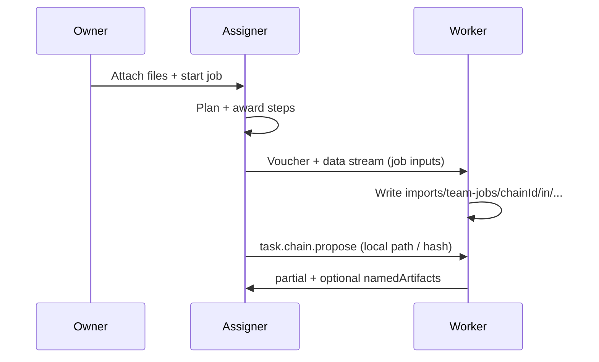

# Team jobs — Job input delivery (not vault sync)

> Deliver composer attachments (and optional step outputs) to **recruited
> workers’ homes** for a **single Team job** — one-shot, audited, size-capped.
>
> Status: **designed (Phase 59)** — implement **after Phase 58**.
>
> Related: [`agent-network-ux-team-jobs.md`](./agent-network-ux-team-jobs.md)
> (Phase 58 honesty / visibility) ·
> [`agent-network-artifacts.md`](./agent-network-artifacts.md) (Phase 53 refs) ·
> [`p2p-file-sharing-plan.md`](./p2p-file-sharing-plan.md) (voucher + `/envoymesh/data`) ·
> [`implementation-plan.md`](./implementation-plan.md) Phase 59.

## 1. Why this exists

Phase 53 passes **refs** (`vaultPath` + `contentHash`) and small packed
payloads between steps. Composer attachments stay on the **Assigner home**.
Remote workers often cannot open the real brief / spreadsheet / PDF.

That gap is real and useful to close — but **not** as “cross-home vault sync.”

| Wrong shape | Right shape |
|-------------|-------------|
| Mirror vaults / ongoing sync | **One-shot delivery** into a job workspace |
| Implicit background copy | Explicit job-scoped transfer, audited |
| Peer keeps standing access | Path under `imports/team-jobs/<chainId>/…`; revoke or GC with the job |

**Product name:** **Job input delivery** (UI may say “Send inputs to workers”).

## 2. Prerequisites

- **Phase 58** shipped (especially 58B honesty + `waitingOn` / delivery status
  hooks) so UI can show “delivering / delivered / failed” without lying.
- Existing data plane: Data Transfer Voucher + `/envoymesh/data/0.1.0`
  (Scenario 5 / FS share path). Prefer **reuse** over a new byte protocol.
- Bonds + policy: only bonded, opted-in workers who are **awarded** (or about
  to be) receive inputs — not the whole contact list.

## 3. Goals

1. When a Team job has composer attachments (and/or file-kind
   `namedArtifacts` the Assigner chooses to forward), **push bytes** to each
   relevant worker home into a **job-scoped vault path**.
2. Update the worker-facing artifact ref so OpenClaw / Ext sees a **local**
   path after delivery (or a clear “waiting for input” state before).
3. Surface progress on assigner + worker UIs: pending / transferring /
   verified / failed.
4. Enforce size caps, sensitivity, mandate expiry, and audit with
   `correlationId` / `chainId`.

## 4. Non-goals

- Bidirectional or continuous vault sync
- Delivering the owner’s entire vault or Library tree
- Auto-publish into peer public knowledge
- Replacing Phase 53 `inputArtifacts` for small text/structured packs
- Chat-based “share this file into a Team job” as the primary path (can link
  later)

## 5. Lifecycle

```text
Owner attaches [brief] on Assigner home
  → chainStartFromGoal (paths in goal / attachment manifest)
  → plan+assign → award worker W for step S
  → Assigner: for each attachment needed by S (or job-global inputs):
       issue voucher → /envoymesh/data → W writes
         imports/team-jobs/<chainId>/in/<safeName>
  → verify contentHash
  → propose/accept carries local path on W (or refreshed inputArtifacts)
  → W executes with local file
  → on chain terminal (optional): GC job workspace or retain until report GC
```



**When to deliver**

| Trigger | Default |
|---------|---------|
| On **award** of a step that references the attachment / expects the key | Preferred |
| Job-global attachments to **all** awarded workers once | Optional setting |
| Before first propose (block propose until verified) | Recommended for file-required steps |

**Local “You” worker:** skip transfer; path already on Assigner home (or
copy into the same job workspace for consistency).

## 6. Data model (sketch)

Keep additive; exact schemas land in 59A.

- **Attachment manifest** on the chain (already implied by composer):  
  `{ relativePath, label?, contentHash?, byteLength?, sensitivity? }`
- **Delivery record** per `(chainId, workerPeerId, relativePath)`:  
  `pending | transferring | verified | failed` + error + `deliveredPath`
- Worker vault layout:  
  `imports/team-jobs/<chainId>/in/<sanitize(name)>`  
  Optional outs: `.../out/` for worker-produced files (future)

Wire options (pick in 59A; prefer least new surface):

1. **Reuse share/data transfer** under the chain’s `correlationId` (fastest).
2. Thin `task.chain.input.offer` / `.ack` envelopes if we need explicit
   job semantics without looking like a Library share.

## 7. Policy & safety

- Trust: same bar as recruiting the worker (`direct` / `referred` as today
  for chain propose/accept).
- Sensitivity: attachment ceiling ≤ mandate / job maxSensitivity; deny or
  require owner approval when higher.
- Size: hard cap per file and per job (start from composer 25 MiB × 8; may
  lower for WAN).
- Path safety: sanitize names; never write outside `imports/team-jobs/<chainId>/`.
- Audit: `chain.input_delivered` / `chain.input_failed` with peer, hash, bytes.
- Failure: step can stall with visible “input delivery failed — retry”; do
  not silently run without the file if the step marked it required.

## 8. UX

**Assigner (Social / EnvoyGo start + detail)**

- Start: keep honesty from 58B; add “Workers will receive a copy of these
  inputs when assigned” when Phase 59 is live.
- Detail: per attachment × worker delivery chips; Retry on failure.
- Optional Advanced: “Deliver job inputs to all workers” vs “Only steps that
  reference them.”

**Worker (observed / local activity)**

- “Receiving job inputs…” / “Inputs ready under Team job workspace.”
- Never imply the peer owns the owner’s Library.

## 9. Waves (Phase 59)

| Wave | Scope |
|------|--------|
| **59A** | Design lock: schema + reuse voucher vs new intent; caps; vault layout |
| **59B** | Assigner deliver-on-award + verify hash; local-You skip; unit tests |
| **59C** | Wire into propose/`inputArtifacts` so worker executor sees local path |
| **59D** | Social + EnvoyGo delivery status + retry; i18n |
| **59E** | Two/three-home E2E (attach → award → deliver → worker reads file); GC policy |

## 10. Success criteria

- Remote worker can open a labeled composer attachment as a **local vault
  file** for that `chainId` after award.
- Owner sees delivery success/failure per worker.
- No standing vault mirror; cancelling/completing the job can GC the
  workspace.
- Small text packs still use Phase 53 without forcing a data-channel hop.

## 11. Open questions (settle in 59A)

1. Auto-deliver on award vs owner toggle default-on?
2. Deliver only attachments referenced by `[label]` / `expects`, or all
   composer attachments to every awarded worker?
3. Retain workspace until report pin expiry vs delete on terminal?
4. WAN: require circuit-capable data path; fail clearly if only envelope-size
   packs are possible?
