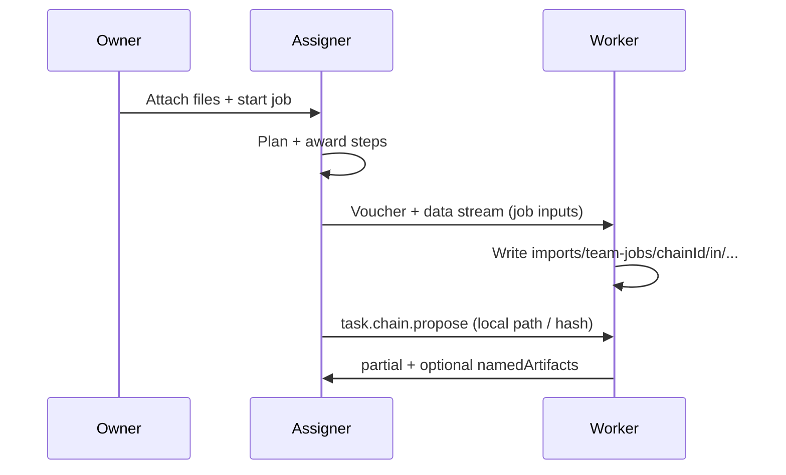

# Team jobs — Job input delivery (not vault sync)

> Deliver composer attachments (and optional step outputs) to **recruited
> workers’ homes** for a **single Team job** — one-shot, audited, size-capped.
>
> Status: **Phase 59 — `[~]` in progress** (59A design lock shipped; 59B+ next).
>
> Related: [`agent-network-ux-team-jobs.md`](./agent-network-ux-team-jobs.md)
> (Phase 58 honesty / visibility) ·
> [`agent-network-artifacts.md`](./agent-network-artifacts.md) (Phase 53 refs) ·
> [`p2p-file-sharing-plan.md`](./p2p-file-sharing-plan.md) (voucher + `/envoymesh/data`) ·
> [`implementation-plan.md`](./implementation-plan.md) Phase 59.

## 1. Why this exists

Phase 53 passes **refs** (`vaultPath` + `contentHash`) and small packed
payloads between steps. Composer attachments stay on the **Assigner home**.
Remote workers often cannot open the real brief / spreadsheet / PDF.

That gap is real and useful to close — but **not** as “cross-home vault sync.”

| Wrong shape | Right shape |
|-------------|-------------|
| Mirror vaults / ongoing sync | **One-shot delivery** into a job workspace |
| Implicit background copy | Explicit job-scoped transfer, audited |
| Peer keeps standing access | Path under `imports/team-jobs/<chainId>/…`; revoke or GC with the job |

**Product name:** **Job input delivery** (UI may say “Send inputs to workers”).

## 2. Prerequisites

- **Phase 58** shipped (especially 58B honesty + `waitingOn` / delivery status
  hooks) so UI can show “delivering / delivered / failed” without lying.
- Existing data plane: Data Transfer Voucher + `/envoymesh/data/0.1.0`
  (Scenario 5 / FS share path). Prefer **reuse** over a new byte protocol.
- Bonds + policy: only bonded, opted-in workers who are **awarded** (or about
  to be) receive inputs — not the whole contact list.

## 3. Goals

1. When a Team job has composer attachments (and/or file-kind
   `namedArtifacts` the Assigner chooses to forward), **push bytes** to each
   relevant worker home into a **job-scoped vault path**.
2. Update the worker-facing artifact ref so OpenClaw / Ext sees a **local**
   path after delivery (or a clear “waiting for input” state before).
3. Surface progress on assigner + worker UIs: pending / transferring /
   verified / failed.
4. Enforce size caps, sensitivity, mandate expiry, and audit with
   `correlationId` / `chainId`.

## 4. Non-goals

- Bidirectional or continuous vault sync
- Delivering the owner’s entire vault or Library tree
- Auto-publish into peer public knowledge
- Replacing Phase 53 `inputArtifacts` for small text/structured packs
- Chat-based “share this file into a Team job” as the primary path (can link
  later)
- Full `share.request` / `share.preview` / `share.accept` negotiation for job
  inputs (bond + award is enough trust context)

## 5. Lifecycle

```text
Owner attaches [brief] on Assigner home
  → staged under imports/team-jobs/<composerBatchId>/…
  → chainStartFromGoal (Attachments: in goal + structured manifest)
  → plan+assign → award worker W for step S
  → Assigner (auto, default): for each attachment selected for S:
       issue voucher → /envoymesh/data → W writes
         imports/team-jobs/<chainId>/in/<safeName>
  → verify contentHash
  → propose/accept carries local path on W (or refreshed inputArtifacts)
  → W executes with local file
  → on chain terminal: GC imports/team-jobs/<chainId>/ (default)
```



### Locked defaults (59A)

| Decision | Lock |
|----------|------|
| **When to deliver** | **Auto on award** (`autoDeliverOnAward: true`). No owner click required. |
| **Which files** | **`referenced` scope**: attachments whose `[label]` appears in the step objective / expects; if none match, **fall back to all** job attachments for that worker. Advanced may expose `all` later (59D). |
| **Local “You”** | Skip network transfer; optionally copy into `imports/team-jobs/<chainId>/in/` for path consistency (59B). |
| **GC** | **`on_terminal`**: delete `imports/team-jobs/<chainId>/` when the chain completes or is cancelled. |
| **WAN failure** | Attempt data path (same dial/retry as chat share). On failure: mark delivery `failed`, stall required-file steps, surface Retry — **never** silent-run without the file. |

## 6. Data model (59A locked)

Shared types live in `@envoymesh/api` (`chain-input-delivery.ts`).

### Attachment manifest

```typescript
interface ChainInputAttachment {
  sourceRelativePath: string; // Assigner vault path
  label?: string;             // ≤40 chars
  fileName?: string;
  contentHash?: string;
  byteLength?: number;
  sensitivity?: "public" | "friends" | "private";
}
```

Parsed from the goal `Attachments:` block via `parseChainInputAttachmentsFromGoal`
(supports `- [label] path` and `- path`). Composer still stages under
`imports/team-jobs/<composerBatchId>/…`; delivery remaps to `chainId`.

### Delivery record

```typescript
type ChainInputDeliveryPhase = "pending" | "transferring" | "verified" | "failed";

interface ChainInputDeliveryRecord {
  chainId: string;
  workerPeerId: string;
  sourceRelativePath: string;
  deliveredRelativePath?: string; // worker-local after verify
  contentHash?: string;
  phase: ChainInputDeliveryPhase;
  error?: string;
  transferId?: string;
  updatedAt: string; // ISO
}
```

Surfaced on `ChainGetStateResult.inputAttachments` / `inputDeliveries` (optional;
populated in 59B+).

### Vault layout

| Role | Path |
|------|------|
| Composer staging (pre-chain) | `imports/team-jobs/<composerBatchId>/<safeName>` |
| Worker inbound (post-delivery) | `imports/team-jobs/<chainId>/in/<safeName>` |
| Future outs (not 59) | `imports/team-jobs/<chainId>/out/…` |

Never write outside `imports/team-jobs/<chainId>/`. Sanitize names; reject `..`.

### Caps

| Cap | Value |
|-----|--------|
| Attachments per job | 8 |
| Per-file size | 25 MiB (composer) |
| Network inbound stream | 64 MiB (`MAX_DATA_INBOUND_BYTES`) |
| Job input voucher TTL | 60 minutes (re-issue on Retry) |

### Wire (59A lock)

**Reuse Data Transfer Voucher + `/envoymesh/data/0.1.0`.**

- Call assigner send path directly on award (same machinery as
  `sendVaultFileViaDataTransfer`) — **skip** `share.request` / preview / accept.
- Remap inbound write via existing `resolveInboundRelativePath` /
  `pendingDataTransferSavePath` so voucher source path → worker
  `imports/team-jobs/<chainId>/in/…`.
- Correlate progress with `chainId` (and optional `transferId`); reuse
  `TransferStatus` phases where useful.
- **Do not** add `task.chain.input.*` intents in v1 unless reuse proves
  insufficient (parked).

After verified write (59C): refresh propose `inputArtifacts` with worker-local
`file` refs (`vaultPath` + `contentHash`). Keep Phase 53 small text packs on
the JSON path (≤ ~48 KiB) without a data-channel hop.

## 7. Policy & safety

- Trust: same bar as recruiting the worker (`direct` / `referred` as today
  for chain propose/accept).
- Sensitivity: attachment ceiling ≤ mandate / job maxSensitivity; deny or
  require owner approval when higher.
- Path safety: sanitize names; never write outside `imports/team-jobs/<chainId>/`.
- Audit: `chain.input_delivered` / `chain.input_failed` with peer, hash, bytes
  (59B).
- Failure: step can stall with visible “input delivery failed — retry”; do
  not silently run without the file if the step marked it required.
- Voucher verify still needs peer-directory device key material (same as
  Library share).

## 8. UX

**Assigner (Social / EnvoyGo start + detail)**

- Start: keep honesty from 58B; add “Workers will receive a copy of these
  inputs when assigned” when Phase 59 deliver path is live (59D).
- Detail: per attachment × worker delivery chips; Retry on failure (59D).
- Optional Advanced: scope `referenced` vs `all` (59D).

**Worker (observed / local activity)**

- “Receiving job inputs…” / “Inputs ready under Team job workspace.”
- Never imply the peer owns the owner’s Library.

## 9. Waves (Phase 59)

| Wave | Status | Scope |
|------|--------|-------|
| **59A** | `[x]` | Design lock: schema + reuse voucher; caps; vault layout; open Qs settled |
| **59B** | `[ ]` | Assigner deliver-on-award + verify hash; local-You skip; unit tests |
| **59C** | `[ ]` | Wire into propose/`inputArtifacts` so worker executor sees local path |
| **59D** | `[ ]` | Social + EnvoyGo delivery status + retry; i18n |
| **59E** | `[ ]` | Two/three-home E2E; GC on terminal |

## 10. Success criteria

- Remote worker can open a labeled composer attachment as a **local vault
  file** for that `chainId` after award.
- Owner sees delivery success/failure per worker.
- No standing vault mirror; cancelling/completing the job can GC the
  workspace.
- Small text packs still use Phase 53 without forcing a data-channel hop.

## 11. Settled questions (was open; locked in 59A)

| # | Question | Decision |
|---|----------|----------|
| 1 | Auto-deliver on award vs owner toggle? | **Auto on award** (default). Toggle later only if needed. |
| 2 | Referenced-only vs all attachments? | **`referenced` with all-job fallback** when the step mentions no labels. |
| 3 | GC timing? | **Delete workspace on chain terminal** (`on_terminal`). |
| 4 | WAN failure UX? | **Fail delivery + stall + Retry**; never silent-run without required file. |
