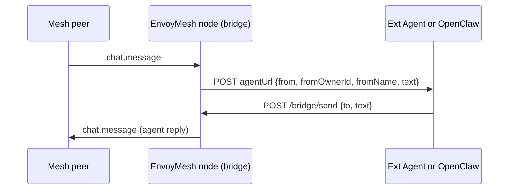

# External agent bridge guide

EnvoyMesh pipes P2P `chat.message` traffic to an external agent over HTTP.
There are **two operator paths**:

| Path | Where you configure it | Typical `agentUrl` | Doc |
|------|------------------------|--------------------|-----|
| **Ext Agent presets** (Pi / HomeClaw / Hermes / OpenHuman) | **Settings → AI → Ext Agent** | `:8022` / `:8010` / `:8020` / `:8021` `/message` | **[Ext_Agent_guide.md](./Ext_Agent_guide.md)** (full setup) |
| **OpenClaw plugin** (EnvoyAI / Gateway webhook) | `bridge-config.json` + OpenClaw `channels.envoymesh` | `:18789/webhook/envoymesh` | This guide + [openclaw-extension.md](./openclaw-extension.md) |

**One bridge = one `agentUrl`.** Do not point the same bridge at two agents at once.
Use separate EnvoyMesh profiles to A/B test.

**Related docs:**

- [Ext_Agent_guide.md](./Ext_Agent_guide.md) — Pi / HomeClaw / Hermes / OpenHuman (recommended starting point for Ext Agent UI)
- [profile-photos.md](./profile-photos.md) — thumbnails, gallery, `profile.sync`, sharing
- [openclaw-agent-bridge-adr.md](./openclaw-agent-bridge-adr.md) — wire contract, security, CI smokes
- [openclaw-extension.md](./openclaw-extension.md) — OpenClaw install and config (detailed)
- [openclaw-bridge-e2e-checklist.md](./openclaw-bridge-e2e-checklist.md) — manual OpenClaw E2E checklist
- [implementation-plan.md](./implementation-plan.md) — Phase 9K / 9I

---

## Ext Agent presets (summary)

Full steps, env vars, ports, and checklists: **[Ext_Agent_guide.md](./Ext_Agent_guide.md)**.

| Agent | Who owns `/message`? | Default URL | Auth / notes |
|-------|----------------------|-------------|--------------|
| **Pi (built-in)** | EnvoyMesh sidecar `:8022` | `http://127.0.0.1:8022/message` | **Default preset; bridge on by default.** Same bundled Pi as the coding TUI (separate RPC process); conversational only (tools auto-denied). |
| **HomeClaw** | HomeClaw built-in channel | `http://127.0.0.1:8010/message` | Start HomeClaw only; no EnvoyMesh sidecar. Match `ENVOYMESH_BRIDGE_URL` to bridge port. |
| **Hermes** | EnvoyMesh sidecar `:8020` | `http://127.0.0.1:8020/message` | Hermes API `:8642` needs `API_SERVER_ENABLED` + `API_SERVER_KEY`; set `HERMES_API_KEY` on the node. |
| **OpenHuman** | EnvoyMesh sidecar `:8021` | `http://127.0.0.1:8021/message` | Prefer `/v1` auto-key with OpenHuman.app (desktop `/rpc` token is in-memory). CLI uses `core.token` / `OPENHUMAN_CORE_TOKEN`. |

```
You → Ext Agent chat → home Node bridge
                         ↓ POST agentUrl
   Pi :8022  |  HomeClaw :8010  |  Hermes :8020  |  OpenHuman :8021
                         ↓ POST /bridge/send
                    Reply in chat
```

Select the agent in **Settings → AI → Ext Agent**, enable the bridge, and save.
Pi / Hermes / OpenHuman sidecars start and stop automatically with that selection
(`apps/node/src/ext-agent-adapter/`).

---

## Architecture (shared wire contract)

The bridge (`apps/node/src/bridge/`) is a **message pipe only**:

| Direction | What happens |
|-----------|----------------|
| **Mesh → agent** | Bonded peer sends `chat.message` to the bridge agent peer id → bridge `POST`s JSON to `agentUrl`. |
| **Agent → mesh** | Agent must `POST` `{ to, text }` to `http://127.0.0.1:<listenPort>/bridge/send` (default port **3031**). |
| **Sync HTTP body** | Response bodies from `agentUrl` are **not** used for P2P delivery (avoids duplicate messages). |



**Rules:**

- **OpenClaw / HomeClaw / Hermes / OpenHuman never hold libp2p keys** — only the EnvoyMesh node speaks P2P.
- **Reply routing:** `to` on `/bridge/send` must be the mesh **peer id** from inbound `from` (`envoy_…`), not `envoy:owner:…`.

### Wire contract (summary)

**Bridge → agent** (`POST agentUrl`):

```json
{
  "from": "<senderPeerId>",
  "fromOwnerId": "<envoy:owner:…>",
  "fromName": "<display name>",
  "text": "<message body>",
  "messageId": "<unique envelope id>"
}
```

`messageId` is the unique id of the inbound P2P envelope. Agents should treat
repeated `messageId`s as duplicates. The OpenClaw plugin dedups on `messageId`
with a 10-second content-hash fallback for legacy bridges that omit it.

Optional: `Authorization: Bearer <secret>` when `bridge-config.json` / UI sets `secret`.

**Agent → bridge** (`POST http://127.0.0.1:3031/bridge/send`):

```json
{
  "to": "<recipientPeerId>",
  "text": "<reply body>",
  "correlationId": "<optional, see below>"
}
```

**Sync H2A ask replies (built-in EnvoyAI path):** the bridge also supports a
sync-reply mode used by the runtime's `ask()` — the agent POSTs the same body
shape with a `correlationId` matching the original ask. The bridge returns:

- `200` + `{"ok": true, "mode": "sync-reply"}` when a matching ask is in flight
- `410` + `{"ok": false, "mode": "unknown-correlation"}` when no matching ask exists
  (typically after a node restart between ask and reply)

**Async mesh (OpenClaw plugin):** `POST agentUrl` with `type: "mesh.async_reply"` for
`discovery.response` / `knowledge.response`. See [openclaw-agent-bridge-adr.md](./openclaw-agent-bridge-adr.md).

---

## Operator cheat sheet

| | **Pi (built-in)** | **HomeClaw** | **Hermes** | **OpenHuman** | **OpenClaw** |
|---|--------------|--------------|------------|---------------|--------------|
| **UI preset** | Ext Agent → Pi (default) | Ext Agent → HomeClaw | Ext Agent → Hermes | Ext Agent → OpenHuman | Not an Ext Agent preset (EnvoyAI / webhook) |
| **Channel / adapter** | EnvoyMesh sidecar `:8022` | HomeClaw `channels/envoymesh` | EnvoyMesh sidecar `:8020` | EnvoyMesh sidecar `:8021` | `OpenClawExtension/` → `openclaw/extensions/envoymesh/` |
| **Typical `agentUrl`** | `http://127.0.0.1:8022/message` | `http://127.0.0.1:8010/message` | `http://127.0.0.1:8020/message` | `http://127.0.0.1:8021/message` | `http://127.0.0.1:18789/webhook/envoymesh` |
| **Backend** | Bundled Pi runtime | HomeClaw Core | Hermes API `:8642` | OpenHuman `:7788` | OpenClaw Gateway |
| **Auth** | None (local) | Optional bridge secret | `API_SERVER_KEY` ↔ `HERMES_API_KEY` | `/v1` auto-key or `/rpc` token | `bridgeSecret` / `inboundSecret` |
| **Both at once?** | **No** — one `agentUrl` per bridge | | | | |

**Switching Ext Agents:** use **Settings → AI → Ext Agent** (sidecar start/stop is automatic for Pi / Hermes / OpenHuman).

**Switching to OpenClaw webhook:** change `bridge-config.json` `agentUrl` (and `secret` if used). Leave unused products installed but unused.

---

## How to use HomeClaw

See **[Ext_Agent_guide.md § HomeClaw](./Ext_Agent_guide.md#homeclaw)** for the full checklist.

Short version:

1. EnvoyMesh: Ext Agent = **HomeClaw**, bridge enabled → `agentUrl` `http://127.0.0.1:8010/message`.
2. Start HomeClaw (built-in channel; **no** `channels.run envoymesh`).
3. Align `ENVOYMESH_BRIDGE_URL` with the EnvoyMesh bridge port (`3031` / `4031`).
4. Bonded peer → Ext Agent contact → reply via `/bridge/send`.

Default sample: `apps/node/data/default/bridge-config.json` → `~/.envoymesh/<profile>/bridge-config.json`.

---

## How to use Hermes

See **[Ext_Agent_guide.md § Hermes](./Ext_Agent_guide.md#hermes)**.

Short version:

1. Hermes `.env`: `API_SERVER_ENABLED=true` + `API_SERVER_KEY=…`
2. EnvoyMesh node: `HERMES_API_KEY=<same secret>` (or `HERMES_ENV_FILE` / `HERMES_HOME`)
3. `hermes gateway run` → `:8642` healthy
4. Ext Agent = **Hermes** → sidecar `:8020` auto-starts

---

## How to use OpenHuman

See **[Ext_Agent_guide.md § OpenHuman](./Ext_Agent_guide.md#openhuman)**.

Short version:

1. Keep **OpenHuman.app** on `:7788` (Path A) **or** quit the app and run CLI core (Path B).
2. Ext Agent = **OpenHuman** → sidecar `:8021` auto-starts.
3. Path A uses `/v1` with **auto-provisioned** API key (no manual `export` by default).
   Set `OPENHUMAN_AUTO_PROVISION_API_KEY=0` if you do not want EnvoyMesh writing into OpenHuman’s credential store.
4. If first `/v1` call 401s after auto-provision, restart OpenHuman.app once.

---

## How to use OpenClaw

OpenClaw uses the Gateway **webhook** path (not the Ext Agent Hermes/OpenHuman sidecars).

### What changed in EnvoyMesh (OpenClaw support)

#### Unchanged on purpose

| Item | Notes |
|------|--------|
| `apps/node/src/bridge/` | Same module for all agents |
| `apps/node/data/default/bridge-config.json` | Default `agentUrl` → HomeClaw `http://localhost:8010/message` |
| HomeClaw `channels/envoymesh` | Lives in the **HomeClaw** repo; not modified in EnvoyMesh |

#### OpenClaw-specific additions

| Area | Purpose |
|------|---------|
| [`OpenClawExtension/`](../OpenClawExtension/) | Canonical OpenClaw channel plugin → `openclaw/extensions/envoymesh/` |
| [`scripts/install-openclaw-extension.sh`](../scripts/install-openclaw-extension.sh) | Copy plugin (+ optional docs) into an OpenClaw checkout |
| `apps/node/data/default/bridge-config.openclaw.example.json` | Example EnvoyMesh config for OpenClaw |
| Docs | [openclaw-extension.md](./openclaw-extension.md), [openclaw-agent-bridge-adr.md](./openclaw-agent-bridge-adr.md), [openclaw-bridge-e2e-checklist.md](./openclaw-bridge-e2e-checklist.md) |
| Tests & smoke | `apps/node/test/bridge-openclaw-agent-mock.test.ts`, `apps/node/src/openclaw-bridge-smoke/` |

#### OpenClaw plugin capabilities

| Phase | Feature |
|-------|---------|
| **A** | Chat: Gateway webhook `/webhook/envoymesh`, replies via `/bridge/send` |
| **B** | Tools: `envoymesh_list_mesh_tools`, `envoymesh_execute_mesh_tool` |
| **C** | Async: `mesh.async_reply` → agent as `[EnvoyMesh async …]` messages |
| **D** | `openclaw onboard` wizard, channel docs, example JSON5 |

**CI-only:** `ENVOYMESH_SMOKE_ECHO=1` echoes webhook → `/bridge/send` without the LLM (live smoke). Not for production.

#### CI smokes

| Script | CI | What it proves |
|--------|-----|----------------|
| `npm run smoke:openclaw-bridge` | `ci-smoke-local` (PR) | Mock webhook + real bridge round-trip |
| `npm run smoke:openclaw-bridge:live` | `ci-smoke-openclaw-live` (nightly) | Built OpenClaw Gateway + extension + bridge |

### 1. Install the plugin

From EnvoyMesh repo root:

```bash
./scripts/install-openclaw-extension.sh /path/to/openclaw --with-docs
cd /path/to/openclaw && pnpm install
```

Symlink for development:

```bash
ln -sf /path/to/EnvoyMesh/OpenClawExtension /path/to/openclaw/extensions/envoymesh
```

### 2. Configure OpenClaw

In `~/.openclaw/openclaw.json` (or `openclaw onboard` → EnvoyMesh), for example:

```json
{
  "channels": {
    "envoymesh": {
      "enabled": true,
      "bridgeUrl": "http://127.0.0.1:3031/bridge/send",
      "bridgeSecret": "your-shared-secret",
      "inboundSecret": "your-shared-secret",
      "webhookPath": "/webhook/envoymesh",
      "dmPolicy": "allowlist",
      "allowedOwnerIds": ["envoy:owner:YOUR_BONDED_PEER_OWNER_ID"]
    }
  }
}
```

| Field | Purpose |
|-------|---------|
| `bridgeUrl` | Where the plugin POSTs replies (EnvoyMesh `listenPort`, default **3031**) |
| `bridgeSecret` | Bearer for `/bridge/send` (match EnvoyMesh `secret`) |
| `inboundSecret` | Bearer the bridge sends to the webhook |
| `webhookPath` | Gateway route (default `/webhook/envoymesh`) |
| `allowedOwnerIds` | Allowed mesh senders (`envoy:owner:…` from `fromOwnerId`) |

Restart the **OpenClaw Gateway** (often port **18789**). Confirm logs register the EnvoyMesh HTTP route.

Merge fragment: `OpenClawExtension/examples/openclaw-channels.envoymesh.json5`.

### 3. Configure EnvoyMesh

Do **not** overwrite a working HomeClaw / Ext Agent `bridge-config.json` unless switching:

```bash
cp apps/node/data/default/bridge-config.openclaw.example.json \
   ~/.envoymesh/<profile>/bridge-config.json
```

Example:

```json
{
  "enabled": true,
  "agentUrl": "http://127.0.0.1:18789/webhook/envoymesh",
  "listenPort": 3031,
  "agentName": "OpenClaw",
  "secret": "your-shared-secret"
}
```

| Field | Purpose |
|-------|---------|
| `agentUrl` | `http://<gateway-host>:<port><webhookPath>` |
| `listenPort` | Bridge HTTP server (default **3031**) |
| `secret` | Optional; match OpenClaw `bridgeSecret` / `inboundSecret` |

Restart the **EnvoyMesh node**. Look for `[bridge] HTTP on http://127.0.0.1:3031/bridge/send`.

### 4. Chat on the mesh

1. Note the bridge **agent peer id** from node logs or UI.
2. From a **bonded** peer whose owner id is in `allowedOwnerIds`, send `chat.message` to that peer id.
3. OpenClaw receives the inbound; the agent reply returns on the mesh via `/bridge/send`.

Optional: `envoymesh_list_mesh_tools` / `envoymesh_execute_mesh_tool` in the OpenClaw agent session.

### 5. Verify OpenClaw

```bash
# EnvoyMesh (no OpenClaw binary)
npx vitest run apps/node/test/bridge-openclaw-agent-mock.test.ts
npm run smoke:openclaw-bridge

# Live Gateway (requires built OpenClaw)
export OPENCLAW_ROOT=/path/to/openclaw   # cd openclaw && pnpm build first
npm run smoke:openclaw-bridge:live

# Plugin tests (inside OpenClaw checkout)
cd /path/to/openclaw
node scripts/run-vitest.mjs run extensions/envoymesh/src
```

Manual: [openclaw-bridge-e2e-checklist.md](./openclaw-bridge-e2e-checklist.md).

### Configuration mapping (OpenClaw)

| EnvoyMesh `bridge-config.json` | OpenClaw `channels.envoymesh` |
|-------------------------------|-------------------------------|
| `agentUrl` | Gateway host + `webhookPath` |
| `secret` | `bridgeSecret` + `inboundSecret` |
| `listenPort` | `bridgeUrl` → `http://127.0.0.1:3031/bridge/send` |

---

## Troubleshooting

| Symptom | What to check |
|---------|----------------|
| **Ext Agent: no reply (HomeClaw / Hermes / OpenHuman)** | See [Ext_Agent_guide.md § Troubleshooting](./Ext_Agent_guide.md#troubleshooting-all-agents) |
| **401 on webhook** (OpenClaw) | `inboundSecret` vs bridge `Authorization: Bearer` |
| **401 on `/bridge/send`** | `bridgeSecret` vs bridge `secret` |
| **403 sender not allowed** (OpenClaw) | Add peer `fromOwnerId` to `allowedOwnerIds` |
| **410 on `/bridge/send` (sync-reply path)** | `mode: "unknown-correlation"` — node restarted between ask and reply; re-issue ask with a fresh `correlationId` |
| **Reply routing error** | Inbound must include `from`; `to` must be peer id `envoy_…` |
| **Duplicate messages** | Do not return chat text in webhook HTTP body; use `/bridge/send` only |
| **No EnvoyMesh route** (OpenClaw) | Restart Gateway; `channels.envoymesh.enabled` |
| **Wrong agent** | Confirm single `agentUrl`; Ext Agent UI selection matches the process you started |
| **Hermes / OpenHuman sidecar not listening** | Bridge enabled + correct Ext Agent selected; check `[ext-agent:…] listening` logs |
| **OpenHuman `/rpc` 401 with desktop app** | Expected — use `/v1` auto-key (see Ext Agent guide) |

---

## References

| Resource | Location |
|----------|----------|
| Bridge implementation | `apps/node/src/bridge/` |
| Ext Agent sidecars (Hermes / OpenHuman) | `apps/node/src/ext-agent-adapter/` |
| Ext Agent operator guide | [Ext_Agent_guide.md](./Ext_Agent_guide.md) |
| OpenClaw plugin source | `OpenClawExtension/` |
| HomeClaw channel | `HomeClaw/channels/envoymesh/` (separate repo) |
| ADR | [openclaw-agent-bridge-adr.md](./openclaw-agent-bridge-adr.md) |
| OpenClaw setup | [openclaw-extension.md](./openclaw-extension.md) |
