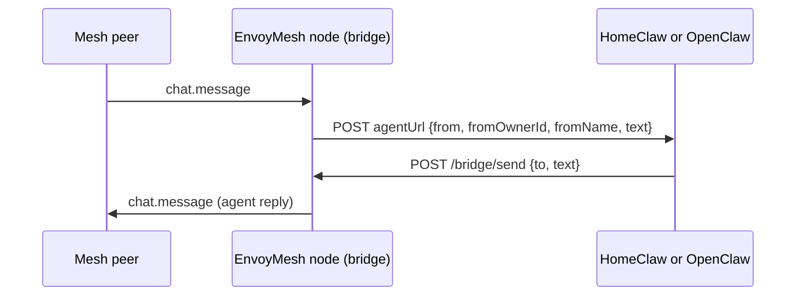

# External agent bridge guide (HomeClaw & OpenClaw)

EnvoyMesh **Phase 9K** lets a home node pipe P2P `chat.message` traffic to an external agent over HTTP. **HomeClaw** and **OpenClaw** share the same wire contract; you pick one agent per bridge via `bridge-config.json` `agentUrl`.

**Related docs:**

- [profile-photos.md](./profile-photos.md) — thumbnails, gallery, `profile.sync`, sharing
- [openclaw-agent-bridge-adr.md](./openclaw-agent-bridge-adr.md) — wire contract, security, CI smokes
- [openclaw-extension.md](./openclaw-extension.md) — OpenClaw install and config (detailed)
- [openclaw-bridge-e2e-checklist.md](./openclaw-bridge-e2e-checklist.md) — manual OpenClaw E2E checklist
- [implementation-plan.md](./implementation-plan.md) — Phase 9K / 9I

---

## Architecture (shared by both)

The bridge (`apps/node/src/bridge/`) is a **message pipe only**:

| Direction | What happens |
|-----------|----------------|
| **Mesh → agent** | Bonded peer sends `chat.message` to the bridge agent peer id → bridge `POST`s JSON to `agentUrl`. |
| **Agent → mesh** | Agent must `POST` `{ to, text }` to `http://127.0.0.1:<listenPort>/bridge/send` (default port **3031**). |
| **Sync HTTP body** | Response bodies from `agentUrl` are **not** used for P2P delivery (avoids duplicate messages). |



**Rules:**

- **One bridge = one `agentUrl`.** Do not point the same bridge at HomeClaw and OpenClaw at once. Use separate EnvoyMesh profiles to A/B test.
- **OpenClaw / HomeClaw never hold libp2p keys** — only the EnvoyMesh node speaks P2P.
- **Reply routing:** `to` on `/bridge/send` must be the mesh **peer id** from inbound `from` (`envoy_…`), not `envoy:owner:…`.

### Wire contract (summary)

**Bridge → agent** (`POST agentUrl`):

```json
{
  "from": "<senderPeerId>",
  "fromOwnerId": "<envoy:owner:…>",
  "fromName": "<display name>",
  "text": "<message body>"
}
```

Optional: `Authorization: Bearer <secret>` when `bridge-config.json` sets `secret`.

**Agent → bridge** (`POST http://127.0.0.1:3031/bridge/send`):

```json
{
  "to": "<recipientPeerId>",
  "text": "<reply body>"
}
```

**Async mesh (OpenClaw plugin):** `POST agentUrl` with `type: "mesh.async_reply"` for `discovery.response` / `knowledge.response`. See [openclaw-agent-bridge-adr.md](./openclaw-agent-bridge-adr.md).

---

## What changed in EnvoyMesh (OpenClaw support)

### Unchanged on purpose

| Item | Notes |
|------|--------|
| `apps/node/src/bridge/` | Same module for both agents |
| `apps/node/data/default/bridge-config.json` | Default `agentUrl` → HomeClaw `http://localhost:8010/message` |
| HomeClaw `channels/envoymesh` | Lives in the **HomeClaw** repo; not modified in EnvoyMesh |

### OpenClaw-specific additions

| Area | Purpose |
|------|---------|
| [`OpenClawExtension/`](../OpenClawExtension/) | Canonical OpenClaw channel plugin → `openclaw/extensions/envoymesh/` |
| [`scripts/install-openclaw-extension.sh`](../scripts/install-openclaw-extension.sh) | Copy plugin (+ optional docs) into an OpenClaw checkout |
| `apps/node/data/default/bridge-config.openclaw.example.json` | Example EnvoyMesh config for OpenClaw |
| Docs | [openclaw-extension.md](./openclaw-extension.md), [openclaw-agent-bridge-adr.md](./openclaw-agent-bridge-adr.md), [openclaw-bridge-e2e-checklist.md](./openclaw-bridge-e2e-checklist.md) |
| Tests & smoke | `apps/node/test/bridge-openclaw-agent-mock.test.ts`, `apps/node/src/openclaw-bridge-smoke/` |

### OpenClaw plugin capabilities

| Phase | Feature |
|-------|---------|
| **A** | Chat: Gateway webhook `/webhook/envoymesh`, replies via `/bridge/send` |
| **B** | Tools: `envoymesh_list_mesh_tools`, `envoymesh_execute_mesh_tool` |
| **C** | Async: `mesh.async_reply` → agent as `[EnvoyMesh async …]` messages |
| **D** | `openclaw onboard` wizard, channel docs, example JSON5 |

**CI-only:** `ENVOYMESH_SMOKE_ECHO=1` echoes webhook → `/bridge/send` without the LLM (live smoke). Not for production.

### CI smokes

| Script | CI | What it proves |
|--------|-----|----------------|
| `npm run smoke:openclaw-bridge` | `ci-smoke-local` (PR) | Mock webhook + real bridge round-trip |
| `npm run smoke:openclaw-bridge:live` | `ci-smoke-openclaw-live` (nightly) | Built OpenClaw Gateway + extension + bridge |

---

## How to use OpenClaw

### 1. Install the plugin

From EnvoyMesh repo root:

```bash
./scripts/install-openclaw-extension.sh /path/to/openclaw --with-docs
cd /path/to/openclaw && pnpm install
```

Symlink for development:

```bash
ln -sf /path/to/EnvoyMesh/OpenClawExtension /path/to/openclaw/extensions/envoymesh
```

### 2. Configure OpenClaw

In `~/.openclaw/openclaw.json` (or `openclaw onboard` → EnvoyMesh), for example:

```json
{
  "channels": {
    "envoymesh": {
      "enabled": true,
      "bridgeUrl": "http://127.0.0.1:3031/bridge/send",
      "bridgeSecret": "your-shared-secret",
      "inboundSecret": "your-shared-secret",
      "webhookPath": "/webhook/envoymesh",
      "dmPolicy": "allowlist",
      "allowedOwnerIds": ["envoy:owner:YOUR_BONDED_PEER_OWNER_ID"]
    }
  }
}
```

| Field | Purpose |
|-------|---------|
| `bridgeUrl` | Where the plugin POSTs replies (EnvoyMesh `listenPort`, default **3031**) |
| `bridgeSecret` | Bearer for `/bridge/send` (match EnvoyMesh `secret`) |
| `inboundSecret` | Bearer the bridge sends to the webhook |
| `webhookPath` | Gateway route (default `/webhook/envoymesh`) |
| `allowedOwnerIds` | Allowed mesh senders (`envoy:owner:…` from `fromOwnerId`) |

Restart the **OpenClaw Gateway** (often port **18789**). Confirm logs register the EnvoyMesh HTTP route.

Merge fragment: `OpenClawExtension/examples/openclaw-channels.envoymesh.json5`.

### 3. Configure EnvoyMesh

Do **not** overwrite a working HomeClaw `bridge-config.json` unless switching:

```bash
cp apps/node/data/default/bridge-config.openclaw.example.json \
   ~/.envoymesh/<profile>/bridge-config.json
```

Example:

```json
{
  "enabled": true,
  "agentUrl": "http://127.0.0.1:18789/webhook/envoymesh",
  "listenPort": 3031,
  "agentName": "OpenClaw",
  "secret": "your-shared-secret"
}
```

| Field | Purpose |
|-------|---------|
| `agentUrl` | `http://<gateway-host>:<port><webhookPath>` |
| `listenPort` | Bridge HTTP server (default **3031**) |
| `secret` | Optional; match OpenClaw `bridgeSecret` / `inboundSecret` |

Restart the **EnvoyMesh node**. Look for `[bridge] HTTP on http://127.0.0.1:3031/bridge/send`.

### 4. Chat on the mesh

1. Note the bridge **agent peer id** from node logs or UI.
2. From a **bonded** peer whose owner id is in `allowedOwnerIds`, send `chat.message` to that peer id.
3. OpenClaw receives the inbound; the agent reply returns on the mesh via `/bridge/send`.

Optional: `envoymesh_list_mesh_tools` / `envoymesh_execute_mesh_tool` in the OpenClaw agent session.

### 5. Verify OpenClaw

```bash
# EnvoyMesh (no OpenClaw binary)
npx vitest run apps/node/test/bridge-openclaw-agent-mock.test.ts
npm run smoke:openclaw-bridge

# Live Gateway (requires built OpenClaw)
export OPENCLAW_ROOT=/path/to/openclaw   # cd openclaw && pnpm build first
npm run smoke:openclaw-bridge:live

# Plugin tests (inside OpenClaw checkout)
cd /path/to/openclaw
node scripts/run-vitest.mjs run extensions/envoymesh/src
```

Manual: [openclaw-bridge-e2e-checklist.md](./openclaw-bridge-e2e-checklist.md).

---

## How to use HomeClaw

HomeClaw integration predates OpenClaw and remains the **default** in EnvoyMesh sample config.

### 1. HomeClaw side (HomeClaw repo)

- Enable **`channels/envoymesh`** (`HomeClaw/channels/envoymesh/`).
- HomeClaw Core exposes the inbound endpoint the bridge calls (typically **`http://localhost:8010/message`**).
- The channel posts replies to EnvoyMesh **`/bridge/send`** after Core responds (same async pattern as OpenClaw).

Configure allowlists, secrets, and channel options in **HomeClaw** config — not in `OpenClawExtension/`.

### 2. EnvoyMesh side

Use the default bridge config (or equivalent in your profile):

```json
{
  "enabled": true,
  "agentUrl": "http://localhost:8010/message",
  "listenPort": 3031,
  "agentName": "My Agent"
}
```

Sample path: `apps/node/data/default/bridge-config.json` → `~/.envoymesh/<profile>/bridge-config.json`.

Start **HomeClaw** (with envoymesh channel) and the **EnvoyMesh node** with the bridge enabled.

### 3. Chat on the mesh

1. Bonded peer → `chat.message` → bridge agent peer id.
2. Bridge → `POST` HomeClaw `agentUrl`.
3. HomeClaw → `POST /bridge/send` with `to` = sender peer id.
4. Mesh peer receives the agent reply.

### 4. Verify HomeClaw

- HomeClaw + bridge round-trip per HomeClaw repo docs.
- EnvoyMesh: `agentUrl` is `8010/message`, bridge listens on **3031**, one bonded peer chat works.

---

## HomeClaw vs OpenClaw (operator cheat sheet)

| | **HomeClaw** | **OpenClaw** |
|---|--------------|--------------|
| **Channel code** | `HomeClaw/channels/envoymesh/` | `EnvoyMesh/OpenClawExtension/` → `openclaw/extensions/envoymesh/` |
| **Typical `agentUrl`** | `http://localhost:8010/message` | `http://127.0.0.1:<gateway-port>/webhook/envoymesh` |
| **Agent runtime** | FastAPI → Core `/inbound` | Gateway webhook → `channel.inbound.run` |
| **EnvoyMesh example config** | `bridge-config.json` (default) | `bridge-config.openclaw.example.json` |
| **Mesh tools from agent** | HomeClaw integration | `envoymesh_*` OpenClaw tools → bridge |
| **Both at once?** | **No** — one `agentUrl` per bridge |

**Switching agents:** change only `bridge-config.json` `agentUrl` (and `secret` if used). Leave the other product installed but unused.

### Configuration mapping (OpenClaw)

| EnvoyMesh `bridge-config.json` | OpenClaw `channels.envoymesh` |
|-------------------------------|-------------------------------|
| `agentUrl` | Gateway host + `webhookPath` |
| `secret` | `bridgeSecret` + `inboundSecret` |
| `listenPort` | `bridgeUrl` → `http://127.0.0.1:3031/bridge/send` |

---

## Troubleshooting

| Symptom | What to check |
|---------|----------------|
| **401 on webhook** | `inboundSecret` vs bridge `Authorization: Bearer` |
| **401 on `/bridge/send`** | `bridgeSecret` vs `bridge-config.json` `secret` |
| **403 sender not allowed** (OpenClaw) | Add peer `fromOwnerId` to `allowedOwnerIds` |
| **Reply routing error** | Inbound must include `from`; `to` must be peer id `envoy_…` |
| **Duplicate messages** | Do not return chat text in webhook HTTP body; use `/bridge/send` only |
| **No EnvoyMesh route** (OpenClaw) | Restart Gateway; `channels.envoymesh.enabled` |
| **Wrong agent** | Confirm single `agentUrl`; not mixing HomeClaw and OpenClaw |

---

## References

| Resource | Location |
|----------|----------|
| Bridge implementation | `apps/node/src/bridge/` |
| OpenClaw plugin source | `OpenClawExtension/` |
| HomeClaw channel | `HomeClaw/channels/envoymesh/` (separate repo) |
| ADR | [openclaw-agent-bridge-adr.md](./openclaw-agent-bridge-adr.md) |
| OpenClaw setup | [openclaw-extension.md](./openclaw-extension.md) |
