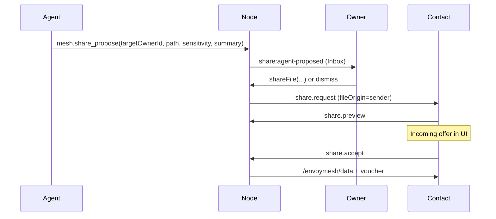

# AI Document Backbone — detailed design & implementation plan

**Status:** **ADB-A–F shipped** (2026-05-21) · human paths **FS-A–D shipped** · agent paths **FS-E partial** · see §8 for phase exit criteria and test coverage.

**Related:** [P2P file sharing plan](./p2p-file-sharing-plan.md) (FS phases) · [External distribution — IPFS](./external-distribution-ipfs-plan.md) · [EnvoyMesh with Kubo/Helia](./envoymesh-with-kubo-helia.md) · [Implementation plan](./implementation-plan.md) · [Agentic next step](./next-step.md) · [Protocol standard](./protocol-standard.md) · [User stories](./UserStory.md) · [Scenarios](./scenarios.md)

---

## 1. Why this feature matters

EnvoyMesh is not only a chat mesh — it is an **owner-controlled document network**. Files live in a local vault, can be **published as discoverable metadata**, and move between peers only after **explicit consent** and **verified transfer**.

The **AI Document Backbone** is the product feature that lets the **EnvoyMesh on-node LLM** (primary) — and optionally an external bridge agent (secondary) — help the owner:

1. **Publish** — decide what metadata to advertise to bonded contacts (and optionally attach a Kubo/Helia CID).
2. **Find** — search locally (RAG) or across contacts (discovery) without confusing metadata with bytes.
3. **Share** — propose or execute file transfers through the same `share.*` protocol the human UI uses.

Without a deliberate design here, the built-in assistant either cannot help with documents beyond vault Q&A, or future tool wiring bypasses consent — both unacceptable for EnvoyMesh’s security model.

### 1.1 Primary vs secondary agent runtimes

| Runtime | Role in ADB | LLM source | Status |
|---------|-------------|------------|--------|
| **EnvoyMesh native LLM** | **Primary** — owner-facing AI in Social/mobile | `NodeConfig.modelProviders` (mock / Ollama / LiteLLM / OpenAI-compatible / Anthropic-compatible) | **Shipped** — vault Q&A, chat drafts, **document agent loop** (`runDocumentAgentTurn`) |
| **External bridge agent** | **Optional** — HomeClaw/OpenClaw HTTP callback | External process | Chat relay, share-proposal HTTP, **`/bridge/execute-tool`**, async `discovery.response` / `knowledge.response` |

**Product default:** Settings → **Node** (model provider) + Settings → **AI** (behavior rules) configure the assistant that powers **Envoy AI** chat, `/ai` knowledge queries, and inbound chat drafts. Document publish/find/share tools must plug into **this** loop first.

---

## 2. Design principles (invariants)

These are **non-negotiable** for every ADB phase:

| # | Principle | Implication |
|---|-----------|-------------|
| 1 | **Same pipeline for UI and agent** | Diplomat → Bond Engine → Brain → Vault. No alternate socket or hidden libp2p access for agents. |
| 2 | **Metadata ≠ bytes** | `discovery.response` / `libraryMatches` never carry vault payloads. Bytes flow only after `share.accept` + `/envoymesh/data`. |
| 3 | **Explicit consent** | Publish toggle, IPFS export, outbound share, and inbound accept are owner-visible actions unless a **narrow mandate** explicitly grants autonomy (still audited). |
| 4 | **Propose before execute (default)** | Agent **proposes** publish/share/discovery actions; owner approves via Inbox, Library, or approval queue. |
| 5 | **Trust-first discovery** | Default queries go to **bonded contacts**, ranked by trust tier — not an anonymous firehose. |
| 6 | **Verify bytes** | Hash in voucher must match received chunks; mismatch surfaces in UI + audit. |
| 7 | **One API, two shells** | Desktop Social + mobile Capacitor call identical `NodeService` methods. |
| 8 | **CID ≠ permission** | IPFS CID in discovery is a pointer; bonds and mandates still gate P2P transfer. |

---

## 3. Three-layer model

Every document operation maps to exactly one layer. Agents and UI must preserve the boundary.

```text
┌─────────────────────────────────────────────────────────────────┐
│ Layer 3 — Bytes (consent-gated)                                 │
│   share.request → share.preview → share.accept → /envoymesh/data│
│   Verified voucher + chunked stream → recipient vault path      │
└───────────────────────────────▲─────────────────────────────────┘
                                │ only after accept
┌───────────────────────────────┴─────────────────────────────────┐
│ Layer 2 — Published catalog (opt-in metadata)                   │
│   published-library.json  (+ optional published-external.json)  │
│   discovery.request/response → libraryMatches[]                 │
└───────────────────────────────▲─────────────────────────────────┘
                                │ owner toggles "Published"
┌───────────────────────────────┴─────────────────────────────────┐
│ Layer 1 — Vault library (local truth)                           │
│   Files on disk under vault root; vault index; RAG chunks       │
│   vault.search / knowledge.query (self)                         │
└─────────────────────────────────────────────────────────────────┘
```

| Layer | Owner question | Agent question | Primary APIs / intents |
|-------|----------------|----------------|------------------------|
| **1 — Vault** | “What do I have?” | “Search my notes for X” | `listLibraryItems`, `vault.search`, `knowledgeQuery` (self) |
| **2 — Catalog** | “Who can discover this exists?” | “Who on my mesh has a Kubo parity doc?” | `setLibraryItemPublished`, `discoverPublishedLibrary`, `discovery.request` |
| **3 — Bytes** | “Send/receive the actual file” | “Request Alex’s report and save to inbox/” | `shareFile`, `acceptShare`, `share.*`, data transfer |

---

## 4. Architecture overview

### 4.0 EnvoyMesh native LLM stack (primary path)

EnvoyMesh already runs an on-node LLM path independent of any external agent:

| Component | Location | Purpose |
|-----------|----------|---------|
| **Model provider config** | Settings → **Node** · `NodeConfig.modelProviders` | Endpoint, model name, API key; modes: `mock`, `ollama`, `litellm`, `openai-compatible`, `anthropic-compatible`, `disabled` |
| **AI behavior config** | Settings → **AI** · `NodeConfig.aiSettings` | Online/offline assistant, identity mode (`invisible` / `transparent` / `defensive`), per-contact access, keyword/regex rules |
| **Chat assist toggle** | `NodeConfig.chatAssistEnabled` | LLM drafts for inbound `chat.message` |
| **Local vault Q&A** | `NodeService.knowledgeQuery()` → `handleInboundKnowledgeQuery` | Self-query with `isLocalSelfQuery: true`; uses configured `modelProviders` + vault search |
| **Envoy AI chat UI** | `AIChatPanel.tsx` (desktop/mobile) | Owner chat with native LLM via `knowledgeQuery` |
| **Inline knowledge** | `ContactChatPanel` / mobile chat — `/ai …` prefix | Same `knowledgeQuery` path |
| **Inbound chat drafts** | `generateChatDraft()` in `chat-draft-inbound.ts` | Policy-gated draft replies using `modelProviders` + AI rules |
| **Approval queue** | `approval-queue.ts` | Owner review for sensitive autonomous actions |
| **Semantic firewall** | `@envoymesh/models` | Pre/post-model filtering; egress scan on tool outputs |

**Today:** native LLM runs **`runDocumentAgentTurn`** (heuristic planner + `ToolRegistry`) from Envoy AI chat, with tier-0 proposals by default and tier-2 autonomous share when configured in Settings → AI.

**Shipped modules:** `packages/api/src/document-agent-loop.ts`, `NodeServiceImpl.runDocumentAgentTurn()`, `getToolExecutionContext()`, `packages/api/src/document-autonomy.ts`, `apps/node/src/transfer-tracker.ts`, bridge `POST /bridge/execute-tool` + async mesh replies.

### 4.1 Runtime pipeline (native LLM + tools)

```mermaid
flowchart TD
  subgraph ui [Social / mobile UI]
    AICHAT[Envoy AI chat / AIChatPanel]
    CHAT[/ai prefix in contact chat]
    INBOX[Inbox proposals]
  end

  subgraph native [EnvoyMesh native agent loop — PRIMARY]
    NL[Owner natural language]
    PLAN[LLM planner with tool schemas]
    TR[ToolRegistry.executeTool]
    KQ[knowledgeQuery / chat drafts]
    APQ[Approval queue]
  end

  subgraph node [Node runtime]
    NS[NodeServiceImpl]
    BE[Bond Engine]
    MP[modelProviders → routeModelRequest]
    V[Vault]
    M[libp2p mesh]
  end

  AICHAT --> NL
  CHAT --> KQ
  NL --> PLAN
  PLAN --> TR
  PLAN --> KQ
  TR --> BE
  BE -->|allow| NS
  TR -->|requiresApproval| APQ
  APQ --> INBOX
  KQ --> MP
  MP --> V
  NS --> V
  NS --> M
```

**Optional secondary path:** external bridge agent → `POST /bridge/execute-tool` → same `executeTool` + `NodeService` (see §6.7).

### 4.2 Tool systems (consolidation target)

| System | Location | Wired to native LLM? | Document coverage |
|--------|----------|----------------------|-------------------|
| **ToolRegistry** | `apps/node/src/tool-registry.ts` | **No** — `executeTool` tested only | Full: library, discovery, share, IPFS |
| **LocalToolRegistry** | `packages/models/src/tools.ts` + `tool-impl.ts` | **No** — tests only | Partial: vault search, mesh chat/knowledge — **no library/discovery/share** |

**ADB goal:** wire **`executeTool` + `NodeService`** into the **native LLM tool-calling loop** (AIChatPanel / future agent session). One registry, one policy path. Deprecate duplicate LocalToolRegistry mesh stubs. Bridge HTTP remains an optional alternate front-end to the same tools.

### 4.3 Tool context identity (fix required)

Today `getMeshToolContext()` returns `null` unless **bridge identity** exists (`loadBridgeIdentity`). For native LLM, context must be built from **owner/device profile** (and the node’s agent credential if mesh sends use `senderRole: "agent"`), so document tools work **without** enabling the bridge.

**ADB-A deliverable:** `getToolExecutionContext()` (or extend `getMeshToolContext`) that always works when the node is running, with bridge identity as an override for external agents.

### 4.4 Identity note (envelope vs transport)

- Envelope `senderPeerId` = `derivePeerId(devicePublicKeyPem)` → `envoy_*` format.
- libp2p dial target = transport peer id (`12D3Koo…`) stored in peer directory.
- Inbound share/discovery handlers resolve bond owner via **envelope id with fallback to `remotePeerId`** (see `share-inbound.ts`).

Agents must never confuse the two; tools and proposals always use **`targetOwnerId`** for humans and let the node resolve transport ids.

---

## 5. Current state vs gaps

### 5.1 Shipped (human + native LLM + hooks)

| Capability | Desktop | Mobile | Native LLM today | ToolRegistry hook |
|------------|---------|--------|------------------|-------------------|
| `knowledgeQuery` (local vault RAG) | ✓ | ✓ | **AIChatPanel**, `/ai` prefix | — |
| Chat drafts (`chatAssistEnabled`) | ✓ | ✓ | Inbound `chat.message` | — |
| `modelProviders` + `aiSettings` UI | ✓ | ✓ (localStorage prefs) | Settings → Node / AI | — |
| `listLibraryItems` | ✓ | ✓ | — | `mesh.library_list` |
| `setLibraryItemPublished` | ✓ | ✓ | — | — (no tool) |
| `importToLibrary` | ✓ | ✓ | — | — |
| `shareFile` / accept / decline | ✓ | ✓ | — | `share.send` (incomplete) |
| `discoverPublishedLibrary` | ✓ | ✓ | — | `mesh.library_discover` |
| IPFS export / gateway verify | ✓ | mobile delegates verify | — | `mesh.library_export_ipfs` |
| Agent share proposals + Inbox | ✓ | ✓ | — (UI only) | bridge HTTP today |
| `getMeshToolContext()` | ✓ | partial | **null without bridge** | library hooks when bridge exists |
| Two-node share e2e | ✓ | — | — | — |

### 5.2 Gaps (remaining / backlog)

| Gap | Impact | Notes |
|-----|--------|-------|
| Rich signed manifests (§4.2 p2p plan) | Discovery metadata limited to ID overlay + `libraryMatches` | **Backlog** |
| Mobile tier-2 autonomous share + transfer status | Mobile document agent stubs `mesh.transfer_status` | Relay-only mobile; desktop parity optional |
| LLM-native function calling (OpenAI tools API) | Heuristic `classifyDocumentIntent` today | ReAct / provider tool schemas — future enhancement |
| Pull `share.request` after discovery | Owner must accept via chat + Inbox | See §11 open question #1 |

---

## 6. Detailed design

### 6.0 Native LLM tool-calling loop (ADB-A core)

This section defines how **EnvoyMesh’s own LLM** — not an external agent — gains document capabilities.

#### 6.0.1 Session entry points

| UI / trigger | Current behavior | Target behavior (ADB) |
|--------------|------------------|------------------------|
| **Envoy AI** (`AIChatPanel`) | `knowledgeQuery` only | LLM + tools: list library, discover, propose share/publish |
| **Contact chat `/ai …`** | `knowledgeQuery` only | Same tool loop; may restrict mesh tools by contact AI access level |
| **Inbound chat** (offline/online assistant) | `generateChatDraft` text only | Draft may reference pending shares; no silent file send |
| **Voice / future** | — | Same `executeTool` backend |

#### 6.0.2 Planner architecture

```text
Owner message
    → classify: vault Q&A | document action | mesh action | chat only
    → if simple vault Q&A: knowledgeQuery (keep fast path)
    → else: LLM with listAgentTools() JSON schemas
         → tool calls → executeTool → results → final natural language reply
    → if tool.requiresApproval: enqueue ApprovalQueue / Inbox, do not execute mesh side-effect
    → audit: tool.called + correlationId
```

**Model routing:** reuse `nodeConfig.modelProviders` and `routeModelRequest()` from `@envoymesh/models`. Providers that support OpenAI-style **function calling** use native tool schemas; others use a **ReAct-style** prompt with structured JSON tool invocations (same pattern as Phase 8 chat drafts).

**Policy:** `aiSettings.rules` and per-contact `contactAiAccessLevel` gate which tool categories run (`assistant_only` may query vault but not `share.send`). Document autonomy tier (§6.5) further restricts auto-execution.

#### 6.0.3 Implementation modules (indicative)

| Module | Responsibility |
|--------|----------------|
| `apps/node/src/document-agent-loop.ts` | Orchestrate LLM ↔ tools for document intents |
| `NodeServiceImpl.runDocumentAgentTurn()` | RPC entry from `AIChatPanel` (extends or wraps `knowledgeQuery`) |
| `getToolExecutionContext()` | Build `MeshToolContext` from owner profile (fix §4.3) |
| `apps/social/.../AIChatPanel.tsx` | Call new RPC; show tool progress + proposal links |

#### 6.0.4 Native vs bridge — same tools

```text
                    ┌─────────────────────────┐
                    │   ToolRegistry          │
                    │   executeTool()         │
                    └───────────┬─────────────┘
                                │
           ┌────────────────────┼────────────────────┐
           ▼                    ▼                    ▼
   document-agent-loop    AIChatPanel RPC     POST /bridge/execute-tool
   (PRIMARY)              (PRIMARY UI)        (OPTIONAL secondary)
```

No duplicate tool implementations. Bridge is a thin HTTP adapter for external runtimes that prefer their own orchestration but still want EnvoyMesh policy + mesh access.

---

### 6.1 Publish — help the owner advertise metadata

#### 6.1.1 Human workflow (reference)

1. Owner opens **Library** → toggles **Published** on a row.
2. Node writes `published-library.json` (set of vault `documentId`s).
3. Optional: **Export to IPFS** → `published-external.json` stores CID when export hash matches vault bytes.
4. Bonded peers querying `discovery.request` with capability `envoymesh.published-library` receive **`libraryMatches`** (title, path, hash, size, optional `cid`).

#### 6.1.2 Native LLM workflow

```mermaid
sequenceDiagram
  participant Owner
  participant UI as Envoy AI (AIChatPanel)
  participant Loop as document-agent-loop
  participant Node
  participant Peers

  Owner->>UI: Make my Q1 report discoverable to contacts
  UI->>Loop: runDocumentAgentTurn(message)
  Loop->>Node: mesh.library_list
  Node-->>Loop: docs/report.pdf, published=false
  Loop->>Owner: Found report.pdf (2.1 MB). Publish metadata (public)?
  Owner->>Loop: Publish only
  Loop->>Node: mesh.library_publish (approval queue)
  Owner->>UI: Approve in notification / Inbox
  Node->>Node: setLibraryItemPublished(id, true)
  Loop->>Owner: Published. Bonded contacts can discover title/hash; bytes still require share accept.
```

#### 6.1.3 Agent capabilities (publish)

| Action | Tool (planned) | Approval | Maps to |
|--------|----------------|----------|---------|
| List vault + publish flags | `mesh.library_list` | No | `listLibraryItems` |
| Propose publish/unpublish | `mesh.library_publish` | **Yes** | `setLibraryItemPublished` |
| Propose IPFS export | `mesh.library_export_ipfs` | **Yes** (exists) | `exportLibraryItemToIpfs` |
| Verify gateway bytes | `mesh.library_verify_ipfs_gateway` | No | `verifyLibraryItemIpfsGateway` |

#### 6.1.4 Publish policy

- Discovery matches always advertise `sensitivity: "public"` in `matchPublishedLibraryDocuments` today.
- Agent must not claim a file is “shared” when only **metadata** is published.
- IPFS export is a **separate** explicit action with its own audit events (`vault.ipfs_export.*`).

#### 6.1.5 Future: rich manifests (backlog)

The [P2P plan §4.2](./p2p-file-sharing-plan.md#42-manifest-published-item) describes signed manifests (title, license, topics, description). **ADB v1** uses the shipped overlay; manifest schema extension is a separate protocol epic when `libraryMatches` proves insufficient.

---

### 6.2 Find — local search vs mesh discovery

Agents must **classify intent** before calling tools.

#### 6.2.1 Decision tree

```text
User: "Find X"
    │
    ├─► Mentions "my vault" / "my files" / "do I have"
    │       → Layer 1: vault.search OR knowledgeQuery(self)
    │
    ├─► Mentions contact name / "who has" / "on the mesh"
    │       → Layer 2: mesh.library_discover OR discovery.search
    │
    └─► Ambiguous
            → Layer 1 first, then offer Layer 2 if empty
```

#### 6.2.2 Local find (Layer 1)

| Tool | Input | Output | Sensitivity |
|------|-------|--------|-------------|
| `vault.search` | query, limit | Chunk snippets + paths | private (self) |
| `knowledge.query` (self via `knowledgeQuery`) | natural language | LLM answer + citations | up to owner vault policy |

**Agent behavior:** Summarize hits with **paths and document ids**; never auto-publish or auto-share.

#### 6.2.3 Mesh find (Layer 2)

| Tool | Input | Output |
|------|-------|--------|
| `mesh.library_discover` | `fileTitleQuery?`, `contentHashPrefix?`, `maxPeers?` | Per-peer `PublishedLibraryFileHit[]` + bond level |
| `discovery.search` | `targetOwnerId` + same query fields | Single-contact RPC |

Implementation: `NodeService.discoverPublishedLibrary` iterates bonded contacts in **trust rank order** (`bondTrustRank`), sends `discovery.request` with `requestedCapabilities: ["envoymesh.published-library"]`, aggregates `libraryMatches`.

**Agent behavior:**

- Present results as a **table of options**: peer display name, bond tier, title, hash snippet, optional CID.
- Explicit disclaimer: **“Metadata only — request share to download.”**
- Do **not** call `share.send` automatically after discovery.

#### 6.2.4 NL → structured query mapping

Agent prompt contract (for tool planner):

| User phrase | Structured field |
|-------------|------------------|
| “report about Helia” | `fileTitleQuery: "helia"` |
| “hash starting abc123” | `requestedContentHashPrefixes: ["abc123"]` |
| “ask Jordan” | restrict to `targetOwnerId` for Jordan |
| “anyone on my contacts” | `discoverPublishedLibrary` (all bonds) |

---

### 6.3 Share — consent boundary and byte transfer

#### 6.3.1 Outbound (owner → contact)

**Preferred path (FS-E):**



**Direct path (mandate-gated only):**

- `shareFile` or fixed `share.send` with `fileOrigin: "sender"` when mandate allows **auto-share to direct bond** at ≤ friends sensitivity.

#### 6.3.2 Inbound (contact → owner)

Agent role is **notification + assist**, not auto-accept:

1. Surface `share:offered` events / `listPendingShareOffers`.
2. Summarize preview text + sender trust tier.
3. On owner command, call `acceptShare(shareId, savePath)` or `declineShare`.

#### 6.3.3 Discovery → share chain (ADB-C)

New composite tool **`mesh.library_request_share`** (or orchestration in agent, not one mega-tool):

**Input:**

```typescript
interface RequestShareFromDiscoveryParams {
  sourcePeerOwnerId: string;
  documentId?: string;          // from libraryMatches
  contentHash?: string;         // disambiguate
  vaultRelativePath?: string;   // if known from match
  savePath?: string;            // recipient-side path hint for inbound (N/A outbound)
  sensitivity: "public" | "friends" | "private";
  summary?: string;
}
```

**Behavior:**

1. Validate source is a known bond.
2. If **outbound** (owner sending own file): `submitAgentShareProposal`.
3. If **inbound** (owner wants peer’s file): `submitAgentShareProposal` is wrong — instead:
   - Option A: `chat.send` with structured message + human asks peer.
   - Option B (preferred v2): new **`share.request`** pull mode (`fileOrigin: "responder"`) initiated by owner agent with `relativePath` from discovery match — **requires protocol UX decision** (see §11).

**ADB v1 recommendation:** After discovery hit, agent creates **`submitAgentShareProposal`** only for **outbound** shares; for **inbound**, agent proposes a **chat message** template: “Please share `{title}` (hash `{prefix}…`)” and/or opens Inbox instruction for owner to request via existing contact flow.

#### 6.3.4 `share.send` fix specification

Current tool sends `share.request` without `fileOrigin: "sender"`. Required change in `tool-registry.ts`:

```typescript
createShareRequestPayload({
  requestType: "file",
  relativePath: params.path,
  requestedSensitivity: params.sensitivity ?? "friends",
  fileOrigin: "sender",  // REQUIRED for push share
})
```

Tool remains **`requiresApproval: true`**; default agent path should prefer **`mesh.share_propose`**.

---

### 6.4 Agent orchestration patterns

Three reusable **orchestration recipes** the agent runtime should implement (prompt + tool planner, not necessarily one tool each):

| Recipe | Steps | Owner checkpoints |
|--------|-------|-------------------|
| **Curate & publish** | list → suggest → publish proposal → optional IPFS export | Approve publish + export |
| **Find on mesh** | classify intent → discover → rank by bond → present options | Pick source peer |
| **Share with consent** | propose share → Inbox → shareFile on approve | Inbox send / dismiss |

**Anti-patterns (reject in agent system prompt):**

- Silent publish or IPFS export.
- Downloading bytes without `share.accept`.
- Calling `share.send` without approval unless mandate explicitly allows.
- Querying non-bonded peers for library metadata without anonymous mode config.

---

### 6.5 Autonomy tiers & mandate schema

#### 6.5.1 Tiers

| Tier | Name | Publish metadata | Discover | Outbound share | Inbound accept |
|------|------|------------------|----------|----------------|----------------|
| 0 | **Assistant** (default) | Propose only | Query + summarize | Proposals → Inbox | Notify only |
| 1 | **Delegated** | Auto-publish `public` only | Query all bonds | Proposals + pre-filled Inbox | Surface offers |
| 2 | **Autonomous** (narrow) | — | — | Auto `shareFile` to **direct** bond, ≤ **friends** sensitivity | — |

Tier 2 requires explicit **mandate** on the agent credential; never default.

#### 6.5.2 Proposed mandate extensions (ADB-F)

Add optional fields to agent mandate / node config (exact schema TBD in `@envoymesh/protocol`):

```typescript
interface DocumentAutonomyPolicy {
  /** Max tier for autonomous outbound shareFile (0 = proposals only). */
  maxAutonomousShareTier: 0 | 1 | 2;
  /** Bond levels eligible for autonomous share (default: ["direct"]). */
  autonomousShareBondLevels: ("direct" | "referred")[];
  /** Max sensitivity for autonomous share (default: "friends"). */
  autonomousShareMaxSensitivity: "public" | "friends";
  /** Allow agent to call setLibraryItemPublished without approval (default: false). */
  allowAutonomousPublish: boolean;
  /** Allowed publish sensitivity ceiling (default: "public"). */
  autonomousPublishMaxSensitivity: "public";
}
```

Enforcement point: **`executeTool`** and **`submitAgentShareProposal`** check mandate before skipping approval queue.

---

### 6.6 Tool catalog — shipped and planned

#### Shipped (ToolRegistry)

| Tool | Mesh? | Approval | Notes |
|------|-------|----------|-------|
| `vault.search` | No | No | Local RAG index |
| `knowledge.query` | Yes | No | Peer vault Q&A |
| `discovery.search` | Yes | No | Single-contact discovery RPC |
| `share.send` | Yes | Yes | **Fix `fileOrigin` in ADB-B** |
| `mesh.library_list` | No* | No | *local hook |
| `mesh.library_discover` | No* | No | *calls `discoverPublishedLibrary` |
| `mesh.library_export_ipfs` | No* | Yes | |
| `mesh.library_verify_ipfs_gateway` | No* | No | |

#### Planned (ADB)

| Tool | Phase | Approval | NodeService / intent |
|------|-------|----------|----------------------|
| `mesh.library_publish` | B | Yes | `setLibraryItemPublished` |
| `mesh.share_propose` | B | No (creates proposal) | `submitAgentShareProposal` |
| `mesh.share_list_pending` | D | No | `listPendingShareOffers` |
| `mesh.share_list_proposals` | D | No | `listAgentShareProposals` |
| `mesh.transfer_status` | D | No | new: `getTransferStatus(correlationId)` |
| `mesh.library_request_share` | C | Yes | composite; see §6.3.3 |

Register all in `ToolRegistry`; expose via `listAgentTools()` to the **native LLM planner** and optionally to bridge `GET /bridge/list-tools`.

---

### 6.7 Optional: external bridge integration (secondary)

Use the bridge when an **external** agent runtime (e.g. HomeClaw) should drive the same tools without reimplementing mesh policy. **Not required** for the primary Envoy AI experience.

#### 6.7.1 Current bridge surface

| Endpoint | Direction | Purpose |
|----------|-----------|---------|
| `POST /bridge/send` | Agent → mesh | Outbound chat (`chat.message` only in practice) |
| P2P handler | mesh → agent | Inbound `chat.message` forward |
| `POST /bridge/agent-share-proposal` | Agent → node | Persist FS-E proposal |

#### 6.7.2 Target bridge surface (ADB-A/E)

| Endpoint / mechanism | Purpose |
|---------------------|---------|
| `POST /bridge/execute-tool` | Run `executeTool(name, params)` with auth + audit |
| `GET /bridge/list-tools` | Mirror `listAgentTools()` |
| Webhook or WS push | `share:offered`, `share:agent-proposed`, transfer progress |
| Optional: forward `discovery.response` / `knowledge.response` to agent session | Async mesh replies |

**Security:** Same `bridge.secret` header auth as today; max body size caps; every tool call → `tool.called` audit event.

#### 6.7.3 Not in scope for primary ADB

External agents do **not** replace Settings → Node model configuration for owner-facing **Envoy AI**. Bridge consumers reuse EnvoyMesh tools; they bring their own LLM if desired.

---

### 6.8 Protocol & NodeService extensions

#### 6.8.1 Prefer extending existing intents (v1)

| Need | Approach |
|------|----------|
| Tie discovery hit to share | `share.request.correlationId` + optional `discoveryMatchRef` field (additive, Zod) |
| Transfer progress | Audit events + `NodeService.getTransferStatus` (no new intent v1) |
| Pull share after discovery | Extend `share.request` payload with optional `sourceDocumentId` / `contentHash` — **v2** |

#### 6.8.2 NodeService additions (ADB-D)

```typescript
interface TransferStatus {
  correlationId: string;
  phase: "negotiating" | "transferring" | "verified" | "failed";
  bytesTransferred?: number;
  totalBytes?: number;
  remotePeerOwnerId?: string;
  vaultRelativePath?: string;
  error?: string;
  updatedAt: string;
}

// NodeService
listActiveTransfers(): Promise<TransferStatus[]>;
getTransferStatus(correlationId: string): Promise<TransferStatus | undefined>;
```

Implementation: track in `NodeServiceImpl` from data-transfer callbacks + share state maps; emit `share:progress` event for UI/agent.

#### 6.8.3 RPC / mobile parity

Every new method: `@envoymesh/api` interface → `ws-protocol` union → `json-rpc-router` → `MobileNode` → `DirectCallClient`.

---

### 6.9 Correlation IDs & audit

| Event type | When | Fields |
|------------|------|--------|
| `tool.called` | Agent tool invoke | toolName, outcome, correlationId |
| `share.request` / `share.preview` / `share.accept` | Share protocol | remotePeerId, messageId |
| `vault.ipfs_export.*` | IPFS export | documentId, cid |
| `discovery.request` / `discovery.response` | Library discover | libraryMatches count |
| `share.agent_proposed` | **New** — proposal created | targetOwnerId, path |

Agent orchestration should **propagate one `correlationId`** across discover → propose → share → transfer for owner-visible tracing in audit JSONL.

---

### 6.10 UI/UX surfaces (agent-aware)

| Surface | Agent interaction |
|---------|-------------------|
| **Library** | Show “Agent suggested publish” badge when proposal exists (ADB-B+) |
| **Discover → Published files** | Same data as `mesh.library_discover`; “Ask agent to request share” |
| **Inbox** | Agent share proposals (shipped); discovery-sourced proposals (ADB-C) |
| **Chat** | File offer cards; agent can reference correlation id in summary |
| **Envoy AI** (`AIChatPanel`) | Tool-call progress; links to Inbox proposals; model mode badge (shipped) |
| **Settings → Node** | LLM provider (`modelProviders`) — already shipped |
| **Settings → AI** | Behavior rules + **document autonomy tier** (ADB-F) |

Mobile parity: same Inbox + Library flows via shared `apps/social` views.

---

## 7. End-to-end scenarios

### Scenario A — Publish then notify contact

1. Owner: “Publish my Helia integration doc so bonded contacts can find it.”
2. Agent lists library → finds `docs/helia-integration.md` → proposes publish.
3. Owner approves → `setLibraryItemPublished`.
4. Owner: “Tell Jordan it’s available.”
5. Agent sends chat (approval-gated): “I published metadata for Helia integration doc — discover or ask for a share.”

### Scenario B — Find on mesh, request share

1. Owner: “Does anyone have the Kubo golden test checklist?”
2. Agent runs `mesh.library_discover({ fileTitleQuery: "kubo golden" })`.
3. Agent: “Sam (direct) advertises `tests/kubo-golden.md`, hash `a1b2…`. Want me to request a share?”
4. Owner confirms → agent `mesh.share_propose` **or** sends chat request (ADB v1).
5. Sam accepts in UI → bytes transfer → owner vault `inbox/kubo-golden.md`.

### Scenario C — Agent-assisted outbound share

1. Owner: “Send the contract PDF to Alex.”
2. Agent lists library → proposes share to Alex with `friends` sensitivity.
3. Inbox card → owner clicks **Send share** → full protocol → Alex receives offer.

### Scenario D — IPFS + discovery

1. Owner exports doc to IPFS (approval) → CID in `published-external.json`.
2. Owner publishes metadata.
3. Peer discovery sees `cid` in `libraryMatches` when hash matches.
4. Peer uses gateway verify locally; P2P share still required for vault-integrated copy.

---

## 8. Phased implementation plan (ADB-A–F)

Phases are **sequential**; each has verifiable exit criteria. Cross-reference [FS phases](./p2p-file-sharing-plan.md#8-phased-roadmap) where overlap exists.

### ADB-A — Native LLM tool-calling loop (primary)

**Goal:** EnvoyMesh’s own LLM (via `modelProviders`) can invoke `ToolRegistry` with a profile-based context — **without** requiring bridge.

| Task | Owner |
|------|-------|
| `getToolExecutionContext()` — build context from owner/device profile when bridge absent | `node-service-impl.ts` |
| `document-agent-loop.ts` — LLM planner + `executeTool` round-trip | `apps/node/src/` |
| `NodeService.runDocumentAgentTurn(message)` RPC + ws-protocol | `packages/api`, `json-rpc-router`, `MobileNode`, `DirectCallClient` |
| Wire **AIChatPanel** to new RPC (keep `knowledgeQuery` fast path for pure vault Q&A) | `apps/social` |
| Approval queue integration for `requiresApproval` tools | `approval-queue.ts` + Inbox |
| Unit + integration tests: mock LLM returns tool call → `mesh.library_list` | `apps/node/test/` |

**Exit:** Owner asks Envoy AI “what files do I have?” and gets a tool-backed library list using configured Ollama/mock provider; audit `tool.called` written.

**Verify:** `npx vitest run apps/node/test/document-agent-loop.test.ts` (new).

**Secondary (same phase or ADB-E):** `POST /bridge/execute-tool` for external agents — thin wrapper around same `executeTool`.

---

### ADB-B — Publish & propose tools + `share.send` fix

| Task | Owner |
|------|-------|
| Register `mesh.library_publish` (approval → `setLibraryItemPublished`) | `tool-registry.ts` |
| Register `mesh.share_propose` → `submitAgentShareProposal` | `tool-registry.ts` |
| Fix `share.send` `fileOrigin: "sender"` | `tool-registry.ts` |
| Extend `getMeshToolContext` hooks: `setLibraryItemPublished`, `submitAgentShareProposal` | `node-service-impl.ts` |
| Unit tests for new tools | `tool-registry.test.ts` |

**Exit:** Agent can propose publish and share via tools; direct `share.send` completes push share in two-node e2e.

---

### ADB-C — Discovery → action orchestration

| Task | Owner |
|------|-------|
| Add `mesh.library_request_share` or documented multi-step recipe in agent prompt pack | tools + docs |
| Inbox UI: show discovery context in proposal `summary` | `apps/social` |
| Optional: `share.request` correlationId from discovery match | `@envoymesh/protocol` |
| E2e test: discover metadata → propose share → human approve | `apps/node/test/` |

**Exit:** Test demonstrates find-then-propose flow without auto-download.

---

### ADB-D — Transfer status & agent visibility

| Task | Owner |
|------|-------|
| Implement `listActiveTransfers` / `getTransferStatus` | `NodeServiceImpl` |
| Emit `share:progress` during data transfer | `data-transfer-inbound`, `node-file-share` |
| Tools: `mesh.transfer_status`, `mesh.share_list_pending`, `mesh.share_list_proposals` | `tool-registry.ts` |
| Social: optional transfer progress row (if not already complete) | `apps/social` |

**Exit:** Agent can answer “did Alex receive the file?” using correlation id.

---

### ADB-E — Bridge async mesh replies (secondary)

**Goal:** External bridge agents can receive async `discovery.response` / `knowledge.response` — optional for HomeClaw-style integrations; **not** required for native Envoy AI.

| Task | Owner |
|------|-------|
| Extend bridge to forward selected intents to agent (`knowledge.response`, `discovery.response`) | `bridge/pipe.ts` |
| Session routing via `correlationId` | bridge + gateway |
| Rate limit + payload size caps | bridge |

**Exit:** Agent can `discovery.search` over HTTP and receive structured response in same session.

---

### ADB-F — Mandate-driven document autonomy

| Task | Owner |
|------|-------|
| Define `DocumentAutonomyPolicy` in protocol or node config | `@envoymesh/protocol` or config store |
| Enforce in `executeTool` + proposal bypass rules | `tool-registry.ts` |
| **Settings → AI** tab: document autonomy controls (extends existing AI rules UI) | `SettingsAITab.tsx` |
| Tests: tier 2 auto-share only when mandate allows | vitest |

**Exit:** Owner can enable autonomous share to direct bonds; default remains proposals-only.

---

### Roadmap summary

```text
ADB-A  native LLM tool loop + AIChatPanel  ──► ✓ shipped
ADB-B  publish + propose tools              ──► ✓ shipped
ADB-C  discovery → share orchestration       ──► ✓ shipped (chat request + e2e)
ADB-D  transfer status                       ──► ✓ shipped
ADB-E  bridge async replies (optional)       ──► ✓ shipped
ADB-F  document autonomy in aiSettings       ──► ✓ shipped
```

**Milestone reached:** **ADB-A + ADB-B through ADB-F** — Envoy AI document backbone with `npm run smoke:local` coverage (golden path, tier-2 autonomy, discovery.search, bridge execute-tool, mobile list/request-share).

---

## 9. Testing strategy

| Level | Scope |
|-------|-------|
| **Unit** | Tool param validation; policy gates; `fileOrigin`; mandate enforcement |
| **Native LLM** | `document-agent-loop` tool round-trip; AIChatPanel RPC |
| **Integration** | Two-node: discover → propose → share → verify bytes |
| **Bridge** (secondary) | HTTP execute-tool auth |
| **UI** | Inbox proposal → shareFile; Library publish toggle |
| **Mobile** | `DirectCallClient` document agent RPC parity |
| **Smoke** | Add document-agent recipe to `npm run smoke:local` after ADB-A |

**Regression checklist:**

- Relays do not store vault payloads.
- Public bond cannot receive undiscovered private files.
- Agent cannot bypass bond engine via bridge.

---

## 10. Security review checklist

- [x] Every agent document tool goes through `evaluatePolicy` / bond tier checks where mesh-facing.
- [x] Publish and IPFS export require approval by default.
- [x] `share.send` and autonomous share require approval or explicit mandate (tier 2 + `DocumentAutonomyPolicy`).
- [x] Discovery responses leak only published metadata; vault paths in matches are already advertised by owner choice.
- [x] Bridge endpoints require secret; body size capped; async reply rate limit (60/min).
- [x] Audit JSONL records tool name + correlation id; no raw file bytes in audit.
- [x] CID in discovery does not skip share consent for vault-integrated copies.
- [x] Agent envelopes verified via `verifyInboundEnvelope` / `verifyAgentEnvelope` in production inbound guard and e2e harnesses.

---

## 11. Open questions

| # | Question | Recommendation | Decide by |
|---|----------|----------------|-----------|
| 1 | Inbound “request share” after discovery — chat only vs pull `share.request`? | Chat + manual accept for **ADB v1**; pull mode **v2** | ADB-C |
| 2 | Auto-accept shares from **direct** bonds? | Stay manual for v1; product toggle in ADB-F | ADB-F |
| 3 | Consolidate LocalToolRegistry vs ToolRegistry? | Single ToolRegistry for mesh; migrate `tool-impl` tests | ADB-A |
| 4 | Rich signed manifests vs ID overlay? | Defer until title/hash discovery insufficient | Backlog |
| 5 | Resume for large mobile transfers? | Track in ADB-D; implement if product requires | ADB-D |

---

## 12. Document history

| Date | Change |
|------|--------|
| 2026-05-21 | **ADB-A–F marked complete** — document agent loop, tools, transfer status, bridge execute-tool + async replies, document autonomy UI, smoke:local e2e suite |
| 2026-05-20 | Reframed around **EnvoyMesh native LLM** (Settings → Node/AI, AIChatPanel) as primary path; bridge as optional secondary; added §4.0, §6.0, native tool-calling loop design |
| 2026-05-20 | Initial detailed design & ADB-A–F implementation plan |
