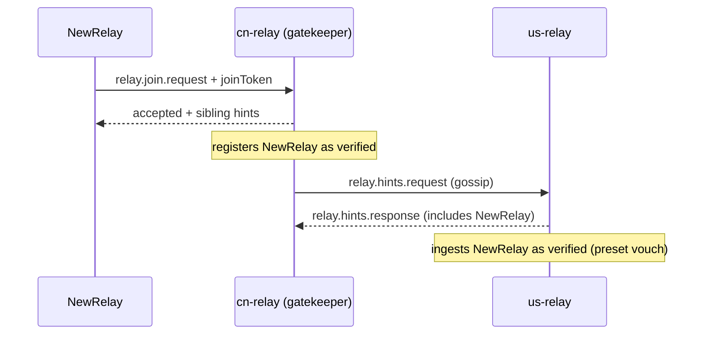

# Community relay gated join (Phase 46D)

**Goal:** Only **shipped community preset relays** (`cn-relay`, `us-relay`) may admit new relays into the **verified** sibling book. Private relays, leaf checkin hints, and gossip RTT alone must **not** auto-promote unknown relays.

**Related:** [operator-relay-fleet.md](./operator-relay-fleet.md) · [relay-server-design.md](./relay-server-design.md) Part B · [layered-relay-network.md](./layered-relay-network.md)

---

## Trust model

| Source | Sibling book state | Miss-forward? |
|--------|-------------------|---------------|
| `--bootstrap` seed / repo CN+US merge | **verified** | Yes |
| `relay.join.request` accepted by preset gatekeeper | **verified** | Yes |
| `relay.hints.response` from **community preset** sibling | **verified** (vouched) | Yes |
| Leaf `relay.checkin` hints | **candidate** | No |
| Gossip / hints from non-preset relays | **candidate** | No |
| Successful RTT to a **candidate** | Stays **candidate** | No |

**Community preset relays** are identified by libp2p peer IDs derived from `DEFAULT_ENVOY_COMMUNITY_RELAY_BOOTSTRAP_ADDRS` in `packages/api/src/default-bootstrap.ts`.

---

## Join flow



### Operator steps (new relay)

1. Deploy with public `--advertise-addr` (auto public-mode).
2. Set the **same** join token on the new relay and on **both** preset gatekeepers:
   ```bash
   export ENVOYMESH_RELAY_JOIN_TOKEN='<long-random-secret>'
   ```
3. Restart preset relays (CN + US) so they accept joins.
4. Start the new relay — it sends `relay.join.request` to CN/US on startup.
5. **Client preset updates** (adding the new relay to `cn-relay` / app defaults) remain a **separate release step** — join governs relay-to-relay miss-forward, not end-user bootstrap lists.

### Gatekeeper rules (cn-relay / us-relay)

- Must be a **community preset peer ID** and **public mode**.
- `ENVOYMESH_RELAY_JOIN_TOKEN` must be set (≥ 8 chars); joins rejected if unset.
- Join token compared with **timing-safe** equality.
- Joiner must send matching `relay.relayId` == envelope sender and non-empty `publicAddrs`.

---

## Protocol

Uses existing intents:

| Intent | Direction | Payload |
|--------|-----------|---------|
| `relay.join.request` | relay → preset | `relay`, optional `joinToken`, `knownRelays` |
| `relay.join.response` | preset → relay | `accepted`, `siblings`, `reason?` |

`joinToken` is optional in the schema for backward compatibility; preset gatekeepers require it when `ENVOYMESH_RELAY_JOIN_TOKEN` is configured.

---

## Implementation map

| Area | Path |
|------|------|
| Preset peer IDs | `packages/api/src/default-bootstrap.ts` |
| Join evaluation + outbound client | `apps/relay/src/community-relay-join.ts` |
| Inbound handler | `apps/relay/src/standalone-relay-control.ts` |
| Gossip (no candidate promote) | `apps/relay/src/index.ts` |
| CLI / env | `--relay-join-token`, `ENVOYMESH_RELAY_JOIN_TOKEN` |

---

## What this does **not** do

- Does not add private org relays to the **shipped client preset** automatically.
- Does not replace mutual `--bootstrap` for org fleets (`ENVOYMESH_RELAY_SKIP_COMMUNITY_SIBLINGS=1`).
- Does not implement full hierarchical `relay.join` level assignment (see layered design).

---

## Security notes

- Treat `ENVOYMESH_RELAY_JOIN_TOKEN` like an operator secret (rotate on compromise).
- Preset relays are trust anchors — compromise of a preset + token allows fleet admission.
- Leaf hints remain untrusted by design (Phase 46 B9 poisoned-hint mitigation).
