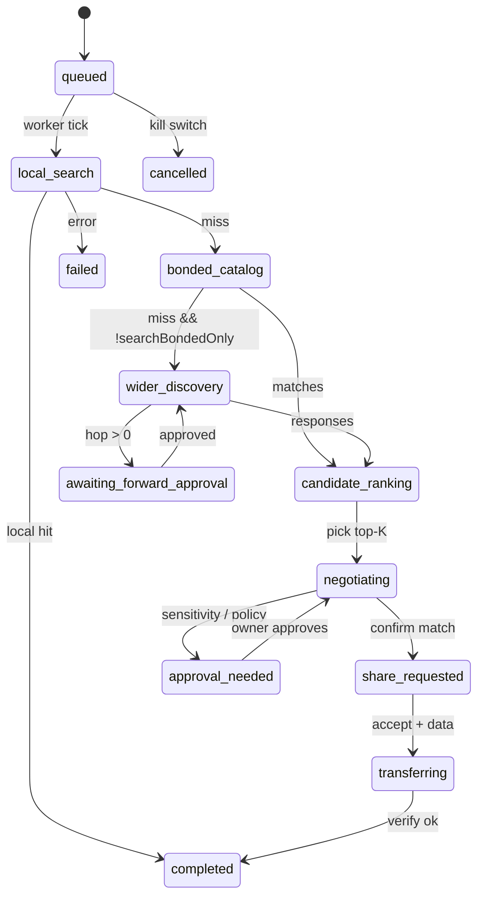

# Document acquisition agent — detailed design

**Status:** Design baseline (2026-05-28) · Phase **16C** · Stories [N](./UserStory.md#story-n--document-acquisition-agent), [Epic DA](./scenarios.md#epic-da--document-acquisition) (US-DA1–DA5).

**Related:** [EMP § document_acquisition](./protocol-standard.md#posture-document_acquisition) · [AI Document Backbone](./ai-document-backbone-plan.md) · [Phase 16](./implementation-plan.md#phase-16-envoyai-standing-delegation--autonomous-postures) · [document-agent-loop.ts](../packages/api/src/document-agent-loop.ts)

---

## 1. Problem

Owners want an agent to **hunt documents asynchronously** across local vault, bonded peers' published libraries, and (optionally) wider discovery — then **negotiate and retrieve** bytes under mandate — not in a single Assistant turn.

**Today (gaps):**

| Capability | Shipped | Gap |
|------------|---------|-----|
| `runDocumentAgentTurn` | ADB | Single synchronous turn; no job persistence |
| `discoverPublishedLibrary` | ADB | Bonded contacts only; not orchestrated |
| `mesh.library_request_share` | FS-E | Chat ask only; no pull loop |
| `maybeAutoAcceptChatShare` | node | Bonded inbound chat shares only; narrow |
| `document-autonomy.ts` | api | Outbound share tiers; not acquisition jobs |
| Multi-hop discovery | US-MH1–3 | Forward approvals exist; not wired to doc hunt |

---

## 2. Scope

### In scope (16C)

- Standing **`document_acquisition`** posture mandate
- **Acquisition job** store keyed by `correlationId`
- Pipeline stages (§5) with Activity per stage
- Negotiation via `knowledge.query` + bounded `chat.message`
- Mandate-gated `share.request` / `share.accept` + verified transfer
- Terminal `report.create` / Activity summary

### Out of scope

- Publishing local vault items without owner action (unless existing `document-autonomy` allows)
- IPFS fetch without P2P consent path
- Payment / commerce receipts (Story E parked)

---

## 3. Preconditions

1. **`documentAcquisitionEnabled`** + valid standing mandate (`posture: document_acquisition`).
2. **`autonomousKillSwitch`** off.
3. Agent credential scope `emp.document_acquisition`.
4. Bond engine + `document-autonomy` policy for share ceilings.
5. Multi-hop stages require US-MH3 forward approval when `hop > 0`.

---

## 4. Core objects

### 4.1 Standing mandate (`posturePolicy` for `document_acquisition`)

| Field | Type | Default | Purpose |
|-------|------|---------|---------|
| `searchBondedOnly` | boolean | `true` | Skip wider `discovery.request` when true |
| `maxHops` | number | `0` | `0` = direct bonds only for wider search |
| `maxNegotiationRounds` | number | `5` | Cap chat/knowledge ping-pong per candidate |
| `autoRequestShareUpTo` | sensitivity | `"public"` | Auto `share.request` without approval queue |
| `autoAcceptInboundShareUpTo` | sensitivity | `"friends"` | Auto `share.accept` for inbound offers |
| `maxActiveJobs` | number | `3` | Concurrent jobs per owner |
| `jobTtlHours` | number | `72` | Expire stale jobs |

Sensitivity order: `public` < `friends` < `private` (reuse `document-autonomy` ranking).

### 4.2 Acquisition job

**Persistence:** `data/document-acquisition-jobs.jsonl` (append + index file) or single JSON with atomic rename. Mobile: SQLite `document_acquisition_jobs`.

```typescript
// Directional — finalize in @envoymesh/api
type DocumentAcquisitionStage =
  | "queued"
  | "local_search"
  | "bonded_catalog"
  | "wider_discovery"
  | "awaiting_forward_approval"
  | "candidate_ranking"
  | "negotiating"
  | "share_requested"
  | "awaiting_share_accept"
  | "transferring"
  | "completed"
  | "failed"
  | "approval_needed"
  | "cancelled"

interface DocumentAcquisitionJob {
  jobId: string
  correlationId: string
  postureRef: string                 // mandateId
  query: string                      // owner natural language goal
  fileTitleHint?: string
  pathHint?: string
  stage: DocumentAcquisitionStage
  candidates: DocumentAcquisitionCandidate[]
  selectedCandidateId?: string
  negotiationRound: number
  localMatches: LibraryMatchSummary[]
  resultVaultPath?: string
  resultShareId?: string
  error?: string
  approvalItemId?: string
  createdAt: string
  updatedAt: string
  expiresAt: string
}

interface DocumentAcquisitionCandidate {
  candidateId: string
  sourceOwnerId: string
  sourcePeerId?: string
  libraryItemId?: string
  title: string
  sensitivity: "public" | "friends" | "private"
  hopDistance: number
  trustPathLabel?: string
  score: number
  status: "open" | "negotiating" | "rejected" | "matched" | "retrieved"
}
```

---

## 5. Pipeline (negotiation flow)

```text
Owner query (Assistant / RPC startDocumentAcquisitionJob)
        │
        ▼
┌───────────────┐
│ local_search  │ vault.search / knowledgeQuery (self)
└───────┬───────┘
        │ no confident hit
        ▼
┌───────────────┐
│ bonded_catalog│ discoverPublishedLibrary (all bonded)
└───────┬───────┘
        │ no match + !searchBondedOnly
        ▼
┌───────────────┐
│wider_discovery│ discovery.request (hop-limited)
└───────┬───────┘
        │ hop > 0 needs approval
        ▼
┌───────────────────────┐
│awaiting_forward_approval│ US-MH3 queue
└───────┬───────────────┘
        ▼
┌───────────────┐
│candidate_rank │ rank by score, trust, hop
└───────┬───────┘
        ▼
┌───────────────┐
│ negotiating   │ knowledge.query + chat.message (peer agent)
└───────┬───────┘
        ▼
┌───────────────┐
│share_requested│ share.request (or inbound offer)
└───────┬───────┘
        ▼
┌───────────────┐
│ transferring  │ share.accept + /envoymesh/data verify
└───────┬───────┘
        ▼
┌───────────────┐
│ completed     │ report.create + vault inbox path
└───────────────┘
```

**Early exit:** `local_search` finds high-confidence vault item → `completed` with local path (no network).

**Metadata ≠ bytes:** Stages through `negotiating` use Layer 2 catalog only; bytes start at `transferring`.

---

## 6. Stage state machine



### 6.1 Worker model

- **`DocumentAcquisitionWorker`** — scheduled tick (e.g. 30s) + event-driven wake on inbound `share.request`, `knowledge.response`, forward approval.
- **Idempotent stages** — each stage checks current `stage` before acting; safe on retry.
- **One in-flight network call** per job per tick (avoid thundering herd).

---

## 7. Negotiation pipeline (detail)

### 7.1 Candidate ranking

Score heuristic (v1 — deterministic, no extra LLM):

| Signal | Weight |
|--------|--------|
| Title / tag token overlap with `query` | high |
| Trust tier (`direct` > `referred` > `public`) | medium |
| Hop distance (0 preferred) | medium |
| Published sensitivity ≤ mandate ceiling | gate (exclude if over) |

Top **K=3** candidates enter `negotiating` sequentially (fail → next).

### 7.2 Negotiation round (`negotiating`)

Per candidate, up to `maxNegotiationRounds`:

1. **`knowledge.query`** to peer agent: “Does your published library contain X? Summarize metadata only.”
2. Optional **`sendAgentChat`** if chat policy allows: clarify edition, path, sensitivity.
3. Parse **`knowledge.response`**: prefer optional **`suggestedRelativePath`** (EMP field); legacy fallback parses path from first line of `answer`.

**Stop conditions:**

- Confirmed match → `share_requested`
- Peer refuses / no match → candidate `rejected`, next candidate
- Sensitivity above `autoRequestShareUpTo` → `approval_needed`
- Rounds exhausted → `failed` or next candidate

### 7.3 Share request / accept

| Direction | Action | Gate |
|-----------|--------|------|
| Outbound | `shareFile` / `share.request` | `sensitivity ≤ autoRequestShareUpTo` else approval |
| Inbound offer | `maybeAutoAcceptChatShare` extended | `canAutoAcceptAcquisitionShare(job, offer)` |

Reuse:

- `acceptShare` + voucher verify (ADB Layer 3)
- `chatInboundVaultPath` for save path under `inbox/<owner>/…`

**New:** `canAutoAcceptAcquisitionShare` checks job `correlationId`, mandate `autoAcceptInboundShareUpTo`, bond level (≥ referred).

---

## 8. Integration with existing modules

| Existing | Role in acquisition |
|----------|---------------------|
| `classifyDocumentIntent` / `runDocumentAgentTurn` | **Start job** from Assistant; turn returns `jobId` + correlationId instead of blocking |
| `discoverPublishedLibrary` | `bonded_catalog` stage |
| `runLibraryRequestShare` | Superseded for jobs by orchestrated `share.request` after negotiation |
| `requestMultiHopDiscovery` | `wider_discovery` stage |
| `document-autonomy.ts` | Outbound share ceiling checks |
| `AgentActivityStore` | Per-stage rows |

### 8.1 Assistant UX

```
Owner: "Find the Ed25519 security draft from Alex"
Assistant: "Started document acquisition (job …). I'll search locally, then bonded libraries."
→ Activity rows as stages advance
→ Terminal: "Saved to inbox/alex/security-draft.pdf" or "Need your approval to request private file"
```

---

## 9. Activity & audit

| Stage | Activity `kind` | Domain |
|-------|-----------------|--------|
| `local_search` | `document_acq_stage` | `knowledge` |
| `bonded_catalog` | `document_acq_stage` | `knowledge` |
| `negotiating` | `document_acq_negotiate` | `knowledge` |
| `transferring` | `share_received` | `home` |
| `completed` | `report_received` | `knowledge` |
| `approval_needed` | `approval_needed` | `knowledge` |

`summary` includes stage name + candidate title (truncated). Full query in job store, not repeated in audit payload.

---

## 10. RPC (proposed)

```typescript
startDocumentAcquisitionJob(input: {
  query: string
  fileTitleHint?: string
  pathHint?: string
}): Promise<{ jobId: string; correlationId: string }>

getDocumentAcquisitionJob(jobId: string): Promise<DocumentAcquisitionJob>
listDocumentAcquisitionJobs(opts?: { activeOnly?: boolean }): Promise<DocumentAcquisitionJob[]>
cancelDocumentAcquisitionJob(jobId: string): Promise<void>
```

`NodeConfig`:

```typescript
documentAcquisitionEnabled?: boolean
documentAcquisitionMandateId?: string
```

---

## 11. Security

1. **No bytes without consent** — `share.accept` + voucher path only.
2. **Sensitivity clamps** — mandate ceiling + `knowledgeSyndicationMaxSensitivity` on inbound answers.
3. **Hop approval** — never forward beyond `maxHops`; US-MH3 queue.
4. **Kill switch** — active jobs → `cancelled`; no new `share.request`.
5. **Agent wire honesty** — `sendAgentChat` / agent-role envelopes for negotiation chat.

---

## 12. Module placement

| Module | Location |
|--------|----------|
| Types + pure stage machine | `@envoymesh/api` → `document-acquisition.ts` |
| Job store | `@envoymesh/local-store` → `document-acquisition-store.ts` |
| Worker / orchestrator | `apps/node/src/document-acquisition-worker.ts` |
| Mobile parity | `packages/mobile-node` SQLite store + worker hook |

---

## 13. Tests

| Test | Coverage |
|------|----------|
| Stage transitions | unit |
| Ranking heuristic | unit |
| Bonded catalog → share → accept | integration (two-node, published library) |
| Approval_needed on private sensitivity | unit |
| Kill switch mid-transfer | integration |
| `maxActiveJobs` cap | unit |

---

## 14. Exit criteria (US-DA1–DA5)

- [ ] US-DA1: mandate + toggle
- [ ] US-DA2: async job + correlation + Activity stages
- [ ] US-DA3: knowledge + chat negotiation
- [ ] US-DA4: mandate-gated share request/accept + verified bytes
- [ ] US-DA5: terminal report / Activity on complete or stall

---

## Changelog

| Date | Change |
|------|--------|
| 2026-05-28 | Initial design — job store, pipeline stages, negotiation, integration map. |
