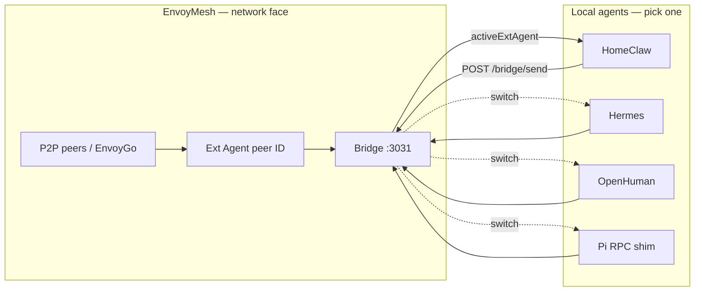
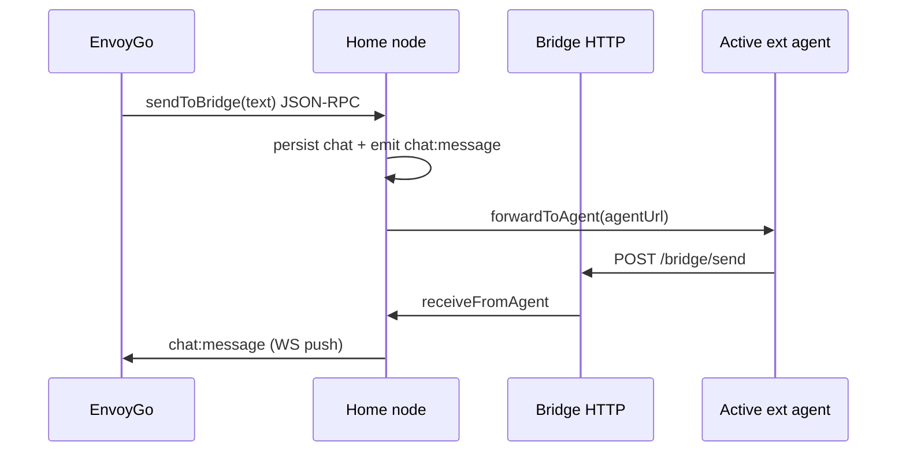

# Ext Agent — Multi-Provider Super Channel

**Status:** Designed (2026-06-24)  
**Implements:** Phase 44 in [implementation-plan.md](./implementation-plan.md)  
**Protocol:** [envoymesh-bridge-protocol.md](./envoymesh-bridge-protocol.md) v1  
**Related:** [agent_bridge_guide.md](./agent_bridge_guide.md), [agent-network-config.md](./agent-network-config.md), [openclaw-agent-bridge-adr.md](./openclaw-agent-bridge-adr.md)

---

## 1. Problem

EnvoyMesh today supports two AI surfaces on the home node:

| Surface | Role | Integration |
|---------|------|-------------|
| **EnvoyAI** (built-in OpenClaw) | Primary assistant on the home node | `/webhook/envoymesh` on the OpenClaw gateway |
| **Ext Agent** (external bridge) | P2P-facing agent peer for bonded contacts & EnvoyGo | HTTP bridge (`apps/node/src/bridge/`) → one `agentUrl` |

HomeClaw works as Ext Agent today. The owner wants **Ext Agent to become a super channel**: install several local agents (HomeClaw, Hermes, OpenHuman, Pi, …), **switch** which one is active, and reach it from **Social**, **EnvoyGo**, and **remote mesh peers** — without those agents speaking libp2p directly.

**Gap:** configuration allows only **one** `agentUrl`; the UI exposes a single URL field; there is no registry, health check, or switch UX.

---

## 2. Vision



**Principles (unchanged from Phase 9K / 9I):**

1. **EnvoyMesh is the only libp2p face** — external agents never hold mesh keys or dial peers directly.
2. **Bridge is a message pipe** — forward chat in, signed `chat.message` out; optional mesh-tool proxy for OpenClaw-class adapters.
3. **One active backend at a time** — one bridge listener, one `agentPeerId`, one resolved `agentUrl` per home node (same as today at runtime).
4. **EnvoyGo / mobile** — unchanged wire path: chat to the bridge agent peer on the home node; switching backend is transparent to the mesh.

---

## 3. Goals & non-goals

### Goals

| ID | Goal |
|----|------|
| G1 | **Multi-agent registry** in config: list installed backends with id, display name, adapter type, URL, optional secret. |
| G2 | **`activeExtAgent`** — select which registry entry the bridge uses; hot-switch without restart where safe. |
| G3 | **Simple config** — one JSON file, sensible defaults, copy-paste examples per provider. |
| G4 | **Settings UI** — dropdown + health hint in `Settings → AI → Ext Agent` (Social); read-only active agent on EnvoyGo. |
| G5 | **Documented adapter contract** — [envoymesh-bridge-protocol.md](./envoymesh-bridge-protocol.md) v1 with adapter profiles. |
| G6 | **Reference shims** for agents without native support (OpenHuman, Pi) in a small `tools/ext-agent-adapters/` or sibling packages. |
| G7 | **Future-agent extensibility** — registry + adapter profiles allow new backends without protocol or mesh changes when they speak v1 chat. |

### Non-goals

| ID | Non-goal |
|----|----------|
| NG1 | **Fan-out to multiple agents** on one inbound message (no “ask HomeClaw and Hermes both”). |
| NG2 | **Replacing EnvoyAI** — built-in OpenClaw stays separate; Ext Agent is the P2P bridge path. |
| NG3 | **Agents calling libp2p** — mesh tools only via `/bridge/execute-tool` (Phase 9I / OpenClaw extension). |
| NG4 | **Cloud-hosted agent SaaS** as first-class — local loopback first; tunnels are operator concern. |
| NG5 | **Pi as general chat product** — Pi is supported via RPC shim for power users; HomeClaw/Hermes are better defaults. |

---

## 4. Extensibility — supporting future agents

HomeClaw, Hermes, OpenHuman, and Pi are **reference backends**, not a closed set. The design separates a **stable wire** from **pluggable adapters**.

### 4.1 Stable wire, pluggable backends

| Layer | Stability | Extensibility |
|-------|-----------|---------------|
| **Bridge Protocol v1** (chat + `/bridge/send`) | Frozen for chat | Optional fields only; v2 only for breaking changes |
| **Adapter profile** (`adapter` field) | Open string | New profiles documented in [envoymesh-bridge-protocol.md §6](./envoymesh-bridge-protocol.md#6-adapter-profiles) |
| **`extAgents[]` registry** | Stable shape | Add entries without home-node code changes |
| **Reference sidecars** | Per-agent | `tools/ext-agent-adapters/<name>/`; not in core |

### 4.2 Registry entry (future-proof)

Each registry item supports agents not yet known at design time:

```json
{
  "id": "my-custom-agent",
  "name": "My Custom Agent",
  "adapter": "envoymesh-message",
  "url": "http://127.0.0.1:8030/message",
  "inboundSecret": "",
  "enabled": true,
  "vendor": "optional-vendor-id",
  "notes": "Operator notes — ignored by runtime"
}
```

| Field | Purpose |
|-------|---------|
| `id` | Stable switch key (`activeExtAgent`); kebab-case, unique |
| `adapter` | Which profile the bridge uses when talking to `url` |
| `vendor` | Optional tag for UI/docs (e.g. `nous-research`, `tinyhumans`) |
| `notes` | Human-only; never sent to mesh or agents |

**Rule for new agents:** if they accept protocol §3.1 and call §4.1, register with `adapter: "envoymesh-message"` — no EnvoyMesh release required. For async mesh or tools, use or extend `openclaw-webhook`.

### 4.3 Adding a new adapter profile

When minimal chat is not enough:

1. Document the profile in [envoymesh-bridge-protocol.md](./envoymesh-bridge-protocol.md) §6.
2. If the bridge must branch (different HTTP paths), add a resolver in `apps/node/src/bridge/adapters/` — **not** per-vendor forks in `pipe.ts`.
3. Ship a reference sidecar or upstream channel module.
4. Add an example row to `bridge-config.multi-agent.example.json`.

### 4.4 Unknown / custom agents

| Scenario | Approach |
|----------|----------|
| HTTP server speaks v1 chat + `/bridge/send` | Register as `envoymesh-message` |
| OpenClaw-compatible gateway + EnvoyMesh plugin | `openclaw-webhook` |
| Proprietary API | Sidecar that translates to v1 (recommended) |
| Agent wants libp2p | **Not supported** — must use bridge |

---

## 5. Adapter profiles (investigation summary)

All backends integrate by implementing **EnvoyMesh Bridge Protocol v1** — see [envoymesh-bridge-protocol.md](./envoymesh-bridge-protocol.md). **The table below lists known examples; any future agent that implements a profile can be registered.**

| Agent | What it is | Native bridge? | Adapter profile | Effort |
|-------|------------|----------------|-----------------|--------|
| **HomeClaw** | Personal agent + Core + channels | **Yes** — `channels/envoymesh` | `envoymesh-message` | None (shipped) |
| **OpenClaw** (via Ext Agent) | Gateway + EnvoyMesh plugin | **Yes** — `OpenClawExtension` | `openclaw-webhook` | Config only |
| **Hermes Agent** | Nous gateway (Telegram, Discord, plugins) | **No** | `envoymesh-message` via **plugin or sidecar** | Medium |
| **OpenHuman** | Tauri desktop harness | **No** — internal JSON-RPC only | Sidecar → `agent.chat` | Medium–high |
| **Pi** | Coding-agent harness (TUI/RPC/SDK) | **No** — not a chat gateway | Sidecar → `pi --mode rpc` | Low (narrow use) |

### 5.1 HomeClaw (reference)

- **Inbound:** `POST http://127.0.0.1:8010/message` — `{ from, fromOwnerId, fromName, text }`
- **Outbound:** `POST http://127.0.0.1:3031/bridge/send` — `{ to, text }`
- **Config:** `HomeClaw/config/core.yml` → `envoymesh:` block

### 5.2 OpenClaw webhook (Ext Agent path)

Same wire as EnvoyAI plugin, different deployment: point `agentUrl` at gateway `/webhook/envoymesh` when using OpenClaw as Ext Agent (not built-in EnvoyAI).

- Supports **async mesh** (`mesh.async_reply`) and **mesh tools** (`/bridge/list-tools`, `/bridge/execute-tool`).
- Profile id: `openclaw-webhook`.

### 5.3 Hermes Agent

- **OpenClaw lineage:** `hermes claw migrate` imports skills/memory; **no** EnvoyMesh code in repo.
- **Webhook platform** (`gateway/platforms/webhook.py`) is for **event triggers** (GitHub PR → agent run → deliver to Telegram). Wrong shape for bidirectional P2P chat.
- **Recommended path:** Hermes **platform plugin** (`~/.hermes/plugins/envoymesh/`) implementing loopback `POST /message` + `/bridge/send`, or a thin Node/Python sidecar using Hermes CLI/API.
- **Not recommended:** reusing generic webhook routes for chat.

### 5.4 OpenHuman

- **Agent API:** internal `agent.chat` / `agent.chat_simple` (Tauri JSON-RPC).
- **Webhooks module:** cloud tunnel → Socket.IO → triage — not a local loopback chat API.
- **Recommended path:** sidecar HTTP server (`POST /message`) that invokes OpenHuman while the desktop app is running; long-term: upstream `envoymesh` channel in `channels/`.

### 5.5 Pi

- **Not a messaging gateway** — coding harness; chat automation is separate (`pi-chat` repo).
- **RPC mode:** JSONL on stdin/stdout — `{ type: "prompt", message }` → events → `get_last_assistant_text`.
- **Recommended path:** `@envoymesh/ext-agent-adapter-pi` sidecar spawning `pi --mode rpc`; document as **coding assistant** backend, not general “My Agent” default.

---

## 6. Configuration design

### 6.1 Schema (Phase 44A)

Extend `bridge-config.json` (validated by `BridgeConfigSchema`):

```json
{
  "enabled": true,
  "listenPort": 3031,
  "secret": "shared-bridge-secret",
  "agentName": "HomeClaw",

  "activeExtAgent": "homeclaw",

  "extAgents": [
    {
      "id": "homeclaw",
      "name": "HomeClaw",
      "adapter": "envoymesh-message",
      "url": "http://127.0.0.1:8010/message",
      "inboundSecret": "",
      "enabled": true
    },
    {
      "id": "hermes",
      "name": "Hermes",
      "adapter": "envoymesh-message",
      "url": "http://127.0.0.1:8020/message",
      "enabled": true
    },
    {
      "id": "openhuman",
      "name": "OpenHuman",
      "adapter": "envoymesh-message",
      "url": "http://127.0.0.1:8021/message",
      "enabled": false
    },
    {
      "id": "pi",
      "name": "Pi (coding)",
      "adapter": "envoymesh-message",
      "url": "http://127.0.0.1:8022/message",
      "enabled": true
    },
    {
      "id": "openclaw-ext",
      "name": "OpenClaw (Ext)",
      "adapter": "openclaw-webhook",
      "url": "http://127.0.0.1:18789/webhook/envoymesh",
      "inboundSecret": "shared-bridge-secret",
      "enabled": true
    }
  ]
}
```

### 6.2 Resolution rules

1. **`agentUrl`** (legacy single field) — if `activeExtAgent` + `extAgents` present, **derived** from the active entry’s `url`. If absent, legacy `agentUrl` still works (backward compatible).
2. **`activeExtAgent`** — must match an `extAgents[].id` with `enabled: true`. On invalid/missing: fall back to first enabled entry, else disable bridge with clear log.
3. **`agentName`** — display name; defaults to active entry’s `name`.
4. **`secret`** — bridge **outbound** auth for `/bridge/send` (and global inbound to bridge from agents). Per-agent `inboundSecret` overrides what the bridge sends **to** that agent’s `url` when set.
5. **`assistantAgentUrl`** — unchanged; always EnvoyAI built-in OpenClaw path (Phase 32 split).

### 6.3 Operator cheat sheet

| Want | Set |
|------|-----|
| HomeClaw | `activeExtAgent: "homeclaw"`, url `8010/message` |
| Hermes (sidecar on 8020) | `activeExtAgent: "hermes"` |
| OpenHuman sidecar | `activeExtAgent: "openhuman"` |
| Pi coding shim | `activeExtAgent: "pi"` |
| OpenClaw as Ext Agent | `adapter: "openclaw-webhook"`, gateway webhook URL |

Example files: `apps/node/data/default/bridge-config.json`, `bridge-config.openclaw.example.json`, new `bridge-config.multi-agent.example.json`.

---

## 7. Runtime behavior

### 7.1 Inbound (mesh → agent)

Unchanged core path (`forwardToAgent` in `pipe.ts`):

1. Bonded peer sends `chat.message` to **bridge agent peer id**.
2. Bridge POSTs to **resolved** `agentUrl` with v1 chat body.
3. Sync HTTP response body is **ignored** for P2P delivery (duplicate-safe).

Optional Phase 44 enhancement: include `adapter` in bridge logs and `getBridgeStatus()` for UI.

### 7.2 Outbound (agent → mesh)

Unchanged: agent POSTs `{ to, text }` to `http://127.0.0.1:<listenPort>/bridge/send`.

OpenClaw profile additionally uses `/bridge/execute-tool`, `/bridge/list-tools`, and async replies.

### 7.3 Switching active agent

| Action | Behavior |
|--------|----------|
| User selects new agent in UI | Persist `activeExtAgent` (+ optional `agentName`); re-resolve `agentUrl`; optional `GET /status` health probe |
| In-flight request to old agent | Let complete; new messages use new URL (no mid-request migration) |
| New agent down | Bridge logs error; UI shows unhealthy; optional toast in Social |

**No bridge restart required** if only `activeExtAgent` / derived URL changes — `BridgeDeps.config` must be refreshed on config update (Phase 44B).

### 7.4 EnvoyGo (mobile) — access model

EnvoyGo is a **thin client**: it never talks to HomeClaw/Hermes/Pi directly. All Ext Agent traffic goes **phone → home node → active backend**.



#### What already works (no Phase 44 code required for basic chat)

| Capability | Implementation |
|------------|----------------|
| Ext Agent chat thread | `ChatThreadType.externalAgent`, thread id `{nodeId}:external` |
| Send message | `sendAgentMessage(..., agentType: 'external')` → `sendToBridge` RPC |
| Receive reply | Routes on `deliveryChannel: agent` + `deliverySource: bridge` |
| Thread title | `onBridgeStatus()` uses `agentName` + Bridge Online/Offline |
| AI Engine status | `AiEngineSection` calls `getBridgeStatus()` + `getOpenClawStatus()` |
| Pairing | QR may include `agentPeerId` / `agentName` when bridge enabled |

Relevant code: `apps/envoygo/lib/providers/chat_provider.dart`, `node_provider.dart`, `widgets/ai_engine_section.dart`, `services/node_service_client.dart`.

#### What Phase 44 should add (small UI/metadata updates)

| Item | Why |
|------|-----|
| **`BridgeStatus.activeExtAgentId`** + **`adapter`** | Show “Active: Hermes” instead of generic “External Agent Bridge” |
| **Emit `bridge:status` on switch** | Home node must push updated `agentName` when desktop changes `activeExtAgent` so EnvoyGo thread label updates without restart |
| **`AiEngineSection` row** | Display active backend name + adapter profile (read-only) |
| **Optional `listExtAgents` RPC** | Read-only registry for Me → AI Engine (“installed: HomeClaw, Hermes, …”) — **not** required for chat |

#### Explicit non-goals for EnvoyGo

| Non-goal | Rationale |
|----------|-----------|
| Switch active agent from phone | Home node is source of truth; configure on desktop Social |
| Direct libp2p to external agents | Security model — bridge only |
| Separate thread per backend | One Ext Agent thread; backend switch changes personality, not peer id |
| Mesh tools from mobile | Tools run on home node / OpenClaw profile only |

#### Switching backend while EnvoyGo is connected

1. Owner changes `activeExtAgent` on desktop → home re-resolves `agentUrl`.
2. Home calls `setBridgeStatus()` → **`bridge:status` WS push** to EnvoyGo.
3. EnvoyGo `onBridgeStatus()` updates thread display name (e.g. “Hermes (Bridge Online)”).
4. In-flight replies from the old backend may still arrive; new sends use the new URL.

**44B must include step 2** if not already done on config save.

---

## 8. UI design (Social)

Extend `AgentSettings.tsx` (Phase 32):

1. **Active agent** — `<select>` over `extAgents` where `enabled`; saves `activeExtAgent` via `updateNodeConfigPartial` + bridge config merge.
2. **Registry table** — name, adapter badge, URL (read-only or edit mode), enabled checkbox.
3. **Health** — on save/switch, probe `GET {url}` or provider-specific `/status` (HomeClaw exposes `/status`).
4. **Mode chip** — unchanged (`computeAiEngineMode`).

i18n keys under `settings.ai.aiEngine.*` (e.g. `activeAgent`, `adapterProfile`, `agentUnhealthy`).

---

## 9. Security

| Topic | Rule |
|-------|------|
| Bind address | Bridge HTTP stays **`127.0.0.1`** only |
| Secrets | Shared `secret` on `/bridge/send`; optional per-agent `inboundSecret` on webhook POST |
| Authorization | Phase 9I `ExternalAgentGateway.isAuthorized(agentId)` on bridge endpoints |
| DM policy | OpenClaw webhook: `allowedOwnerIds`; HomeClaw: Core user + friend mapping |
| Tool proxy | Only OpenClaw-class adapters should expose mesh tools to the agent |

---

## 10. Implementation phases (see implementation-plan Phase 44)

| Sub-phase | Deliverable |
|-----------|-------------|
| **44A** | Config schema + resolution + example JSON + migration from legacy `agentUrl` |
| **44B** | Runtime hot-resolve `agentUrl` on config change; `getBridgeStatus` extensions |
| **44C** | Social UI: agent picker + registry editor |
| **44D** | EnvoyGo read-only mirror + tests |
| **44E** | Hermes reference sidecar or plugin spec + smoke test |
| **44F** | OpenHuman sidecar spike |
| **44G** | Pi RPC sidecar (optional package) |
| **44H** | Docs + CI smoke matrix (HomeClaw + mock multi-agent switch) |

---

## 11. Success criteria

- Owner can register ≥2 agents in config and switch active backend from Social without editing JSON by hand.
- Remote mesh peer / EnvoyGo sees **same agent peer id**; only backend personality changes.
- **EnvoyGo can chat with Ext Agent today** via `sendToBridge`; Phase 44 only improves labels/status when backend switches.
- HomeClaw continues to work with zero regression (default example unchanged).
- Protocol doc is the single source of truth for third-party adapter authors.
- New agents can be added via registry + adapter profile without a protocol bump when they speak v1 chat.

---

## 12. Open questions

| # | Question | Proposed default |
|---|----------|------------------|
| Q1 | Store registry in `bridge-config.json` only, or also mirror `activeExtAgent` in `node-config.json`? | **Both:** bridge file owns registry; UI toggle writes bridge + `bridgeEnabled` in node config (existing pattern). |
| Q2 | One process spawns all sidecars, or operator starts them? | **Operator starts** sidecars; EnvoyMesh only probes URLs (keeps node lean). |
| Q3 | Separate bridge peer id per backend? | **No** — one `bridge-identity.json` per home node. |
| Q4 | Publish adapters as npm packages or in-repo `tools/`? | **In-repo `tools/ext-agent-adapters/`** first; extract later if needed. |
| Q5 | EnvoyGo switch agents from phone? | **No** — read-only mirror + chat only; desktop configures registry. |

---

## 13. References

| Resource | Location |
|----------|----------|
| Bridge implementation | `apps/node/src/bridge/` |
| HomeClaw channel | `../HomeClaw/channels/envoymesh/channel.py` |
| OpenClaw plugin | `OpenClawExtension/` |
| Phase 32 UI | `apps/social/src/components/views/settings/AgentSettings.tsx` |
| EnvoyGo chat | `apps/envoygo/lib/providers/chat_provider.dart` |
| EnvoyGo AI mirror | `apps/envoygo/lib/widgets/ai_engine_section.dart` |
| Operator guide | [agent_bridge_guide.md](./agent_bridge_guide.md) |
