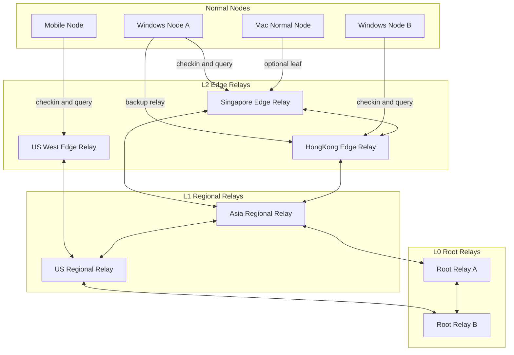
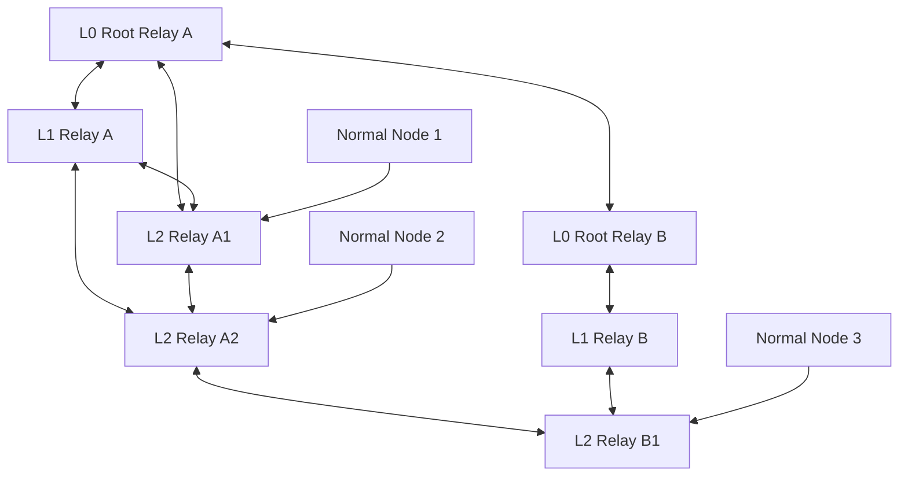
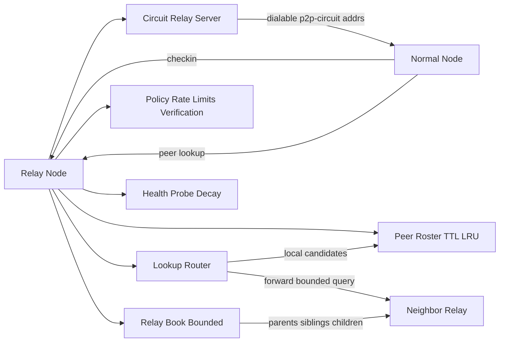
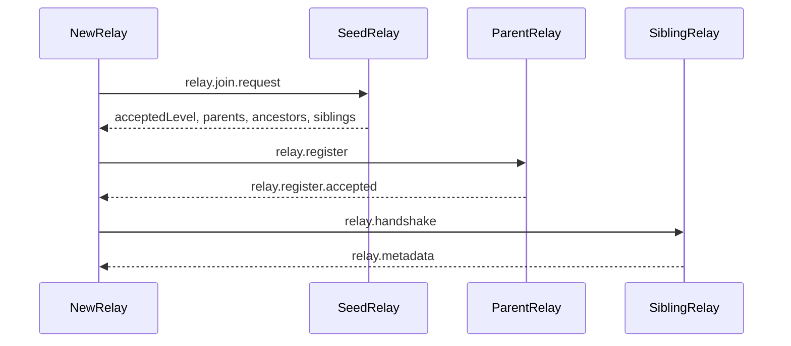
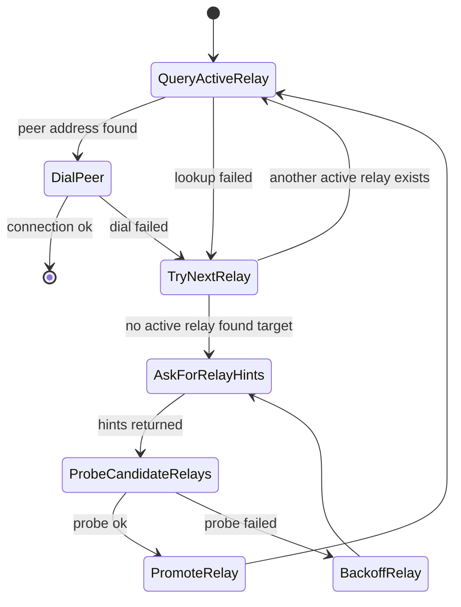
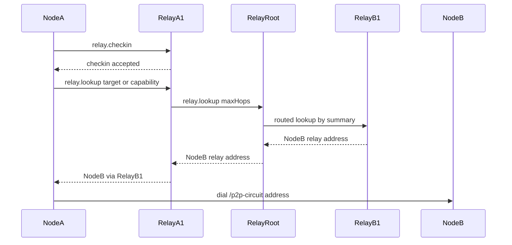

# Layered Relay Network Design

**Related:** [Operator relay fleet](./operator-relay-fleet.md) · [Relay server design (standalone + Phase 46)](./relay-server-design.md) · [P2P discovery](./p2p-discovery.md) · [Implementation plan](./implementation-plan.md)

This document proposes a scalable EnvoyMesh relay-node architecture for WAN discovery, NAT traversal, and peer-to-peer communication. It captures the working direction from local testing: normal nodes can reach a relay, but need relay-mediated address exchange to find and dial each other.

**Near-term implementation** of multi-home clients, one-hop miss-forward, and sibling-list gossip is tracked as **Phase 46** and specified in [relay-server-design.md](./relay-server-design.md). This file remains the longer-horizon join / summary / multi-hop routing design.

## Goals

- Let normal nodes auto-discover other reachable nodes after connecting to one or more relay nodes.
- Let relay nodes work as bounded address switchers, returning dialable `/p2p-circuit` paths.
- Support multiple relay nodes without requiring a full mesh or a single global address book.
- Keep normal nodes simple leaves.
- Keep relay address books bounded with TTL, caps, health checks, and trust policy.
- Provide a path toward global search and anonymous matching without confusing reachability with privacy.

## Non-Goals

- Do not make every normal node a relay server.
- Do not require every relay to know every other relay.
- Do not store normal-node addresses forever.
- Do not treat relay discovery as strong anonymous matching by itself.
- Do not depend only on hard-coded presets beyond initial bootstrap.

## Roles

EnvoyMesh should use the same node software with different enabled roles.

### Normal Node

A normal node is a leaf in the graph.

Responsibilities:

- connect to at least 1 relay for bootstrap, and target 2-3 active relays for healthy WAN mode
- check in periodically
- query relays for peer candidates
- dial returned `/p2p-circuit` addresses
- cache a small bounded address book
- optionally submit known relay candidates as untrusted hints

It should not forward lookup traffic for others, keep a large relay graph, or act as a public relay server by default.

### Relay Node

A relay node is a stable rendezvous and address-switching node.

Responsibilities:

- run libp2p circuit relay server
- maintain a short-lived roster of checked-in normal nodes
- return dialable relay addresses for known peers
- maintain a bounded book of other relay nodes
- introduce relay candidates to normal nodes when local lookup fails
- optionally forward lookup requests to relay neighbors with hop and fanout limits

### Root Or Seed Relay

A root relay is a stable entry point into the relay graph. It is not responsible for knowing every normal node.

Responsibilities:

- help new relays join
- maintain regional or level summaries
- provide bootstrap relay neighbors
- participate in relay graph health and repair

Root relays can be distributed as presets, DNS records, invite payloads, or operator config, but presets only seed the graph; they do not define the whole graph.

## Whole EnvoyMesh Network

EnvoyMesh should separate the relay backbone from normal leaf nodes. Normal nodes attach to relays; relay nodes maintain the graph that makes cross-network discovery possible.



## Graph Shape

Use a layered relay graph, not a fragile strict tree.



The graph is tree-like for organization, but double-linked for resilience:

- child relay knows parent
- parent relay knows child
- lower relay knows at least one ancestor, often a root or regional root
- relay knows a few sibling or nearby relays
- normal nodes connect only as leaves

This means `RelayA1` can know both `RelayA` and `RelayRoot`. If `RelayA` fails, `RelayA1` can still climb through `RelayRoot`.

## Layer Control

Relay levels must be controlled. A relay should not self-promote to a higher layer.

Suggested logical levels:

- `L0`: root or seed relay
- `L1`: regional relay
- `L2`: edge relay
- `L3`: optional local or community relay
- normal nodes: leaves, not relay levels

Layer assignment can evolve in stages:

1. Static config for early deployments.
2. Parent-assigned level during `relay.join`.
3. Operator-signed relay certificate for production.

Hard rules:

- only trusted config or certificate can create `L0`
- `L1` is accepted by `L0`
- `L2` is accepted by `L1`
- child level must be assigning parent level plus one
- ancestor links are backup/routing links, not level-assignment authority
- max depth is fixed, for example 3-4 relay levels
- each relay has `maxChildren`
- overloaded parents redirect new relay candidates

## Relay Address Books

Relays should keep separate books for relays and normal nodes.



```ts
relayBook: relayPeerId -> {
  level,
  region,
  addrs,
  relation, // parent | ancestor | sibling | child | candidate
  state, // seed | candidate | probing | verified | active | stale | removed
  lastVerifiedAt,
  expiresAt,
  failureCount
}

peerRoster: peerId -> {
  relayAddrs,
  ownerId?,
  capabilities?,
  lastSeenAt,
  addrChangedAt?,     // set when peer reconnects with different addresses
  firstSeenAt,        // first check-in time (never resets)
  lastReconnectedAt?, // set when peer returns after >60s offline
  reservationFreshUntil,
  expiresAt
}
```

- `relayBook` is **persisted** to `relay-book.json` and survives relay restarts. Summaries are persisted to `relay-summaries.json`.
- `peerRoster` is **ephemeral** — rebuilt from `relay.checkin` after restart. Peers reconnect and refresh their entries.
- A relay should only return `/p2p-circuit` addresses for peers whose check-in and relay reservation are still fresh.

Suggested caps:

- parents: 1-2
- ancestors: 1-2
- siblings or nearby relays: 3-8
- children: capacity-based, often 20-100
- candidates: temporary cap, for example 100
- normal-node roster: capacity-based with TTL and LRU

## Relay Protocol Primitives

Do not use one broad “give me peers” request as the long-term protocol. Split relay behavior into explicit messages so implementation can enforce TTL, caps, and policy at each step.

| Intent | Sender | Purpose |
| --- | --- | --- |
| `relay.checkin` | normal node → relay | Refresh leaf presence, relay reservation freshness, optional capabilities, and relay hints. |
| `relay.lookup` | normal node or relay → relay | Ask for bounded peer candidates by peer ID, owner ID, capability, or topic. |
| `relay.hints.request` | normal node → relay | Ask for alternative relay candidates when lookup or dial fails. |
| `relay.join.request` | relay → relay | Ask to join the relay graph as a relay node. |
| `relay.register` | relay → assigned neighbor | Establish parent, ancestor, sibling, or child relation. |
| `relay.summary` | relay → relay | Exchange bounded routing summaries, not full normal-node rosters. |

`relay.peers.request` can remain a development/debug shortcut, but production discovery should move to `relay.checkin` plus `relay.lookup`.

### Check-In Contract

`relay.checkin` should include:

```ts
{
  peerId,
  ownerId?,
  relayReachableAddrs,
  capabilities?,
  relayHints?,
  expiresAt,
  signature
}
```

The relay must verify:

- the message is signed by the checking-in peer
- the peer can be reached through this relay, or has a fresh relay reservation
- `expiresAt` is within allowed TTL
- advertised capabilities are acceptable under local policy

The relay should not return a normal node in lookup results after `expiresAt` or `reservationFreshUntil`.

### Lookup Contract

`relay.lookup` should be filter-based and bounded:

```ts
{
  queryId,
  targetPeerId?,
  targetOwnerId?,
  capability?,
  topicHash?,
  maxResults,
  maxHops,
  visibilityScope,
  expiresAt,
  signature
}
```

Responses should include:

```ts
{
  queryId,
  peers,
  relayHints,
  truncated,
  policy,
  expiresAt
}
```

Every response must be capped, deduped, and policy-filtered before returning to the requester.

## New Relay Join Flow

A new relay may start with an almost empty address book. It only needs one entry point.



Join request should include:

- relay peer ID
- public relay multiaddrs
- region or locality hint
- capacity and expected uptime
- desired level
- operator signature if available
- known relay hints, if any

The contacted seed or parent returns assigned neighbors:

- accepted level
- parents
- ancestors
- siblings
- candidate relays
- child limit
- graph epoch or version

The new relay probes returned relays and only promotes verified relays into `relayBook`.

## Relay Routing Summaries

Relay-to-relay lookup cannot depend on flooding the whole graph, and root relays should not store every normal node. Relays need compact routing summaries.

Each relay periodically advertises a `relay.summary` to selected neighbors:

```ts
{
  relayId,
  level,
  region,
  childRelayCount,
  livePeerCount,
  capabilityBloom?,
  topicBuckets?,
  graphEpoch,
  expiresAt,
  signature
}
```

Summaries are hints for routing, not authoritative peer records. A relay may use them to choose which neighbor to ask next, but the relay that owns the fresh `peerRoster` must produce the final peer candidate. Relay summaries must not include owner-derived buckets in the base protocol; owner-based lookup should use direct, policy-authorized lookup paths rather than global owner summaries.

Routing rules:

- prefer local roster first
- prefer sibling or nearby relays for same-region queries
- climb to parent or ancestor when local and sibling routes do not match
- descend only through relays whose summary suggests likely matches
- never forward without decrementing `maxHops`
- never forward to more than `maxFanout` neighbors per hop
- cache negative results briefly to avoid repeated misses
- dedupe by `queryId` to avoid loops

This keeps “connect to one relay and discover the graph” possible without turning every lookup into global broadcast.

Implemented routing behavior:

- `apps/node/src/relay-lookup-router.ts` makes relay-to-relay forwarding decisions from the local relay book plus fresh `relay.summary` state.
- Local roster lookup is always attempted before forwarding.
- Forwarding is bounded by `maxHops` and `maxFanout`; forwarded requests preserve `queryId` and decrement `maxHops`.
- Router selection prefers summaries that match `capability` or `topicHash`, then falls back to nearby/sibling, parent/ancestor, child, and candidate relations.
- Relays keep an in-memory seen-query cache to suppress duplicate `queryId` loops and a short negative cache to avoid repeatedly forwarding the same miss to the same neighbor.
- Responses from selected neighbors are merged, deduped, capped by `maxResults`, and returned with relay hints.

Future hardening remains focused on graph-health diagnostics, signed summary verification policy, richer region scoring, and heavier multi-process libp2p smoke tests.

## Relay Manager Interface

Each relay should expose a local operator management surface separate from the public relay graph protocol. The first implemented manager surface is read-only and local by default:

- the relay runtime periodically writes a `relay.manager.snapshot` audit trace into the local profile
- `relay-status` in the developer CLI reads the latest snapshot and can print text or JSON
- the desktop dashboard includes a Relay Manager panel backed by the same snapshot
- the manager shows relay identity, listen addresses, roster counts, relay-book neighbors, summaries, health status, recovery counters, routing metrics, recent relay traces, and warnings

This is intentionally not a public admin API. A future live admin endpoint should bind to `127.0.0.1` or OS-local IPC, require explicit enablement, and use an operator token or signed owner/admin envelope before allowing actions such as probe, mark-stale, or graph repair.

Relay health is layered with external supervision. The node emits `relay.health.*` audit traces, attempts bounded soft repairs such as neighbor reprobes and summary refresh, records unhealthy restart requests, and exits non-zero only for critical states that should be handled by `launchd`, `systemd`, Windows service managers, Docker, or Kubernetes. Production supervisor examples live in [relay-supervisor-recipes](./relay-supervisor-recipes.md).

### Relay State Persistence

Relay book and summaries are persisted to the profile directory so the relay graph structure survives restarts:

- `relay-book.json` — neighbor relay records (addresses, level, relation, state, failure count)
- `relay-summaries.json` — received relay summaries (level, region, peer counts, topic buckets)

Both are loaded on startup so relay-to-relail routing state is restored. Peer roster entries are **not** persisted (ephemeral by design — peers re-checkin on startup).

## Normal Node Relay Strategy

Normal nodes treat relays as replaceable access points.



Local relay state:

```ts
activeRelays: 2-3
candidateRelays: up to 20
failedRelays: backoff list
```

When lookup or dial fails:

1. retry another active relay
2. ask current relay for relay hints
3. probe candidate relays
4. promote good candidates
5. back off failed relays

Relay responses can include peer results and relay hints:

```ts
{
  peers: [
    { peerId, multiaddrs, viaRelayId }
  ],
  relayHints: [
    { relayId, level, region, multiaddrs, scoreHint }
  ]
}
```

This lets a relay say: “I do not know the target, but try these relays.”

## Peer Lookup Flow

For normal peer discovery:



Lookup must be bounded:

- `maxHops`: for example 3-6
- `maxFanout`: for example 2-3 relays per hop
- `maxResults`: for example 20-50
- request TTL
- dedupe by query ID
- rate limit per requester

Relays should not broadcast every query to the whole graph.

## Visibility And Privacy Policy

Policy is part of discovery from Phase 1, not a later add-on. A relay must decide whether a requester is allowed to see each candidate before returning it.

Suggested visibility levels:

- `public`: visible to any requester allowed by abuse controls
- `capability`: visible only for specific capability/topic queries
- `bonded`: visible only to paired/trusted owners or devices
- `private`: not returned by relay lookup; only reachable by explicit invite or direct address

Check-in should declare intended visibility per capability or advertisement. Relay policy may further restrict it.

Examples:

```ts
{
  defaultVisibility: "bonded",
  advertisements: [
    { capability: "mesh.discovery", visibility: "public" },
    { capability: "file.search", visibility: "capability" }
  ]
}
```

Minimum policy rules:

- never return blocked peers
- do not return private advertisements
- apply trust or owner filters before returning bonded candidates
- cap public/capability results aggressively
- avoid returning stable owner identity for anonymous or exploratory queries
- log policy denials as audit/debug events without leaking denied candidates to the requester

## Auto-Discovery And Communication Evaluation

This design solves the current P2P reachability problem if implemented with real relay address exchange.

It solves:

- Windows A and Windows B both connect to Mac relay but cannot discover each other.
- Relay tracks checked-in normal nodes.
- Relay returns dialable `/p2p-circuit` addresses for other checked-in nodes.
- Normal nodes dial those returned addresses.
- Multiple relays can be queried and merged locally.
- A node can switch relays if the current relay cannot find or reach the target.

It improves auto-discovery because a normal node no longer needs to rely on LAN mDNS, direct TCP reachability, or DHT peer ID discovery alone. It can learn dialable relay paths from a relay graph.

It improves P2P communication because once a relay address is returned, EnvoyMesh can open normal libp2p streams and send signed EMP envelopes over existing protocols. The relay coordinates reachability; application messages remain end-to-end verified by EnvoyMesh protocol rules.

It does not fully solve strong anonymous matching by itself. Relays can observe requester timing, queried capability, and returned peer candidates unless privacy-specific protocols are layered on top.

## Global Search And Anonymous Matching

The relay graph is the reachability substrate for global search, not the whole privacy solution.

Early global search:

- nodes check in with scoped, visibility-limited capability advertisements
- relays keep short-lived capability hints and compact routing summaries
- requester sends bounded `relay.lookup` with capability or topic filters
- relay returns policy-filtered relay addresses and relay hints
- detailed matching happens peer-to-peer with signed `discovery.request` / `discovery.response`

Privacy-preserving matching should add:

- hashed or bucketed topics
- rotating ephemeral advertisements
- consent before stable identity reveal
- query proxying or relay indirection
- batching or delayed responses for stronger metadata protection
- strict TTL and scope on advertisements

## Avoiding Isolated Nodes

The layered design can isolate nodes if relays are misconfigured or under-connected. Use these rules:

- normal node connects to at least 2 relays when possible
- relay knows parent plus ancestor plus siblings
- relay graph health checks detect partition risk
- relay responses include alternative relay hints
- failed relays decay and are replaced
- lookup retries broaden fanout gradually
- invite links or manual multiaddrs remain fallback paths

For real deployments, the target should be:

- normal node minimum active relays: 1 for bootstrap, 2 for healthy WAN mode
- normal node target active relays: 3
- relay sibling links: 3-8
- relay ancestor links: 1-2

## Security And Abuse Controls

Relay graph inputs are untrusted unless verified.

Normal-node-provided relay hints should enter candidate state only:

```text
candidate -> probing -> verified -> active
```

Reject or downgrade relay candidates when:

- no stable public address
- private/LAN address from an untrusted source
- relay handshake fails
- metadata is unsigned when policy requires signatures
- relay claims a higher level than allowed
- relay exceeds failure or abuse thresholds

Relays should rate limit:

- check-ins
- lookup requests
- relay candidate submissions
- forwarded lookup fanout
- failed dial retries

## Implementation Phases

### Phase 1: Local Relay Roster

- Add `relay.checkin` with TTL, visibility, and relay reservation freshness.
- Relay tracks checked-in normal nodes with TTL.
- Add bounded local `relay.lookup` for local roster peers.
- Relay returns `/p2p-circuit` addresses only for fresh reservations visible to the requester.
- Normal nodes periodically check in to and query configured relays.
- Normal nodes persist and dial returned relay addresses.
- Address books are TTL/LRU bounded.

This solves the immediate “two Windows nodes only discover Mac” problem.

### Phase 2: Multi-Relay Client Behavior

- Normal nodes support multiple active relays.
- Relay responses include `relayHints`.
- Normal nodes fail over and promote relay candidates.
- Discovery status reports active, candidate, and failed relays.

This improves reliability when one relay cannot find the desired peer.

### Phase 3: Relay Join And Relay Book

- Add `relay.join.request`.
- Add signed relay metadata.
- Add parent/sibling/ancestor assignment.
- Add bounded `relayBook` with verification state.
- Add `relay.summary` between verified relay neighbors.

This lets the relay network grow beyond presets.

### Phase 4: Bounded Relay-To-Relay Lookup

- Add forwarded lookup with `maxHops`, `maxFanout`, query ID, and TTL.
- Route using `relay.summary`, not full remote peer rosters.
- Return peer candidates from the relay that owns fresh roster records.
- Add relay graph health and partition diagnostics.

This enables graph-wide discovery without full-mesh relay knowledge.

### Phase 5: Search And Privacy Layer

- Add capability/topic indexes on top of relay reachability.
- Add hashed topics and rotating advertisements.
- Add privacy-preserving query modes.

This moves from reachability toward global search and anonymous matching.

## Recommendation

Adopt a layered relay graph where normal nodes are leaves and relay nodes form a bounded, double-linked hierarchy. Start with local relay roster exchange, then add multi-relay client behavior, then relay join and relay-to-relay lookup.

This design is practical for the current EnvoyMesh codebase because it builds on existing libp2p relay transport, signed EnvoyMesh messages, persisted discovery seeds, and the current relay peer-exchange direction. It avoids infinite address-book growth by making every table TTL-based, capped, and role-specific.
