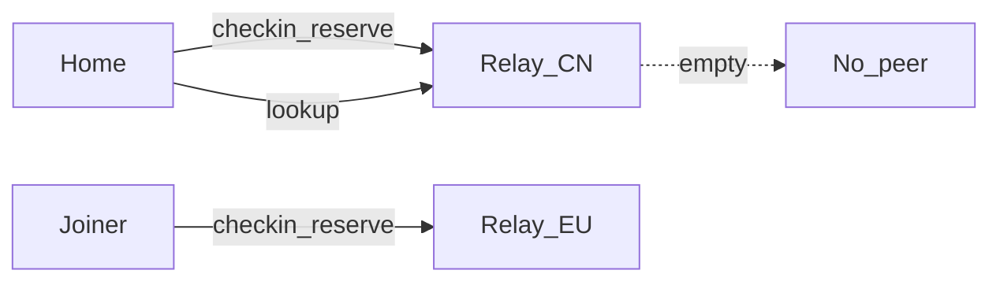
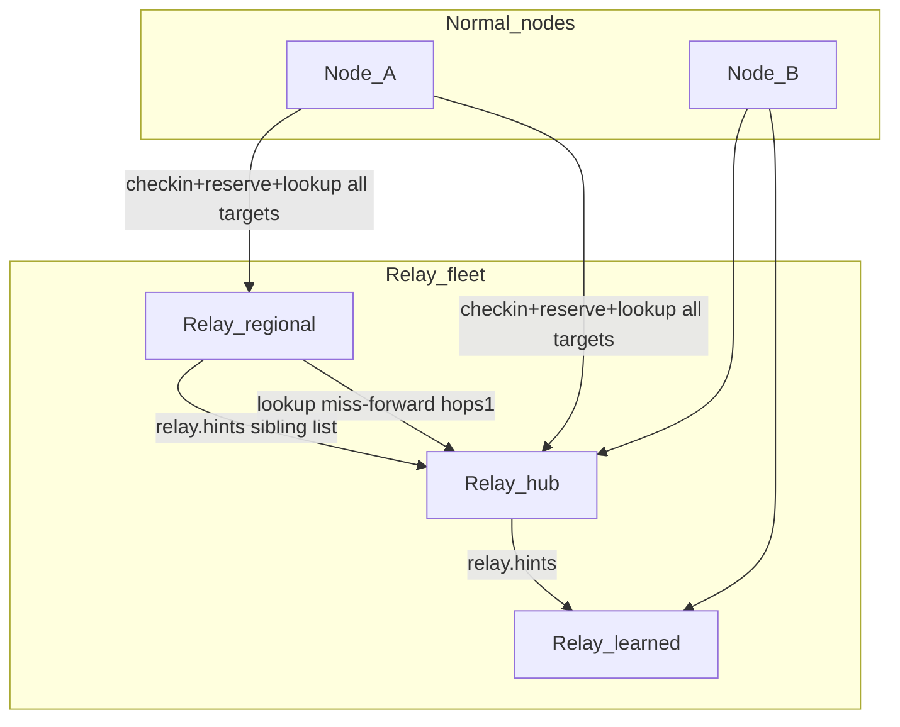
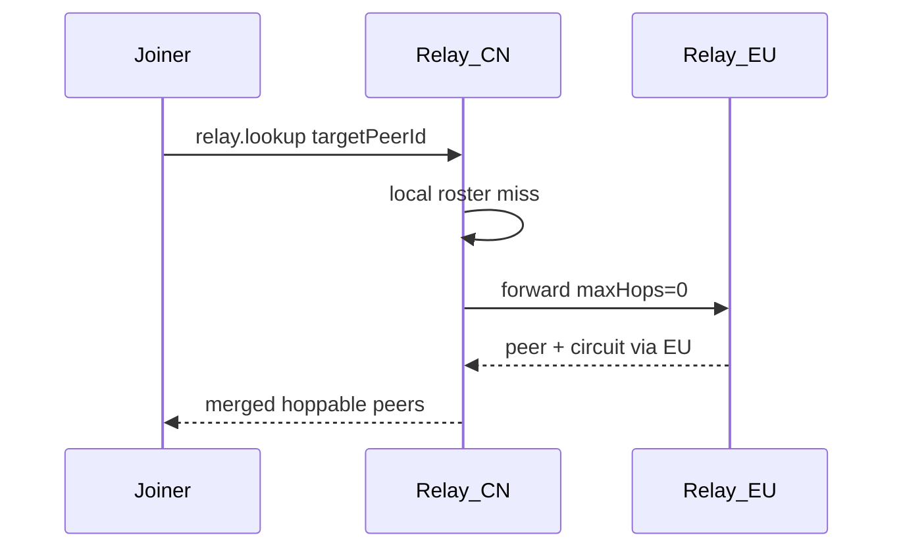
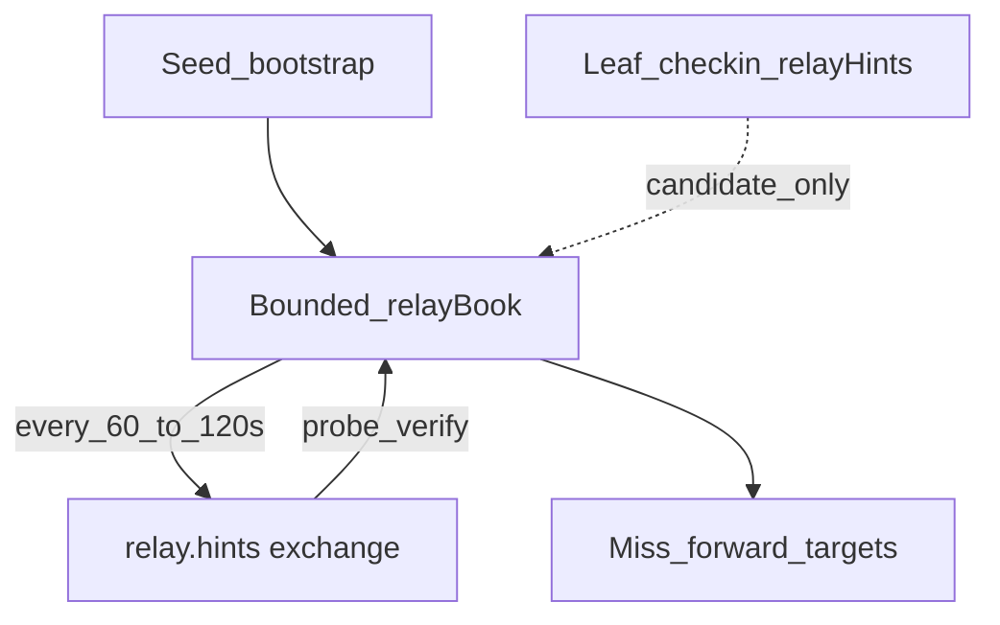

# Relay Server Design

**Status:** Part A shipped; **Part B (Phase 46) shipped** (46A–46C + in-process/process E2E; live dual-relay signoff is operator-gated via `TEST_RELAY_A`/`TEST_RELAY_B`)  
**Audience:** Operators running the relay binary and engineers extending discovery / circuit-relay  
**Related:** [Operator relay fleet](./operator-relay-fleet.md) · [Layered relay network (long-term graph)](./layered-relay-network.md) · [P2P discovery](./p2p-discovery.md) · [Implementation plan Phase 46](./implementation-plan.md#phase-46--multi-relay-fleet-coordination) · [Run relay scripts](./run-relay-scripts.md)

This document is the **dedicated design for the standalone EnvoyMesh relay server**. It covers:

- **Part A** — what `apps/relay` does today (circuit hop, roster, Admin, WebSocket surfaces)
- **Part B** — Phase 46 multi-relay fleet coordination (multi-home clients, one-hop miss-forward, sibling-list gossip)
- **Part C** — how this relates to other docs and the build checklist

It does **not** replace [layered-relay-network.md](./layered-relay-network.md) (longer-horizon join / summary / multi-hop graph) or [operator-relay-fleet.md](./operator-relay-fleet.md) (presets, systemd, **add-Nth-relay runbook**, verification).

**Implementation focus:** Phase 46 (Part B) is **shipped** in-tree. Longer-horizon join/summary remains in [layered-relay-network.md](./layered-relay-network.md).

---

# Part A — Standalone relay (shipped)

## A1. Goals

1. **NAT ↔ NAT reachability** via libp2p circuit-relay-v2 on a public host (`--advertise-addr` → public mode).
2. **Discovery rendezvous** via `relay.checkin` / `relay.lookup` returning **dialable** `/p2p-circuit/` paths only when the relay holds a **live hop** for that peer.
3. **Lean process** — no LLM, no vault, no bonds/chat UI; control intents and hop traffic only.
4. **Operator visibility** — HTTP probes, Admin UI, metrics, health watchdog.
5. **Mobile / thin-client assist** — home tunnel and client-proxy WebSockets so EnvoyGo can reach a home behind NAT via the relay.

## A2. Non-goals (standalone)

- Running agent / vault / Social UI in-process.
- Replicating every checked-in peer to every other relay (global shared roster).
- Treating public libp2p DHT bootstrap peers as EnvoyMesh circuit relays.
- Full hierarchical `relay.join` / `relay.summary` graph (see layered design; Phase 46 is the practical middle).

## A3. Roles

| Role | Binary / package | Responsibility |
|------|------------------|----------------|
| **Standalone relay** | `apps/relay` | Circuit-relay-v2 server, checkin roster, local lookup, Admin HTTP, home tunnel, client-proxy, broadcast/cancel fanout |
| **Normal node (leaf)** | `apps/node` / Tauri / EnvoyGo via home | Checkin + reserve + lookup; dial circuits; home may dial relay tunnel as client |
| **Node-as-relay-server** | `apps/node --relay-server` | Full node + optional relay role; richer **relay book**, miss-forward, `relay.hints*` / `relay.summary` / `relay.join*` (already richer than standalone) |

### Standalone vs node-as-relay (behavior matrix)

| Concern | `apps/relay` | `apps/node --relay-server` |
|---------|--------------|----------------------------|
| Purpose | Dedicated lean hop | Full node + relay role |
| Circuit public presets | `--relay-public-mode` / advertise auto | No first-class public CLI preset (libp2p defaults unless configured) |
| Roster | Checkin roster only | Roster + persisted relay book + summaries |
| Lookup miss-forward | **Yes** (Phase 46B — one-hop to verified siblings) | Yes — `relay-lookup-router.ts` |
| Admin UI | Yes (`/admin`) | No; CLI / audit dashboard instead |
| Home tunnel **server** | Yes (`/ws/home`, `/ws`) | Home is tunnel **client** only |
| Broadcast fanout | Relay fans out `broadcast.request` | Nodes send; matching on nodes |
| Everything else (chat, vault, …) | No | Yes |

---

## A4. Process model & CLI

**Entry points**

- Dev: `npm run relay:dev` → `tsx apps/relay/src/index.ts`
- Prod: `npm run relay:build` → `node apps/relay/dist/index.js`
- Wrapper: [`scripts/run-relay.sh`](../scripts/run-relay.sh) (rebuilds deps, maps common flags)

**Primary args** ([`apps/relay/src/args.ts`](../apps/relay/src/args.ts))

| Flag / env | Default | Notes |
|------------|---------|-------|
| `--profile` / `ENVOYMESH_PROFILE` | `./data/relay` | Stable `libp2p-private.key` |
| `--listen` | `/ip4/0.0.0.0/tcp/4001` | |
| `--advertise-addr` / `ENVOYMESH_ADVERTISE_ADDRS` | (none) | **Auto-enables public mode** unless private opt-out |
| `--bootstrap` / `ENVOYMESH_BOOTSTRAP_PEERS` | (none) | Seed dial peers (Phase 46C: sibling seeds) |
| `--http-port` | `15432` | Probes + Admin + WS upgrade |
| `--relay-public-mode` / `ENVOYMESH_RELAY_PUBLIC_MODE` | off | Community circuit-relay-v2 presets |
| `--relay-private-mode` | — | Opt out of advertise→public auto |
| `--relay-max-reservations` … | null | Per-field overrides |
| `--admin-user` / `--admin-password` | `admin` / `envoymesh123456` | Change before public Admin |
| `--ws-auth-token` | (none) | Gates `/ws/client` only |
| `--no-dht` / `--no-rendezvous` | DHT+rendezvous on | DHT client mode by default |

Mesh construction: `EnvoyMesh({ enableRelayServer: true, enableRelay: true, enableAutoNat: true, enableDcutr: true, dhtClientMode: true, … })`.

Deploy/verify runbook: [operator-relay-fleet.md](./operator-relay-fleet.md) §7.

---

## A5. Circuit-relay-v2 (hop plane)

Public preset (`PUBLIC_RELAY_V2_DEFAULTS` in `args.ts`) vs libp2p private defaults:

| Setting | Private (libp2p defaults) | Public preset |
|---------|---------------------------|---------------|
| `maxReservations` | 15 | **1024** |
| `reservationTtl` | 2 min | **30 min** |
| `defaultDataLimit` | 128 KiB | **4 MiB** |
| `defaultDurationLimit` | 2 min | **60 min** |
| `hopTimeout` | 30 s | **90 s** |
| `maxOutboundStopStreams` | 300 | **1024** |

Advertise bases must be **dialable** from clients (public IP or DNS). Private NIC/loopback bases break circuit dials even when roster checkin succeeds — see [p2p-discovery.md](./p2p-discovery.md#relay-server-dialable-addresses-for-relaylookup-circuit-paths).

---

## A6. Discovery control plane (local roster)

Implementation: [`apps/relay/src/relay-roster.ts`](../apps/relay/src/relay-roster.ts) (ported from node roster **without** relay-book / summary).

| Rule | Value / behavior |
|------|------------------|
| Roster TTL | ~35 min (margin over 30 min public reservation TTL) |
| Roster cap | 10,000 entries |
| Checkin | `relay.checkin` refreshes caps, topicHashes, optional untrusted `relayHints` |
| Lookup | `relay.lookup` → candidates with **live hop only** |
| Circuit addrs | Built from listen/advertise bases via `buildRelayCircuitMultiaddrs` |

### Dialability rules (product)

1. Roster presence (`expiresAt`) ≠ dialable hop.
2. Live reservation (or `reservationFreshUntil` when no live callback) gates inclusion.
3. Lookup **omits** peers without a live hop (avoids “found but can’t dial”).
4. Clients should store circuit multiaddrs in discovery seeds only when `hasHopSlot !== false`.
5. Admin roster may still list checkin-only peers for operators.

Exact `targetPeerId` / `targetOwnerId` visibility: public when public ad **or** `mesh.discovery` capability — see operator fleet privacy note.

---

## A7. HTTP surface

Default port **15432** (`--http-port`).

Admin credentials default to `admin` / `envoymesh123456` (CLI + env). **When credentials are configured (including those defaults),** sensitive JSON paths require HTTP Basic Auth — same as Admin. Only `/health` stays open for probes. See [run-relay-scripts.md](./run-relay-scripts.md) Security note.

| Path | Auth | Purpose |
|------|------|---------|
| `/health` | none | Liveness |
| `/info`, `/version`, `/protocols` | Basic Auth when admin creds set | Identity / build / protocol report (`relay-version.ts`; `/version` may include live metrics) |
| `/reservations`, `/reservations/inspect` | Basic Auth when admin creds set | Reservation counts / inspect |
| `/admin/`, `/admin/api/*` | Basic Auth (required; fail-closed if creds unset) | Status, peers, reservations, roster, metrics, logs, restart |

Admin routes ([`admin-http.ts`](../apps/relay/src/admin-http.ts)): `status`, `reservations`, `peers`, `roster`, `metrics`, `logs`, `logs/clear`, `restart`.

Example peer-id discovery (needed when adding a sibling):

```bash
curl -sf -u "$ENVOYMESH_RELAY_ADMIN_USER:$ENVOYMESH_RELAY_ADMIN_PASSWORD" \
  http://127.0.0.1:15432/info
# → { "peerId": "12D3…", "addrs": ["/ip4/…/tcp/4001/p2p/12D3…", …] }
```

---

## A8. WebSocket surface

Upgrade on the same HTTP server:

| Path | Role |
|------|------|
| `/ws/home` | Home node outbound tunnel claim ([`home-tunnel-proxy.ts`](../apps/relay/src/home-tunnel-proxy.ts)) |
| `/ws?target=&token=` | Mobile / thin client → home via tunnel |
| `/ws` (client-proxy) | Fallback: relay dials home `CLIENT_PROXY_PROTOCOL` |
| `/ws/client` | Direct envelope path (checkin + rendezvous); optional `--ws-auth-token` |

Caps (abuse bounds in `index.ts`): home tunnels ≤ 200; direct clients ≤ 200; proxy 50 total / 10 per target; frame size limits; envelope size ≤ 1 MiB.

---

## A9. Other control forwards (shipped)

| Intent | Behavior |
|--------|----------|
| `broadcast.request` | Fan out to connected relay peers; TTL decrement; queryId dedupe |
| `task.cancel` | Fan out to `forwardToPeerIds` (signature-preserving); forward cap 100 |

These are **not** leaf-roster replication.

---

## A10. Health, metrics, logs

- **Watchdog** [`relay-health.ts`](../apps/relay/src/relay-health.ts) — event-loop lag / RSS / fatal → libp2p restart or process exit 2
- **Metrics** [`relay-metrics.ts`](../apps/relay/src/relay-metrics.ts) — checkin/lookup counters; Admin + `/version` live block
- **Log buffer** [`relay-log-buffer.ts`](../apps/relay/src/relay-log-buffer.ts) — ring + rotated `relay.log` for Admin

---

## A11. Explicit gaps on standalone today

Still deferred (see layered design / post-46):

- **`relay.summary`** topic blooms / capability routing
- **`relay.join.*`** hierarchy / parent assignment

**Shipped in Phase 46:** bounded relay book, `relay.lookup` one-hop miss-forward, periodic `relay.hints` sibling gossip (Part B).

---

# Part B — Multi-Relay Fleet Coordination (Phase 46)

**Roadmap checklist:** [Implementation plan Phase 46](./implementation-plan.md#phase-46--multi-relay-fleet-coordination)  
**Status:** Shipped (46A–46C + E2E harness). Live dual-relay WAN proof is **operator-gated** (`TEST_RELAY_A` + `TEST_RELAY_B` / `npm run test:e2e:relay:live`) — see [operator-relay-fleet.md](./operator-relay-fleet.md) §8.

## B1. Problem: split checkin / split reservation



Each relay keeps a **local** roster and **local** circuit reservations. Lookup on CN cannot see peers that only reserved on EU. After hop-only lookup, even a CN **checkin** without a CN **reservation** is omitted.

Coordination requires:

- **Overlap on the client** (multi-home), and/or
- **Relay miss-forward** to a sibling that holds the hop, and/or
- **Growing the sibling set** via gossip so forward targets are not only static config.

## B2. Architecture



### B2.1 Phase 46A — Client multi-home

Every leaf uses one shared target set for checkin, lookup, and reservation.

```ts
collectRelayControlTargets({
  bootstrapPeers,
  configuredRelays,
  bootstrapPresets,
}): string[]  // EnvoyMesh relays only; exclude bootstrap.libp2p.io; cap ~4
```

Wire into:

- [`relay-client-cycle.ts`](../apps/node/src/relay-client-cycle.ts) (`runRelayClientCycle`)
- [`relay-reservation-health.ts`](../apps/node/src/relay-reservation-health.ts) (`warmAndWatchRelayReservations`)
- NodeService topic / peerId `queryRelayLookup*` paths

**Parallelism:** concurrency 2–3 + per-target time-box (avoid serial 4×30s stalls).

**Ops:** org preset = regional relay(s) **plus** at least one shared hub. Document in [operator-relay-fleet.md](./operator-relay-fleet.md).

### B2.2 Phase 46B — One-hop miss-forward (standalone relay)

When local `relay.lookup` returns fewer peers than `maxResults` and `maxHops > 0`:

1. Select up to `maxFanout` (≤ 2) **verified** siblings from relay book / seed bootstrap.
2. Forward lookup with `maxHops - 1` (same `queryId` for dedupe).
3. Merge with hoppability preference ([`preferRelayPeerCandidate`](../apps/node/src/relay-lookup-merge.ts) or shared helper).
4. Return circuit multiaddrs from the **owning** relay’s advertise bases (`viaRelayId` set).

Client lookups set **`maxHops: 1`** in `queryRelayLookupWithDeps`.



### B2.3 Phase 46C — Sibling-list broadcast (gossip)

Relays exchange **who other relays are** (dial hints), not leaf peer rosters.

**Seed:** `--bootstrap` / `ENVOYMESH_BOOTSTRAP_PEERS` on each relay.  
**Grow:** Periodic `relay.hints.request` / `relay.hints.response`; optional piggyback on lookup responses. For production Nth-relay cutovers prefer mutual `--bootstrap` ([operator §8](./operator-relay-fleet.md#8-adding-a-second-or-nth-relay)) over waiting ~90s gossip.

| Field | Rule |
|-------|------|
| Cap | ~8–16 entries |
| TTL | ~25–35 min |
| Promote | Only after **verify** (successful hints RTT or dial/identify) |
| Forward targets | Verified siblings only |
| Leaf checkin `relayHints` | Untrusted **candidates** only |



**Security:** prefer hints from book/seed peers; cap fanout and book size; never expand beyond protocol `maxHops` / `maxFanout`.

## B3. Data planes (Phase 46)

| Plane | Contents | Sync? |
|-------|----------|-------|
| **Leaf roster** | peerId, caps, topicHashes, expiresAt, reservation freshness | **Local only** |
| **Circuit reservations** | circuit-relay-v2 slots | **Local only** |
| **Sibling / relay hints** | relayId, multiaddrs, optional region/level, TTL | **Gossip + seed** |
| **Lookup answers** | hoppable candidates (+ circuit multiaddrs) | **On demand** (local ∪ one-hop forward) |

## B4. Control intents (Phase 46 usage)

| Intent | Role |
|--------|------|
| `relay.checkin` | Leaf roster refresh; may carry untrusted `relayHints` |
| `relay.lookup` / `relay.lookup.response` | Discovery; miss-forward; optional sibling piggyback |
| `relay.hints.request` / `relay.hints.response` | Sibling-list exchange |
| `relay.summary` | **Not required** for 46 |
| `relay.join.*` / `relay.register` | **Not required** for 46 |

Schemas: `@envoymesh/protocol` (`RelayHintSchema`, etc.).

## B5. Operator model (multi-relay)

**Full sequenced runbook** (peer id → mutual `--bootstrap` → client preset → miss-forward proof): [operator-relay-fleet.md §8](./operator-relay-fleet.md#8-adding-a-second-or-nth-relay).

### Same region (capacity / HA)

- Run 2+ relays with public `--advertise-addr`.
- Put **both** in client presets; seed each relay’s `--bootstrap` with the other (mutual seed preferred over waiting for gossip).

### Multi-region

- One (or more) relays per region + optional global hub.
- Client preset: `[regional, hub]` minimum (cap **4** EnvoyMesh targets total — see B8).
- Relays: bootstrap to hub and/or a small cross-region sibling set.

### Verification

- `/version` → `publicMode: true`, live metrics (Basic Auth when admin creds set).
- Admin: reservations, roster, topicHashes.
- Home Settings: circuit chip **RESERVED** before WAN mint / auto-bond.
- Dual-relay miss-forward: `npm run test:e2e:relay:live` with distinct `TEST_RELAY_A` / `TEST_RELAY_B`.

## B6. Implementation map (Phase 46 code)

| Area | Primary paths |
|------|----------------|
| Standalone relay | `apps/relay/src/index.ts`, `relay-roster.ts` (book + hints), `relay-lookup-router.ts`, `relay-lookup-merge.ts`, `relay-lookup-response-merge.ts`, `standalone-relay-control.ts` |
| Client cycle | `apps/node/src/relay-client-cycle.ts` |
| Reservation / targets | `apps/node/src/relay-reservation-health.ts` (`collectRelayControlTargets`; **serial** `addRelay` in `@envoymesh/network`) |
| Protocol | `@envoymesh/protocol` hints/lookup (reuse) |
| Ops docs | `docs/operator-relay-fleet.md` (§4 presets, §7 systemd, **§8 add Nth**) |

## B7. Success criteria (Phase 46)

1. `[x]` Two nodes with preset `[relay-a, relay-b]` both reserve on both (or shared hub); topic/peerId search + circuit dial succeed (in-process + process E2E).
2. `[x]` Node with only relay-a, peer only on relay-b, relays seeded to each other: lookup with `maxHops: 1` returns b’s circuit (E2E + gated live harness).
3. `[~]` Two relays sharing one seed learn a **third** via verified hints and can forward to it — **manual / deferred** (no dedicated E2E yet; prefer mutual `--bootstrap` for production).
4. `[x]` Client multi-target cycle time-boxed (concurrency 3); multi-relay `addRelay` is **serialized** (parallel RESERVE deadlocks).
5. `[x]` Unit tests for target collection, miss-forward merge, book cap/TTL/verify; two-relay vitest (in-process + process-spawn).

## B8. Open questions (defaults for Phase 46)

1. Exact verify probe: hints RTT only vs identify/stream open? → **hints RTT**
2. Miss-forward when local non-empty but under `maxResults`? → **yes (union underfill)**
3. Cap of 4 client targets vs 2–3 active reservations? → **cap 4; reserve-all-reachable**

## B9. Implementation risks (shipped mitigations)

| Risk | Mitigation |
|------|------------|
| Forward amplification | `maxFanout` ≤ 2, client `maxHops` ≤ 1, queryId dedupe |
| Poisoned leaf hints | Forward only to **verified** book/seed siblings; leaf checkin hints = candidates |
| Parallel multi-relay `addRelay` deadlock | `@envoymesh/network` `requestRelayReservation` **serializes** RESERVE across targets |
| Loopback `--bootstrap` + empty libp2p bootstrap list | Sibling book still seeded from CLI; libp2p Bootstrap service enabled only when filtered list is non-empty |
| Stale sibling addrs | Book TTL (~35 min) + hints RTT verify before promote |
| Scale beyond ~4 client targets | Cap ~4; larger fleets need layered join/summary (deferred) |

---

# Part C — Relation to other docs

| Doc | Role vs this design |
|-----|---------------------|
| [operator-relay-fleet.md](./operator-relay-fleet.md) | **How to run** — presets, systemd, **§8 add Nth relay**, verify + live miss-forward |
| [layered-relay-network.md](./layered-relay-network.md) | **After 46** — join, summary-guided multi-hop, root relays |
| [p2p-discovery.md](./p2p-discovery.md) | Discovery model + dialable advertise bases |
| [implementation-plan.md Phase 46](./implementation-plan.md#phase-46--multi-relay-fleet-coordination) | **Build checklist** for 46A–46C only |
| [run-relay-scripts.md](./run-relay-scripts.md) | Script quick start |

| Layered design theme | Phase 46 stance |
|----------------------|-----------------|
| Local roster | Shipped (Part A) |
| Multi-relay client | **46A** |
| Thin relay book + hints | **46C** (not full join) |
| Summary-guided multi-hop | **Deferred** after 46 |
| Search / privacy layer | Out of scope |

---

## Changelog (this document)

| Date | Change |
|------|--------|
| 2026-07-21 | **Doc hygiene after Phase 46 review.** Fixed stale “live smoke deferred” banners; A7 Basic Auth table; B6 paths; B7#3 demoted to manual; B9 risks (serial `addRelay`, empty bootstrap); link operator §8. |
| 2026-07-21 | **Phase 46 implemented** (46A–46C): client multi-home, miss-forward, sibling hints gossip. |
| 2026-07-21 | Expanded to full standalone relay design: Part A (shipped surface) + Part B (Phase 46) + Part C (doc map). |
| 2026-07-21 | Initial multi-relay fleet draft (now Part B). |
