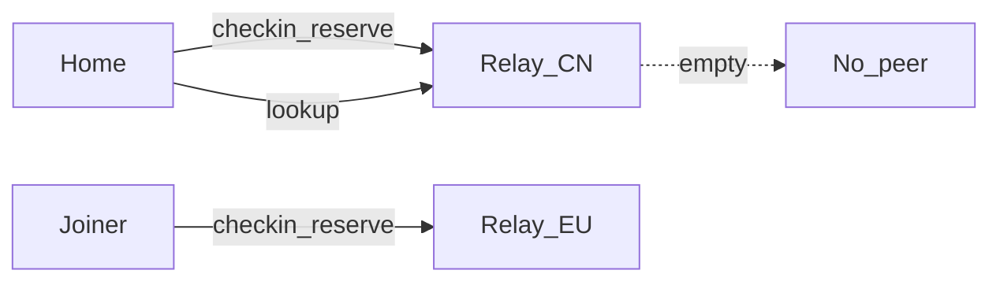
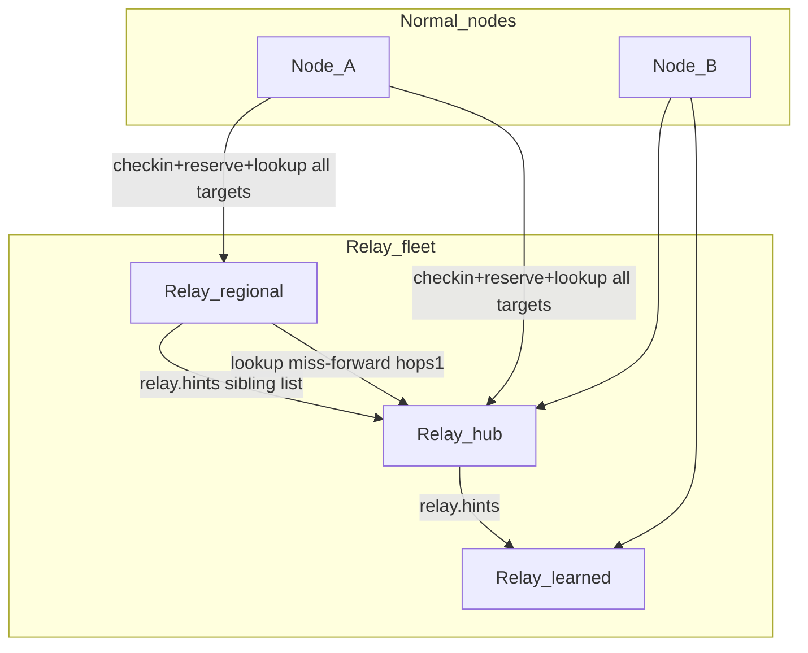
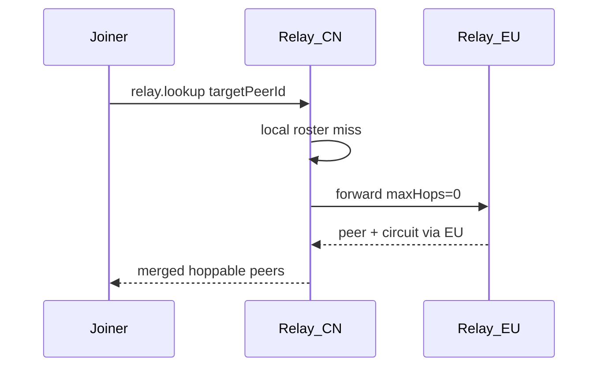
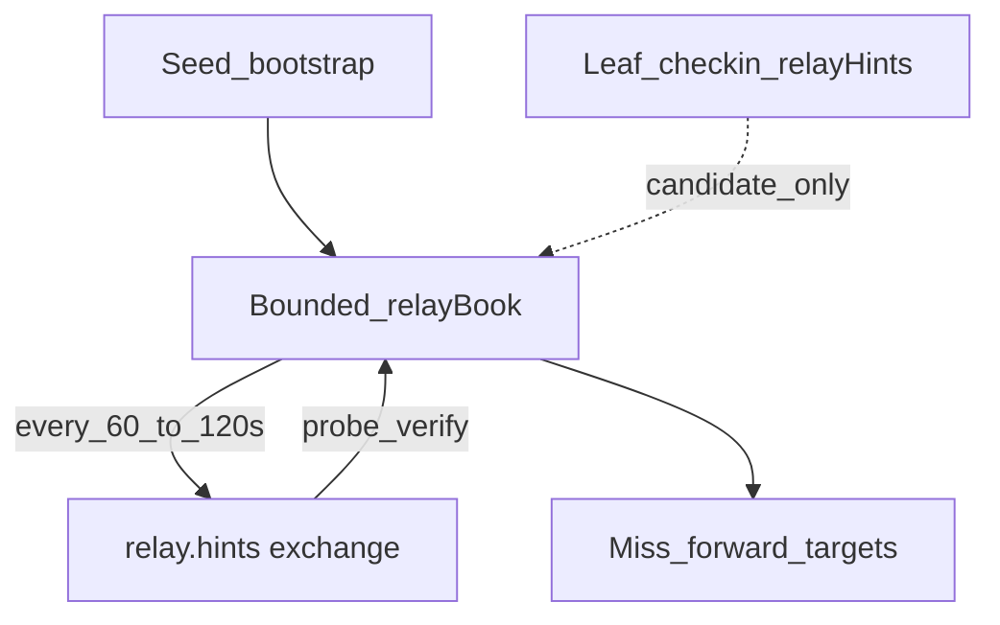

# Relay Server Design — Multi-Relay Fleet Coordination

**Status:** Design for implementation (Phase 46)  
**Audience:** Operators running `apps/relay` and engineers extending discovery / circuit-relay  
**Related:** [Operator relay fleet](./operator-relay-fleet.md) · [Layered relay network (long-term graph)](./layered-relay-network.md) · [P2P discovery](./p2p-discovery.md) · [Implementation plan Phase 46](./implementation-plan.md#phase-46--multi-relay-fleet-coordination)

This document is the **dedicated design for the standalone EnvoyMesh relay server** (`apps/relay`) and how **multiple relays** cooperate with **normal nodes**. It does not replace [layered-relay-network.md](./layered-relay-network.md); that remains the long-horizon parent/sibling/summary architecture. Phase 46 ships the **practical middle**: multi-home clients, one-hop miss-forward, and sibling-list gossip — without full peer-roster replication.

---

## 1. Goals

1. **NAT ↔ NAT reachability** via circuit-relay-v2 on each public relay (`--advertise-addr` → public mode).
2. **Discovery** via `relay.checkin` / `relay.lookup` (topicHash, capability, exact peerId) returning **dialable** `/p2p-circuit/` paths only when the relay holds a **live hop** for that peer.
3. **Multi-relay fleets** (same region or multi-region) where peers that land on different relays can still find each other.
4. **Bounded, efficient** relay↔relay cooperation: exchange **sibling dial hints**, not full leaf rosters.
5. Keep relays **lean**: no LLM, no vault, no private payload inspection beyond control intents.

## 2. Non-goals

- Replicating every checked-in peer to every relay (global shared roster).
- Auto-forming a full hierarchical join graph (`relay.join` parent assignment) in Phase 46 — see layered design for later.
- Treating public libp2p DHT bootstrap peers as EnvoyMesh circuit relays.
- Changing hop-only lookup semantics (undialable / no live reservation ⇒ omit from lookup results).

---

## 3. Roles

| Role | Binary / package | Responsibility |
|------|------------------|----------------|
| **Standalone relay** | `apps/relay` | Circuit-relay-v2 server, checkin roster, lookup, Admin UI, optional sibling book + miss-forward |
| **Normal node (leaf)** | `apps/node` / Tauri / EnvoyGo via home | Checkin + reserve + lookup against **multiple** control targets; dial circuits |
| **Node-as-relay-server** | `apps/node --enable-relay-server` | Richer relay book / forward (existing); Phase 46 focuses on **standalone** parity for miss-forward + hints |

---

## 4. Problem: split checkin / split reservation



Each relay keeps a **local** roster and **local** circuit reservations. Lookup on CN cannot see peers that only reserved on EU. After hop-only lookup, even a CN **checkin** without a CN **reservation** is omitted (not dialable).

Therefore coordination requires either:

- **Overlap on the client** (multi-home), and/or  
- **Relay miss-forward** to a sibling that holds the hop, and/or  
- **Growing the sibling set** via gossip so forward targets are not only static config.

---

## 5. Architecture (Phase 46)



### 5.1 Phase 46A — Client multi-home

**Idea:** Every leaf uses one shared target set for checkin, lookup, and reservation.

**Target collection**

```ts
collectRelayControlTargets({
  bootstrapPeers,
  configuredRelays,
  bootstrapPresets,
}): string[]  // EnvoyMesh relays only; exclude bootstrap.libp2p.io; cap ~4
```

Wire into:

- [`relay-client-cycle.ts`](../apps/node/src/relay-client-cycle.ts) (`runRelayClientCycle`)
- [`relay-reservation-health.ts`](../apps/node/src/relay-reservation-health.ts) (`warmAndWatchRelayReservations`)
- NodeService topic / peerId `queryRelayLookup*` paths

**Parallelism:** Checkin/lookup across targets with concurrency 2–3 and per-target time-box (avoid serial 4×30s stalls).

**Ops:** Org preset = regional relay(s) **plus** at least one shared hub (community or org). Document in [operator-relay-fleet.md](./operator-relay-fleet.md).

### 5.2 Phase 46B — One-hop miss-forward (standalone relay)

When local `relay.lookup` returns fewer peers than `maxResults` and `maxHops > 0`:

1. Select up to `maxFanout` (≤ 2) **verified** siblings from relay book / seed bootstrap.
2. Forward lookup with `maxHops - 1` (same `queryId` for dedupe).
3. Merge responses with hoppability preference ([`preferRelayPeerCandidate`](../apps/node/src/relay-lookup-merge.ts) or shared helper).
4. Return circuit multiaddrs built from the **owning** relay’s advertise bases (`viaRelayId` set).

Client lookups set **`maxHops: 1`** (today often `0` in `queryRelayLookupWithDeps`).



### 5.3 Phase 46C — Sibling-list broadcast (gossip)

**Idea:** Relays exchange **who other relays are** (dial hints), not leaf peer rosters.

**Seed:** `--bootstrap` / `ENVOYMESH_BOOTSTRAP` on each relay (static).  
**Grow:** Periodic `relay.hints.request` / `relay.hints.response` among book members; piggyback samples on lookup responses.

**Bounded relay book (standalone)**

| Field | Rule |
|-------|------|
| Cap | ~8–16 entries |
| TTL | ~25–35 min (align checkin / reservation window) |
| Promote | Only after **verify** (successful hints round-trip or dial/identify) |
| Forward targets | Verified siblings only |
| Leaf checkin `relayHints` | Untrusted **candidates** only — never sole basis for miss-forward |



**Security**

- Prefer hints from peers already in the book or seed list.
- Cap fanout and book size to limit amplification.
- Do not forward lookup payloads that expand beyond protocol `maxHops` / `maxFanout`.

---

## 6. Data planes (what is exchanged)

| Plane | Contents | Sync? |
|-------|----------|-------|
| **Leaf roster** | peerId, caps, topicHashes, expiresAt, reservation freshness | **Local only** |
| **Circuit reservations** | libp2p circuit-relay-v2 slots | **Local only** |
| **Sibling / relay hints** | relayId, multiaddrs, optional region/level, TTL | **Gossip + seed** |
| **Lookup answers** | hoppable `RelayPeerCandidate` (+ circuit multiaddrs) | **On demand** (local ∪ one-hop forward) |

---

## 7. Control intents (existing + usage)

| Intent | Role in Phase 46 |
|--------|------------------|
| `relay.checkin` | Leaf → relay roster refresh; may carry untrusted `relayHints` |
| `relay.lookup` / `relay.lookup.response` | Discovery; miss-forward; response may piggyback sibling hints |
| `relay.hints.request` / `relay.hints.response` | Sibling-list exchange between relays |
| `relay.summary` | **Not required** for 46; reserved for later summary-guided routing |
| `relay.join.*` / `relay.register` | **Not required** for 46; layered graph growth later |

Schemas live in `@envoymesh/protocol` (`RelayHintSchema`, etc.).

---

## 8. Lookup dialability rules (current product)

1. Presence on roster (`expiresAt`) ≠ dialable hop.
2. `hasLiveReservation(peerId)` (or `reservationFreshUntil` fallback when no live callback) gates inclusion.
3. Lookup **omits** peers without a live hop (avoids “found but can’t dial”).
4. Clients store circuit multiaddrs in discovery-seeds only when `hasHopSlot !== false`.
5. Admin UI may still list checkin-only peers for operators (`/admin/api/roster`).

---

## 9. Operator model

### Same region (capacity / HA)

- Run 2+ relays with public `--advertise-addr`.
- Put **both** in client presets; seed each relay’s `--bootstrap` with the other.
- Multi-home + sibling gossip keep discovery resilient if one node only learned one address.

### Multi-region

- One (or more) relays per region + optional global hub.
- Client preset: `[regional, hub]` minimum.
- Relays: bootstrap to hub and/or a small cross-region sibling set so miss-forward can cross regions once.

### Verification

- `/version` → `publicMode: true`, live metrics.
- Admin: reservations, roster, topicHashes.
- Home Settings: circuit chip **RESERVED** before WAN mint / auto-bond.

See [operator-relay-fleet.md](./operator-relay-fleet.md) and [relay-supervisor-recipes.md](./relay-supervisor-recipes.md).

---

## 10. Relation to layered-relay-network.md

| Layered design phase | Phase 46 stance |
|----------------------|-----------------|
| Local roster | Already shipped on `apps/relay` |
| Multi-relay client | **46A** hardens targets + parallel reserve |
| Relay join + book | **46C** = thin book + hints only (not full join) |
| Summary-guided multi-hop lookup | **Deferred** (after 46); miss-forward is `maxHops: 1` only |
| Search / privacy layer | Out of scope |

---

## 11. Implementation map (code)

| Area | Primary paths |
|------|----------------|
| Standalone relay | `apps/relay/src/index.ts`, `relay-roster.ts`, new book/hints helper |
| Client cycle | `apps/node/src/relay-client-cycle.ts` |
| Reservation | `apps/node/src/relay-reservation-health.ts` |
| Merge preference | `apps/node/src/relay-lookup-merge.ts` (share or thin-copy into relay) |
| Protocol | `@envoymesh/protocol` hints/lookup (reuse; bump only if needed) |
| Ops docs | `docs/operator-relay-fleet.md` |

---

## 12. Success criteria

1. Two nodes with preset `[relay-a, relay-b]` both reserve on both (or shared hub); topic/peerId search + circuit dial succeed.
2. Node with only relay-a, peer only on relay-b, relays seeded to each other: lookup with `maxHops: 1` returns b’s circuit.
3. Two relays sharing one seed learn a third via verified hints and can forward to it.
4. Client multi-target cycle does not serialize to multi-minute timeouts (parallel / time-boxed).
5. Unit tests for target collection, miss-forward merge, book cap/TTL/verify; optional two-relay vitest if feasible.

## 13. Open questions

1. Exact verify probe: hints RTT only vs identify/stream open?
2. Should miss-forward run when local results are non-empty but under `maxResults` (union) vs only on total miss?
3. Cap of 4 client targets vs 2–3 active reservations under relay server load?

Defaults for Phase 46: verify via successful `relay.hints` exchange; forward on miss **or** when `peers.length < maxResults`; client target cap 4 with reserve-all-reachable.
