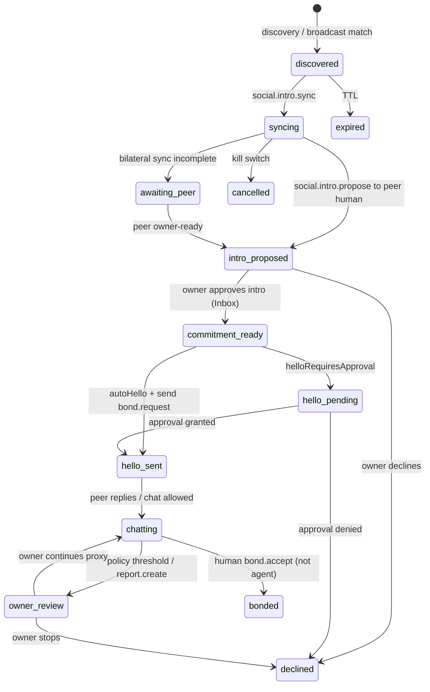

# Social proxy delegation — detailed design

**Status:** Design baseline (2026-05-28) · Phase **16B** · Stories [M](./UserStory.md#story-m--delegated-social-presence), [Epic SP](./scenarios.md#epic-sp--delegated-social-presence) (US-SP1–SP5).

**Related:** [EMP § EnvoyAI](./protocol-standard.md#envoyai-ai-mediated-social-mesh) · [Trust mode](./trust-mode-social-protocol.md) · [Phase 16](./implementation-plan.md#phase-16-envoyai-standing-delegation--autonomous-postures) · [a2a-actor-visibility](./a2a-actor-visibility-plan.md)

---

## 1. Problem

Owners want a **standing social representative**: discover compatible peers, run Trust-mode intros, say hello, and chat before they are online — while **bond commit stays human-only**.

**Today (gaps):**

| Capability | Shipped | Gap |
|------------|---------|-----|
| Trust mode + `social.intro.*` | Phase 12 | Agent cannot complete intro→hello→chat loop alone |
| Friend autopilot | Phase 14A | `runFriendAutopilotPass` only runs `mesh.intro.broadcast_search` |
| `sendHello` + `ownerCommitmentRef` | Phase 12 | Human-driven after Inbox approval; not agent-initiated |
| `sendAgentChat` | Phase 13A | Exists; not wired to standing proxy sessions |
| Inbound agent `bond.request` | Phase 12F | Rejected without `ownerCommitmentRef` |

**Social proxy** unifies these under one **`social_proxy` posture** mandate and a explicit **session state machine**.

---

## 2. Scope

### In scope (16B)

- `NodeConfig.socialProxyEnabled` backed by signed standing mandate
- Per-candidate **proxy session** state machine (below)
- Approval edges: intro commitment, optional hello approval, kill switch
- Activity + audit per transition
- Consolidation path from `friendAutopilotEnabled` (see §8)

### Out of scope

- Delegating `bond.accept` (forbidden in emp/0.1)
- Anonymous / non–Trust-mode discovery without mandate
- LLM-generated biography as signed profile fragments

---

## 3. Preconditions

All autonomous social-proxy actions require:

1. **`socialProxyEnabled`** and valid standing mandate (`posture: social_proxy`, not expired).
2. **`trustModeEnabled`** for `social.intro.*` and intro tools.
3. **`autonomousKillSwitch`** off.
4. Agent credential scope includes `emp.social_proxy`.
5. Rate limits: existing `social-intro-inbound` limits + `posturePolicy.maxNewIntrosPerDay`.

---

## 4. Core objects

### 4.1 Standing mandate (`posturePolicy` for `social_proxy`)

| Field | Type | Default | Purpose |
|-------|------|---------|---------|
| `autoHello` | boolean | `false` | Agent may send `bond.request` when commitment ref exists |
| `autoChatWithPeerAgents` | boolean | `true` | Agent↔agent `chat.message` in pre-bond lane |
| `autoChatWithPeerHumans` | boolean | `false` | Agent→human chat before bond (policy-gated) |
| `maxNewIntrosPerDay` | number | `5` | Cap new sessions entering `intro_proposed` |
| `requireOwnerCommitmentRefOnBondRequest` | boolean | `true` | Aligns with Phase 12 inbound rule |
| `helloRequiresApproval` | boolean | `true` | When true, `bond.request` queues approval even with ref |
| `scheduleIntervalHours` | `0 \| 24 \| 168` | `0` | `0` = manual + event-driven only |

Mandate `requiresApprovalFor` MAY include `bond.request` (approval queue) in addition to `helloRequiresApproval`.

### 4.2 Proxy session

One session per **candidate owner** (or `introCorrelationId` before owner id known).

**Persistence:** `data/social-proxy-sessions.json` (atomic JSON write, mode `0o600`) — same pattern as trust store. Mobile: SQLite table `social_proxy_sessions`.

```typescript
// Directional — finalize in @envoymesh/api
type SocialProxySessionStatus =
  | "discovered"      // candidate seen in discovery/broadcast
  | "syncing"         // social.intro.sync in flight
  | "intro_proposed"  // social.intro.propose sent to owner human
  | "awaiting_peer"   // waiting for counterparty intro / owner-ready
  | "commitment_ready"// ownerCommitmentRef available (local)
  | "hello_pending"   // approval queue for bond.request
  | "hello_sent"      // bond.request emitted
  | "chatting"        // pre-bond chat active
  | "owner_review"    // agent paused; report.create surfaced
  | "bonded"          // terminal: direct/referred bond exists
  | "declined"        // terminal: owner or peer declined
  | "expired"         // terminal: mandate/session TTL
  | "cancelled"       // terminal: kill switch or owner cancel

interface SocialProxySession {
  sessionId: string
  correlationId: string
  postureRef: string              // mandateId
  candidateOwnerId?: string
  candidatePeerId?: string
  introProposalMessageId?: string
  ownerCommitmentRef?: string
  status: SocialProxySessionStatus
  trustPathSummary?: string       // audit-safe label
  lastAgentChatAt?: string
  introCountToday?: number
  createdAt: string
  updatedAt: string
  expiresAt?: string
}
```

---

## 5. State machine



### 5.1 Transition table

| From | Event | Guard | Action | To |
|------|-------|-------|--------|-----|
| `discovered` | `RUN_PASS` | mandate ok, under daily cap | `mesh.intro.sync` or skip if already synced | `syncing` |
| `syncing` | `SYNC_OK` | peer agent responded | `social.intro.propose` to peer **human** | `intro_proposed` |
| `syncing` | `SYNC_DEFER` | — | wait / schedule retry | `awaiting_peer` |
| `intro_proposed` | `OWNER_APPROVE_INTRO` | Inbox `approveSocialIntroCommitment` | store `ownerCommitmentRef` | `commitment_ready` |
| `intro_proposed` | `OWNER_DECLINE` | — | audit deny | `declined` |
| `commitment_ready` | `SEND_HELLO` | `autoHello`, ref present, not `helloRequiresApproval` | `sendHello(..., { introProposalMessageId })` agent role via proxy sender | `hello_sent` |
| `commitment_ready` | `QUEUE_HELLO` | `helloRequiresApproval` | approval queue `bond_request` | `hello_pending` |
| `hello_pending` | `APPROVE_HELLO` | — | `sendHello` with ref | `hello_sent` |
| `hello_sent` | `CHAT_ALLOWED` | policy + posture | `sendAgentChat` | `chatting` |
| `chatting` | `INBOUND_CHAT` | — | verify credential, append thread | `chatting` |
| `chatting` | `ESCALATE` | max rounds / sensitive topic | `report.create` + Activity | `owner_review` |
| `*` | `KILL_SWITCH` | — | cancel outbound, audit | `cancelled` |
| `*` | `BOND_DETECTED` | trust tier upgraded | — | `bonded` |

**Human-only edge:** `bond.accept` is **never** emitted by the proxy runtime. Session moves to `bonded` when inbound/outbound trust store shows requested level accepted via human `sendHello` accept path (existing bond flow).

---

## 6. Approval edges

```text
                    ┌─────────────────────┐
                    │  Owner enables      │
                    │  social_proxy       │
                    │  mandate            │
                    └──────────┬──────────┘
                               │
         ┌─────────────────────┼─────────────────────┐
         ▼                     ▼                     ▼
   [Inbox]              [Approval queue]      [Activity only]
   social.intro         bond_request           discovery pass
   .propose inbound     (optional hello)       chat milestones
         │                     │
         ▼                     ▼
 approveSocialIntro     approvePendingApproval
 Commitment             → sendHello (human
 → ownerCommitmentRef     device key OR
                          executeApprovedAction
                          → sendHello)
```

| Approval type | Queue / surface | Emits | Agent may initiate? |
|---------------|-----------------|-------|---------------------|
| Intro commitment | Inbox `social.intro.propose` | `ownerCommitmentRef` stored | Agent proposes; owner approves |
| Hello (`bond.request`) | Optional `approval_queue` action `bond_request` | `bond.request` with ref + `introCorrelationId` | Agent queues; owner approves unless `autoHello` + no `helloRequiresApproval` |
| Pre-bond chat | Usually none | `chat.message` (`senderRole=agent`) | Yes if `posturePolicy` + bond engine allows stranger/referred chat |
| Bond accept | Chat / Contacts UI | `bond.accept` (`senderRole=human`) | **No** — owner only |

### 6.1 `ownerCommitmentRef` lifecycle

1. Inbound `social.intro.propose` → pending row (`listPendingSocialIntroProposals`).
2. Owner **Approve** → `approveSocialIntroCommitment` assigns ref (existing Phase 12).
3. Proxy session stores ref on `commitment_ready`.
4. Outbound `bond.request` MUST include `ownerCommitmentRef` + `introCorrelationId` when sender is agent (existing `bond-inbound` rule).

**New for 16B:** Agent-initiated hello uses the **same ref** after owner approved **that** intro row — not a synthetic ref.

---

## 7. Runtime architecture

```text
┌──────────────────────────────────────────────────────────────┐
│ SocialProxyScheduler (node index.ts / mobile equivalent)      │
│   - cron: scheduleIntervalHours                              │
│   - event: discovery match, intro WS, kill switch            │
└────────────────────────────┬─────────────────────────────────┘
                             │
┌────────────────────────────▼─────────────────────────────────┐
│ SocialProxyOrchestrator (new: apps/node/src/social-proxy.ts)   │
│   - load mandate, enumerate sessions                           │
│   - transition(session, event)                                 │
│   - delegate sends to NodeServiceImpl                        │
└────────────────────────────┬─────────────────────────────────┘
                             │
     ┌───────────────────────┼───────────────────────┐
     ▼                       ▼                       ▼
 executeTool              sendAgentChat           sendHello
 (mesh.intro.*)            (Phase 13A)             (Phase 12)
 discovery.request         Activity append         bond.request
```

### 7.1 Module placement

| Module | Package / app | Responsibility |
|--------|---------------|----------------|
| `SocialProxySession` types | `@envoymesh/api` | Shared RPC + stores |
| `SocialProxyStore` | `@envoymesh/local-store` | JSON persistence |
| `transitionSocialProxySession` | `@envoymesh/api` | Pure state machine (unit tested) |
| `SocialProxyOrchestrator` | `apps/node/src/social-proxy-orchestrator.ts` | I/O, mandate checks |
| `runSocialProxyPass` | same | One scheduler tick (replaces/extends friend autopilot) |

### 7.2 Send path rules

| Intent | API | `senderRole` | Signer |
|--------|-----|--------------|--------|
| `chat.message` | `sendAgentChat` | `agent` | Agent key + credential |
| `bond.request` | `sendHello` (extended) | `agent` if proxy sends | Agent key + credential + ref |
| `social.intro.*` | `executeTool` | `agent` | Agent key + credential |

**Invariant:** Proxy MUST NOT call `sendChat()` (human role) for automated content.

---

## 8. Migration from friend autopilot

| Today | 16B target |
|-------|------------|
| `friendAutopilotEnabled` | Subsumed by `socialProxyEnabled` + `posturePolicy` |
| `runFriendAutopilotPass` → broadcast only | `runSocialProxyPass` → broadcast + session creation + follow-up transitions |
| Activity `friend_autopilot_pass` | Keep kind for one release; add `social_proxy_transition` rows |

**Compatibility:** If `socialProxyEnabled` is off, keep `friendAutopilotEnabled` behavior unchanged for one release. Settings UI shows migration copy: “Enable Social proxy (recommended)”.

---

## 9. Activity & audit

Each transition appends:

```typescript
{
  kind: "social_proxy_transition",
  domain: "social",
  correlationId: session.correlationId,
  summary: "Social proxy: discovered → syncing (candidate …)",
  remoteOwnerId: session.candidateOwnerId,
  taskId: session.sessionId,
}
```

Digest: count sessions in `chatting` + `hello_sent` per day.

Audit: existing intent audits + `correlationId` = session `correlationId`.

---

## 10. Security

1. **No bond.accept from agent** — hard deny in orchestrator + mandate `disallowedActions`.
2. **Ref required** — orchestrator refuses `SEND_HELLO` without `ownerCommitmentRef` when `requireOwnerCommitmentRefOnBondRequest`.
3. **Trust mode** — `social.intro.*` blocked when `trustModeEnabled` false (existing).
4. **Kill switch** — transitions all non-terminal sessions to `cancelled`; no new passes.
5. **Rate limits** — daily intro cap per owner; reuse `SOCIAL_INTRO_RATE_LIMIT_MAX_PER_PEER`.

---

## 11. RPC / config (proposed)

```typescript
// NodeConfig extensions
socialProxyEnabled?: boolean
socialProxyMandateId?: string
socialProxyLastPassAt?: string

// NodeService (optional v1)
listSocialProxySessions(): Promise<SocialProxySession[]>
runSocialProxyPass(): Promise<{ ok: boolean; error?: string }>
cancelSocialProxySession(sessionId: string): Promise<void>
```

---

## 12. Tests

| Test | Type |
|------|------|
| `transitionSocialProxySession` all edges | unit (`packages/api/test/social-proxy-session.test.ts`) |
| Agent hello without ref rejected | extend `bond-inbound.test.ts` |
| Intro approve → hello → agent chat | integration `social-proxy-flow.test.ts` |
| Kill switch mid-session | unit + integration |
| Two-node smoke extension | optional `smoke:social-proxy` |

---

## 13. Exit criteria (maps to US-SP1–SP5)

- [ ] US-SP1: toggle + mandate validation
- [ ] US-SP2: discovery + intro without manual tool chain
- [ ] US-SP3: agent hello with ref / approval path
- [ ] US-SP4: pre-bond `sendAgentChat` with Activity
- [ ] US-SP5: human-only bond accept; proxy cannot upgrade tier

---

## Changelog

| Date | Change |
|------|--------|
| 2026-05-28 | Initial design — session state machine, approval edges, migration from friend autopilot. |
