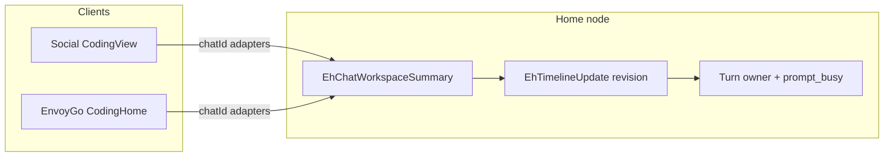

# EnvoyMesh — Dedicated Coding Tab Design

**Status:** Design locked for review — **not implemented** (do not build until explicitly asked to execute)  
**Date:** 2026-09-10  
**Audience:** Product + engineering  

**This file is the single source of truth** for the Coding tab **product + UI/UX design** (Social and EnvoyGo).  

**Implementation checklist (step-by-step status):** [`docs/implementation-plan.md` Phase 68](docs/implementation-plan.md#phase-68--coding-tab-social--envoygo) — flip `[ ]` → `[x]` as each sub-step ships.  

**Cursor working plan (pointer only):** `~/.cursor/plans/coding_tab_implement_84cc6a05.plan.md`

All product decisions from design discussions live here. Update **this** document for design changes; update **Phase 68** for build status.

**Related (context only, not Coding IA):** [product_intro.md](product_intro.md) · Ext Agent presets [`packages/api/src/ext-agent.ts`](packages/api/src/ext-agent.ts)

### Contents

1. [Why this design](#why-this-design) — problem, goals, Paseo website + source
2. [Decisions locked](#0-decisions-locked)
3. [Product thesis](#1-product-thesis) · [Paseo providers](#1b-what-paseo-supports-reference)
4. [Information architecture](#2-information-architecture) — nav order, object/status model
5. [Social UI detail](#3-detailed-ui--social-desktop--tauri)
6. [EnvoyGo UI detail](#3b-detailed-ui--envoygo-flutter)
7. [Shared contract](#3c-shared-contract-both-clients)
8. [Home-link transports](#3d-home-link-transports-envoygo--home-node-only) — IP:port / SSH add-ons
8b. [Paseo UI reference map](#3e-paseo-ui-reference-map-social--envoygo--think-carefully) — Social + EnvoyGo carefully
9. [Provider tiers](#4-provider-tiers-unified-coding-ux)
10. [Boundaries](#5-boundaries) · [Mesh differentiator](#5b-mesh-differentiator-must-not-stay-vapor) · [Backend](#6-backend--data)
11. [Phases](#7-migration-sequence) · [Non-goals](#9-non-goals-v1) · [NFRs](#9b-nfrs--test-plan-design-requirements) · [Success](#10-success-criteria)
12. [Touchpoints](#11-implementation-touchpoints-when-building) · [Review](#12-design-review-notes) · [Open items](#13-open-items-do-not-block-c0-if-0-accepted) · [Checklist](#14-encapsulation-checklist)

---

## Why this design

### The problem in EnvoyMesh today

Coding work is scattered across the wrong surfaces:

- **Chat** hosts a “Coding” section (Pi, Envoy Harness threads) next to people and EnvoyAI — Social [`ChatSidebar.tsx`](apps/social/src/components/views/ChatSidebar.tsx) and EnvoyGo [`chat_list_screen.dart`](apps/envoygo/lib/screens/chat/chat_list_screen.dart).
- **Terminal** also offers Pi / Envoy TUI create paths — Social [`TerminalSidebar.tsx`](apps/social/src/components/terminals/TerminalSidebar.tsx), EnvoyGo [`terminal_create_actions.dart`](apps/envoygo/lib/screens/terminals/terminal_create_actions.dart).
- **Settings / Ext Agent** hold Claude Code, Codex, Cursor, and other CLIs under a different IA.
- Contact chat can bridge Ext Agents again.

Users cannot run a coherent “fix this bug in this repo” loop in one place. Phone and desktop do not share a clear “continue the same coding session” story. Chat becomes noisy; Terminal becomes a junk drawer for coding agents.

### What we want

1. A dedicated **Coding** tab — the home-node control plane for **repo / workspace coding**.
2. **One UI** for every first-class coding harness (adapter changes; chrome does not).
3. **Chat** = people + EnvoyAI (and general assistants). **Terminal** = shell PTY only. **Coding** = Pi, Envoy Harness, Claude Code, Codex, OpenCode, Cursor, DeepSeek harness, …
4. **EnvoyGo** as a thin remote of the **same** home sessions (list → resume), not a second agent runtime.
5. Keep EnvoyMesh strengths: local-first home node, family/coding gates, **Envoy Harness** mesh/review, bonds — not a hosted coding SaaS.

### Why we referenced Paseo

[Paseo](https://www.paseo.sh) is a strong product proof of “daemon on the computer + phone/desktop as remote control for coding agents.” We studied it so EnvoyMesh Coding can match the **patterns that work** (workspace container, status-first session list, resume on mobile, multi-provider switcher, composer tracks, inline permissions) without cloning Paseo’s brand, stack, or entire ACP catalog.

We are **not** building a Paseo fork. We map lessons onto EnvoyMesh’s Social + EnvoyGo + home-node JSON-RPC model.

### Paseo references (website + source)

| Kind | Path / URL |
|------|------------|
| **Product site** | [https://www.paseo.sh](https://www.paseo.sh) |
| **Supported providers (docs)** | [https://www.paseo.sh/docs/supported-providers](https://www.paseo.sh/docs/supported-providers) |
| **Local checkout (sibling of EnvoyMesh)** | [`../paseo`](../paseo) → `/Users/shileipeng/Documents/mygithub/paseo` |
| **Public docs in repo** | [`../paseo/public-docs/`](../paseo/public-docs/) — especially [`supported-providers.md`](../paseo/public-docs/supported-providers.md), [`workspaces.md`](../paseo/public-docs/workspaces.md), [`connectivity.md`](../paseo/public-docs/connectivity.md), [`why.md`](../paseo/public-docs/why.md) |
| **Mobile / desktop app UI** | [`../paseo/packages/app/`](../paseo/packages/app/) — session list, composer tracks, status dots, mobile panels |
| **Daemon / server** | [`../paseo/packages/server/`](../paseo/packages/server/) |
| **Protocol** | [`../paseo/packages/protocol/`](../paseo/packages/protocol/) |
| **Repo README** | [`../paseo/README.md`](../paseo/README.md) |

**Patterns we take from Paseo:** project → workspace → agent session; status-first list; phone opens **existing** home sessions; composer tracks; permission container; harness fixed at create; optional **direct host / Tailscale** for home link (SSH is Desktop/CLI in Paseo — we match that).

**Patterns we keep EnvoyMesh-native:** Envoy Harness + mesh (§5b); Chat vs Coding vs Terminal; family `CODING_GATED_RPC`; phone mesh libp2p; global Terminal for shells only.

Detail on providers and mobile UX continues in §1b, **§3e (Paseo UI reference map)**, and §§3–3b.

---

## 0. Decisions locked

| Decision | Choice |
|----------|--------|
| **Canonical doc** | **This file only** — `product_coding_tab_design.md` encapsulates the full Coding tab design |
| **Implement when** | Design/plan first; **no implementation** until product explicitly asks to execute |
| Ship clients | **Social/desktop (+ Tauri) and EnvoyGo** both get Coding — same IA |
| Chat keeps | **EnvoyAI** (OpenClaw) + human chats only for AI — **no Coding section** on Social **or EnvoyGo** |
| Chat loses | Entire Coding section; Pi and Envoy Harness threads **move into Coding** |
| Terminal stays | **Shell PTY only** (ops, servers, logs, Terminal Agent `/goal`) |
| Terminal loses | **Pi and Envoy Harness** — but **only after** Coding hosts a working replacement (see strip gate below) |
| Coding UI | **One unified chrome** for stream-based harnesses; harness **immutable per session** (switcher is create/draft only) |
| Social nav order | `Social \| Coding \| Knowledge \| Terminal \| Team jobs \| Settings` (copy matches `nav.chains` = “Team jobs”) |
| Social Inbox | **Icon + badge only** (no text label); keep `aria-label` / `title` |
| EnvoyGo nav | **Per-profile visible-tab list** (not index arithmetic). Owner: Social, Coding, Knowledge, Terminal, Me. Family+coding: Chats, Coding, Me. Family−coding: Chats, Me |
| Mobile UX reference | **Paseo** — list/resume ([paseo.sh](https://www.paseo.sh) + [`../paseo`](../paseo)); patterns only unless NOTICE’d Apache-2.0 copy |
| **UI IA — Social** | **Paseo desktop analogue:** three-pane (list \| stream \| Changes) under Coding nav; EnvoyMesh visual language — **§3e** |
| **UI IA — EnvoyGo** | **Keep bottom-nav multi-tab product**; adopt Paseo **only inside** Coding (resume-first list → push session → sheets). Do **not** replace app shell with Paseo three-panel — **§3e** |
| **Code reuse from Paseo** | **No code copy in v1** — patterns/IA only; if later copying Apache-2.0 code, add NOTICE + compliance review |
| Coding engines (first-class) | **Pi, Envoy Harness, Claude Code, Codex, OpenCode, Cursor, DeepSeek = CodeWhale** (`codewhale`) |
| Not Coding engines | HomeClaw / Hermes / OpenHuman; EnvoyAI stays in Chat; Copilot = Tier C later (Paseo built-in, not ACP catalog) |
| Home ↔ phone link | Default relay/LAN/WS; **C1c:** manual `host:port` + document VPN/Tailscale; **SSH = desktop/CLI only** (not EnvoyGo) |
| Phone mesh | Always **libp2p + relay** |
| **IDs** | Home **`chatId` / `sessionId` canonical**; client thread keys are adapters only (`__envoy_harness__:<id>` vs `<nodeId>:eh:<id>`) |
| **Timeline contract** | **Promote** [`EhTimelineUpdate`](packages/api/src/eh-timeline.ts) / `reduceEhTimeline` / revision (generalize naming later); add `sinceRevision` on history fetch |
| **Status UI buckets** | Derive from `EhAgentStateName` + pending permission + `eh:files_changed` (not a parallel enum) |
| **Workspaces** | **Promote** [`EhChatWorkspaceSummary`](packages/api/src/eh-chat-workspace.ts) (+ `projectId` / isolation / status); do not invent a parallel store in C1 |
| **Phone Pi** | No Pi agent timeline today. **C1b:** EH stream under Coding. **Pi:** transitional `sessionKind: tui` **inside Coding** (wrap `ensurePiTerminalSession`) until **C2 Pi timeline** mirrors `eh:*`; then deprecate TUI-in-Coding |
| **Strip gate** | Must not remove Chat/Terminal Pi/EH until Coding can open the same sessions (provisional map + no-orphan + read-only legacy fallback). Live `role: pi\|envoy-harness` PTYs = **C1 blocker** |
| **Turn ownership** | **Home node owns the turn**; cross-client via `eh:prompt_busy` + turn queue (generalize `useEhTurnQueue` / EnvoyGo `EhTurnQueue`); define queue vs interrupt |
| Cap | Keep [`MAX_ENVOY_HARNESS_CHATS = 5`](packages/api/src/eh-chat-workspace.ts) for C1; document; raise later with server-side concurrent-session caps |
| Long tail | Optional later ACP catalog; **not** required to ship Coding tab |

### Scope decisions locked after DeepSeek review (2026-09-10)

| # | Topic | Decision |
|---|--------|----------|
| 1 | Phone Pi | Transitional TUI-in-Coding until C2 Pi timeline; never leave phone with no Pi after Terminal strip |
| 2 | Timeline / workspace | Rebase on EH timeline + `EhChatWorkspaceSummary`; promote, don’t invent |
| 3 | Removal order | Strip Chat/Terminal only with provisional mapping + orphan check + live-PTY migration |
| 4 | §3d transports | EnvoyGo: `host:port` + VPN/Tailscale docs; SSH desktop/CLI only |
| 5 | §3e UI reference | Social ≈ Paseo three-pane (EnvoyMesh skin); EnvoyGo = Paseo patterns inside Coding only; no pixel clone; list-drawer in-session = C4+ |

---

## 1. Product thesis

**Coding is a home-node control plane for repo work** — not a Chat thread and not a generic shell.

| Surface | Job |
|---------|-----|
| **Chat** | People + EnvoyAI (+ optional general Ext Agents: HomeClaw, Hermes, …). **No Pi / EH / coding harnesses here** — on Social **and** EnvoyGo. |
| **Terminal** | Real **shell** PTY for ops and any command. **No Pi / Envoy Harness** entries (those live only in Coding). |
| **Coding** | Task-centric: project → workspace → agent/shell/diff; **all** first-class coding harnesses (including Pi + EH) share one UI; **desktop + EnvoyGo** |

### Why (pain today)

See **Why this design** (top). Summary: coding is split across Chat, Terminal, and Ext Agent settings — this tab consolidates it.

### EnvoyMesh vs Paseo

Take from Paseo: workspace container, status-first list, diff/changes, composer tracks, queue/interrupt, permission container, harness fixed at create, **mobile remote control of home sessions**.

Differentiate:

- **Envoy Harness** mesh/peer-pool/bonds/trust — Paseo has subagents/review orchestration but not Envoy mesh semantics; cash differentiator via §5b
- **Approvals / bonds / family coding gate** (`CODING_GATED_RPC` + family profiles)
- Global Terminal tab for **shells only**

“Better than Paseo” means measurable UX, not a clone:

1. One chrome for every **stream** harness (adapter only) — Pi TUI-in-Coding is a temporary exception
2. Status-first list (derived buckets, not color-only)
3. Diff + permissions without leaving the task
4. Mesh-native EH surfaces (§5b) where other hosts only wrap CLIs
5. EnvoyGo resumes the **same** home `chatId` sessions

---

## 1b. What Paseo supports (reference)

Sources (read at Paseo `d7c7044df` / ~v0.8.0, 2026-09-10): [paseo.sh/docs/supported-providers](https://www.paseo.sh/docs/supported-providers), [`../paseo/public-docs/`](../paseo/public-docs/), [`../paseo/packages/protocol/src/provider-manifest.ts`](../paseo/packages/protocol/src/provider-manifest.ts), ACP catalog metadata (e.g. CodeWhale). Public marketing docs are incomplete — **prefer the protocol manifest + catalog**.

### Paseo — Native (built-in; 6, not 4)

| Id | Notes |
|----|--------|
| `claude` | Claude Code |
| `codex` | OpenAI Codex |
| `copilot` | GitHub Copilot — **built-in**, not ACP catalog |
| `opencode` | OpenCode |
| `pi` | Pi |
| `omp` | Oh My Pi |

### Paseo — ACP catalog

~**38** catalog entries (version-pinned in-repo). **GitHub Copilot is not in the catalog** (built-in). **Aider** is marketing-only, not a first-class catalog ship. DeepSeek-oriented entry: **`codewhale`** — “Terminal coding agent for DeepSeek V4 and open models” (`codewhale serve --acp`).

### EnvoyMesh Coding — target first-class set

| EnvoyMesh Coding harness | Paseo analogue | EnvoyMesh today |
|--------------------------|----------------|-----------------|
| **Envoy Harness** | No mesh/peer-pool/bonds equivalent (Paseo *does* have subagents / review-orchestration — do not overclaim “no review”) | Built-in EH chat + TUI + timeline |
| **Pi** | Native `pi` | Pi TUI + `sendToPi` / proposals; **no** Pi timeline stream yet; `PiChatPanel` is dead |
| **Claude Code** | Native `claude` | Ext Agent `claudecode` `:8024` |
| **Codex** | Native `codex` | Ext Agent `codex` `:8023` |
| **OpenCode** | Native `opencode` | **Add** Coding adapter |
| **Cursor** | ACP: Cursor | Ext Agent `cursor` `:8025` |
| **DeepSeek / CodeWhale** | ACP: `codewhale` | Package/probe CodeWhale; EH may still use DeepSeek **models** |

HEAD Ext Agent presets also include HomeClaw/Hermes/OpenHuman (Chat) and Aider/MMX (Tier C / later) — ports in [`ext-agent.ts`](packages/api/src/ext-agent.ts).

**Harness immutability:** provider is fixed at session **create** (Paseo-compatible). Composer chip does **not** mutate an in-flight session’s harness; it starts/focuses another session. Mode/model may change where the adapter allows.

**Permissions UX:** Paseo stacks a permission **container above the composer**; plan cards can be inline. EnvoyMesh may keep EH docks + optional inline cards — claim “inline” as ours where we diverge.

**Tracks:** “track” concept; pills = Tasks + Subagents; Queue is a composer lane (not a third pill by default).

**Licence:** Paseo is Apache-2.0 — patterns OK; v1 = no code copy (see §0).

---

## 2. Information architecture

### Top navigation

**Social** today ([`Header.tsx`](apps/social/src/components/Header.tsx)): `Social | Terminal | Knowledge | Chains | Settings` (+ Inbox + Profile)  
**Social** target:

```
Social | Coding | Knowledge | Terminal | Team jobs | Settings
```

- **Inbox:** icon only (no visible text label); keep `aria-label` / `title` for accessibility (`nav.inbox`).
- **Profile:** avatar control (unchanged).
- **Team jobs** = existing Chains view (`ViewName "chains"`; `nav.chains` already “Team jobs”).

**EnvoyGo** — use a **per-profile visible-tab list** (do not assume `isOwner ? tab : …` index math in [`home_screen.dart`](apps/envoygo/lib/screens/home_screen.dart)):

| Profile | Tabs (order) |
|---------|----------------|
| Owner | Social, Coding, Knowledge, Terminal, Me |
| Family + `codingEnabled` | Chats, Coding, Me |
| Family − coding | Chats, Me |

Persisted `selectedTab` must map by **tab id**, not raw index, when the list changes.

Add Social `ViewName` `"coding"`. Legacy `"pi"` → Coding (how-to) or Terminal if shell-only CTA. Deep link: **in-page** `CustomEvent` `envoymesh:open-coding` (mirror `OPEN_TERMINAL_EVENT`) — not an OS/`envoy://` intent unless a later platform item adds it.

### Object model

```text
Project (registered folder / git repo on home node)
 └── Workspace (promote EhChatWorkspaceSummary + projectId)
      ├── Agent session(s)   — harness fixed at create; timeline via EhTimeline*
      ├── Task shell (opt.)  — plain PTY cwd = workspace
      ├── Changes / Diff
      └── (later) PR / worktree / mesh invite
```

| Object | Meaning | Persistence note |
|--------|---------|------------------|
| **Project** | Absolute path on home | Unify EH + Ext Agent paths |
| **Workspace** | One task under a project | **Promote** [`EhChatWorkspaceSummary`](packages/api/src/eh-chat-workspace.ts) `{ id: chatId, cwd, title, … }` + `projectId` / `isolation` / derived status |
| **Session** | Runnable unit | Canonical id = **`chatId`** (EH) or future provider session id; Social thread key `__envoy_harness__:<chatId>`; EnvoyGo `<nodeId>:eh:<chatId>` — **adapters only** |
| **Harness profile** | Provider + defaults | Immutable per session after create |

**Isolation:** v1 = `local` only. `worktree` = later.

**C1 list shape:** EH today is a **flat** `EhChatWorkspaceSummary` list (cap 5). Social left rail may **group by cwd/folder basename** as visual “projects” without a separate Project registry until C2. Do not block C1 on a full Project→Workspace DB.

### Status model (UI buckets — derived, not a second enum)

Home truth is [`EhAgentStateName`](packages/api/src/eh-timeline.ts) (11 states). Coding UI **derives** five sidebar buckets (Paseo-style), with an explicit ladder:

| UI bucket | Derive from | Dot / a11y |
|-----------|-------------|------------|
| `needs_input` | `waiting_for_approval` \| `waiting_for_answer` (+ pending permission/question) | Amber + text “Needs you” |
| `failed` | `failed` \| `cancelled` (policy: cancel may map idle) | Red + “Failed” |
| `attention` | turn `completed` + outstanding file changes (`eh:files_changed` / change-set) | Green + “Ready to review” |
| `running` | `submitting` \| `thinking` \| `running_tool` \| `verifying` \| `reconnecting` | Blue + “Working” |
| `done` / quiet | `ready` \| `completed` with no pending review | Muted + “Idle” |

Sidebar sort default: needs_input → failed → attention → running → done. Status must not be color-only (text or icon+label).

Do **not** invent a parallel wire enum.

---

## 3. Detailed UI — Social (desktop / Tauri)

### Nav placement

| Today ([`Header.tsx`](apps/social/src/components/Header.tsx)) | Target |
|--------------------------------------------------------------|--------|
| Social \| Terminal \| Knowledge \| Team jobs \| Settings (+ Inbox w/ label + Profile) | **Social \| Coding \| Knowledge \| Terminal \| Team jobs \| Settings** (+ **Inbox icon-only** + Profile) |

- Add `ViewName = "coding"` in [`App.tsx`](apps/social/src/App.tsx).
- Header button `data-testid="nav-coding"`, label `nav.coding`.
- Order: Coding after Social; **Knowledge before Terminal**; Team jobs (`nav.chains`) after Terminal; Settings last among text tabs.
- **Inbox:** icon + badge only — remove `header-inbox-label`; keep `aria-label` / `title`.
- Deep link: in-page `CustomEvent` `envoymesh:open-coding` (not OS deep link unless later platform work).
- Keep-alive: `codingEverOpened` + hidden slot like Terminal.
- Deep link payload: optional `{ projectId?, workspaceId?, sessionId?, harness?, startNew? }` (mirror [`open-terminal-nav.ts`](apps/social/src/lib/open-terminal-nav.ts)).

### Three-pane layout (default ≥1100px)

```text
┌────────────────┬─────────────────────────────────┬──────────────────┐
│ PROJECTS       │ Workspace header                │ CONTEXT RAIL     │
│                │ title · cwd · status · ⋮        │ Changes / Diff   │
│ ▼ my-app       │─────────────────────────────────│ tree + +/−       │
│   ● fix-login  │ Session tabs                    │                  │
│   ○ refactor   │ [Agent] [Shell] [+]             │ Permissions log  │
│ ▶ other-repo   │─────────────────────────────────│ (EH: EHUI dock)  │
│                │ Timeline / stream               │                  │
│ [+ Project]    │  … messages, tools, cards …     │ Tracks summary   │
│ [+ Workspace]  │─────────────────────────────────│                  │
│                │ Tracks pills (tasks · diff)     │                  │
│                │ Composer                        │                  │
│                │ [harness ▾] [Attach] [Send|Stop]│                  │
└────────────────┴─────────────────────────────────┴──────────────────┘
```

**CSS vocabulary:** reuse `.chat-view` / threads-shell grid (~280px | 1fr | 280px), not a new layout system. Narrow (&lt;1100px): collapse context rail → pills open popovers/sheets. Narrow (&lt;720px): hide project sidebar behind hamburger (same as mobile Social).

### Left rail — Projects / workspaces

| Element | Behavior |
|---------|----------|
| Project group | Collapsible; folder basename; `ProjectFolderLink` for open-in-OS |
| Workspace row | Title, relative time, **status dot** (see §2), harness glyph |
| Sort | Within project (or flat list grouped by cwd): `needs_input` → `failed` → `attention` → `running` → `done` (§2) |
| + Project | [`CodingProjectPickerModal`](apps/social/src/components/CodingProjectPickerModal.tsx) / [`HomeFolderPicker`](apps/social/src/components/HomeFolderPicker.tsx) |
| + Workspace | Title prompt + cwd default = project root; creates workspace + optional first session |
| Row menu | Rename, archive, delete (confirm), “Open shell in Terminal” (plain PTY only — never Pi/EH) |

**Empty left rail:** illustration + “Add a project folder on this computer” → picker.

### Center — Session

| Element | Behavior |
|---------|----------|
| Session tabs | One **Agent** session per harness instance; optional **Shell** tab (PTY cwd = workspace); `+` starts another agent session (cap documented) |
| Timeline | Normalized events (user / assistant / tool / permission / plan / turn_done / error). C1 rehosts [`EhTimelineFeed`](apps/social/src/components/ehui/EhTimelineFeed.tsx) + Pi adapter; later Ext Agent streams |
| Permission / plan cards | Inline in stream + [`EhComposerDockStack`](apps/social/src/components/ehui/EhComposerDockStack.tsx)-style docks above composer |
| Composer | Harness chip (Tier A+B), attachments ([`AgentAttachmentComposerLeading`](apps/social/src/components/AgentAttachmentComposerLeading.tsx)), queue when busy ([`useEhTurnQueue`](apps/social/src/hooks/useEhTurnQueue.ts) generalized), Stop / Interrupt |
| Tracks pills | Tasks · subagents · `+N −M` diff — tap opens rail or popover |

**Harness create (not in-session mutate):** New session / draft flow picks harness. Changing chip mid-workspace **starts or focuses another session** — never mutates the current session’s provider. Outer chrome never swaps. EH-only: EHUI in context rail.

**C1 adapters:** Rehost [`EnvoyHarnessPanel`](apps/social/src/components/views/EnvoyHarnessPanel.tsx). **Pi RPC panel is new** ([`PiChatPanel.tsx`](apps/social/src/components/views/PiChatPanel.tsx) is dead / unwired) — do not call it “rehost.” Until Pi timeline exists, Social may offer Pi as transitional TUI-under-Coding like EnvoyGo.

### Right rail — Context

| Panel | Content |
|-------|---------|
| Changes | File tree + open file / turn review ([`EhTurnReviewModal`](apps/social/src/components/ehui/EhTurnReviewModal.tsx) / split diff) |
| Permissions | Recent allow/deny for this turn |
| EHUI (EH only) | Existing [`EnvoyHarnessEhuiRail`](apps/social/src/components/ehui/EnvoyHarnessEhuiRail.tsx) collapsed into this rail |

### Empty / gated states (Social)

| State | UI |
|-------|-----|
| Family `codingEnabled: false` | Locked empty: “Coding isn’t enabled for this profile” + Settings CTA |
| No projects | Primary CTA: Add project |
| Project, no workspaces | Primary CTA: New workspace |
| Workspace, no sessions | Primary CTA: Start with [default harness]; secondary: other harnesses |
| Home node offline | Banner: reconnect (same connection indicator pattern as elsewhere) |

### Social screen map (components to add / rehost)

| Piece | Path / action |
|-------|----------------|
| Shell | New `CodingView.tsx` |
| Sidebar | New `CodingSidebar.tsx` (pattern: [`ChatSidebar`](apps/social/src/components/views/ChatSidebar.tsx) / [`TerminalSidebar`](apps/social/src/components/terminals/TerminalSidebar.tsx)) |
| Session | New `CodingSessionPanel.tsx` wrapping adapters |
| C1 adapters | Rehost `EnvoyHarnessPanel`; **new** Pi path (dead `PiChatPanel` is not a rehost) |
| Remove | Chat sidebar Coding section ([`ChatSidebar.tsx`](apps/social/src/components/views/ChatSidebar.tsx) ~Coding block); EH routing out of [`ChatView.tsx`](apps/social/src/components/views/ChatView.tsx) |

### Key Social flows

```text
New workspace
  Header Coding → + Workspace → pick/confirm cwd → create → Start harness sheet
    → Agent tab focused → type in composer

Resume
  Left rail → workspace with Needs you / Working → center loads timeline + live events

Permission
  Card in stream + dock → Allow / Deny → leaves `needs_input`

Pop out shell
  Shell tab ⋮ → Open in Terminal (same session id when possible)

Migrate from Chat
  Old EH thread key → resolve Coding workspace/session → navigate Coding
```

---

## 3b. Detailed UI — EnvoyGo (Flutter)

### Nav placement (locked — per-profile list)

Owner bottom nav today: `Social | Terminal | Knowledge | Me`

**Target visible tabs:**

| Profile | Tabs |
|---------|------|
| Owner | Social \| Coding \| Knowledge \| Terminal \| Me |
| Family + coding | Chats \| Coding \| Me |
| Family − coding | Chats \| Me |

Implement as an explicit tab-id list in [`home_screen.dart`](apps/envoygo/lib/screens/home_screen.dart) / [`owner_tabs.dart`](apps/envoygo/lib/navigation/owner_tabs.dart) — **do not** extend `isOwner ? maxTab : 1` index arithmetic (inserting Coding at index 1 breaks family routing and persisted `selectedTab`).

- Label: `navCoding`; icon: code / integration_instructions.
- Unpaired / no home: Coding body = pair CTA.

### Screen hierarchy (single-pane)

```text
CodingHomeScreen (tab root — list)
  ├─ push → CodingSessionScreen (agent stream + composer)
  │            ├─ sheet → Changes / Diff
  │            ├─ sheet → Permissions / Plan respond
  │            └─ sheet → Tracks (tasks / subagents)
  ├─ push → CodingNewSessionFlow (harness + folder)
  └─ Pi TUI session stays **inside Coding** (embedded / detail) until C2 stream — do **not** send users back to Terminal for Pi
```

No desktop-style three-column split. List is home; detail is one session.

### List screen — `CodingHomeScreen` (Paseo-style)

**Default when sessions exist:** status-grouped list of **existing** home sessions (not empty composer).

```text
AppBar: Coding · ConnectionIndicator
────────────────────────────────────
Search (optional, later)
────────────────────────────────────
NEEDS YOU
  ● fix-login · Envoy Harness · 2m
RUNNING
  ○ refactor · Pi · 4m
READY TO REVIEW
  ● auth-tests · Claude Code · 1h
IDLE / RECENT
  …
────────────────────────────────────
FAB: New session
```

| Element | Behavior |
|---------|----------|
| Row | Title, harness name, relative time, status dot (amber/blue/green/red/muted — §2) |
| Tap | Push `CodingSessionScreen` → subscribe + load timeline (**resume**, don’t recreate) |
| Pull-to-refresh | `sync` list from home (`coding.list*` or interim EH/Pi sync) |
| Swipe delete | Confirm → remove session (same as chat list EH delete) |
| FAB / AppBar + | Bottom sheet: New session → harness picker → [`HomeFolderBrowser`](apps/envoygo/lib/widgets/home_folder_browser.dart) |
| Sections | Order: Needs you → Failed → Ready to review → Running → Idle (Paseo bucket order) |

**C1b interim data:** merge `listEnvoyHarnessChats` + Pi/agent entries into this list under Coding chrome; C2 replaces with unified `coding.listSessions`.

**Empty list:** “No coding sessions on home” + tonal buttons: Start Envoy Harness · Start Pi · (later other harnesses). Unpaired: pair home CTA only.

### Session screen — `CodingSessionScreen` (Paseo session anatomy, EnvoyGo chrome)

```text
AppBar: [← or list]  title · status text  [⋮ Changes · Stop · cwd]
Body:   timeline (scroll)
        permission / plan cards (sticky until answered)
Bottom: track pills (Tasks · Subagents · diff) — tap → sheet
        composer (attach · send/stop · queue when busy)
```

Align with Paseo session **structure** (header / transcript / permission block / tracks / composer), not Paseo git/provider chrome. See §3e.

| Concern | Reuse / pattern |
|---------|-----------------|
| EH agent | Rehost [`EnvoyHarnessChatScreen`](apps/envoygo/lib/screens/chat/envoy_harness_chat_screen.dart) under Coding route |
| Composer queue | [`EhTurnQueue`](apps/envoygo/lib/eh/eh_turn_queue.dart) |
| Changes | [`EhChangesBanner`](apps/envoygo/lib/widgets/eh/eh_changes_banner.dart) → [`eh_turn_review_sheet`](apps/envoygo/lib/widgets/eh/eh_turn_review_sheet.dart) |
| Permissions | Bottom sheet actions; sticky until answered (Paseo) |
| Keyboard | `resizeToAvoidBottomInset`; pills above IME |
| Pi agent | **C2:** Pi timeline mirroring `eh:*`. **Until then:** Coding session `sessionKind: tui` wrapping `ensurePiTerminalSession` (not under Terminal tab) |
| Pi / EH TUI in Terminal | Removed from Terminal **only after** Coding hosts replacements (strip gate §3c) |

### What moves out of Chat / Terminal vs stays

| Surface | After Coding ships |
|---------|-------------------|
| Chat list “Coding” section (EH + Pi row) | **Removed** after Coding list shows same EH chats |
| EH **chat** threads (`envoyHarness`) | Live under **Coding** only |
| EH **TUI** threads (`ChatThreadType.terminal` + `role: envoy-harness`) | **Migrate/hide** from Terminal; open via Coding (prefer chat; TUI only if needed) |
| Pi TUI (`role: pi`) | Move into Coding as transitional TUI session; strip Terminal FAB/empty |
| Shell PTY + Terminal Agent | **Terminal only** |
| Me → Coding agents settings | Keep; CTA “Open Coding” |

### EnvoyGo screen map

| Piece | Path / action |
|-------|----------------|
| Tab | Extend `OwnerTabs` + `HomeScreen` IndexedStack |
| List | New `lib/screens/coding/coding_home_screen.dart` |
| Session | New `coding_session_screen.dart` **or** wrap existing EH screen |
| New flow | New sheet + reuse `HomeFolderBrowser` / create EH chat APIs |
| Remove | Coding section in `ChatListScreen` |
| i18n | `navCoding`, empty/gated strings in ARBs + `flutter gen-l10n` |

### Key EnvoyGo flows

```text
Resume from phone
  Open Coding tab → see desktop-started session in RUNNING / NEEDS YOU
    → tap → timeline + live eh:* (or coding.*) events

Start on phone, continue on desktop
  FAB → EH + folder → session id on home → appears in Social Coding sidebar

Needs you on the go
  Amber row → open → permission sheet → Allow → back to running

No home link
  Empty: Pair a computer (QR) — Coding does not run agents on-device
```

### Theme

Match [`AppTheme`](apps/envoygo/lib/theme/app_theme.dart): Material 3, Inter, primary `#1A73E8`, section headers like Chat, FAB primary, sheets with drag handle. Status dots follow §2 semantics (amber/blue/green/red/muted) **plus text** — map Paseo’s status meanings, not necessarily Paseo’s hex values.

---

## 3e. Paseo UI reference map (Social + EnvoyGo) — think carefully

We **did** study Paseo’s app UI ([paseo.sh](https://www.paseo.sh), [`../paseo/packages/app`](../paseo/packages/app)). That does **not** mean EnvoyGo becomes a Paseo clone. Paseo is a **coding-only** client; EnvoyGo is a **multi-surface** product (Social, Coding, Terminal, Knowledge, Me). The mapping must respect that.

### What Paseo’s UI actually is

| Layer | Paseo behavior | Source (approx.) |
|-------|----------------|------------------|
| App shell (mobile) | **Three panels:** agent-list (left) \| session (center) \| file explorer (right); edge-swipe + hamburger; **no product bottom tabs** | `mobile-panels/*`, `_layout.tsx` |
| List | Status- or project-grouped; leading status; title + meta; trailing time/diff; pinned section; “New workspace” vs tap-to-resume | `sidebar-workspace-list.tsx`, status view-model |
| Session | Compact app bar `[☰] title [⋮]`; transcript; **permission cards** (above composer / in stream); **floating track pills**; bottom composer; sheets on compact | `workspace-screen.tsx`, `composer/tracks.tsx`, `agent-stream/view.tsx` |
| Create vs resume | Dedicated **New** screen (compose-first); list tap = resume; optional Sessions history | `new-workspace-screen.tsx`, `sessions-screen.tsx` |
| Desktop | Persistent left sidebar + optional right explorer; denser header | `_layout.tsx` breakpoints (`sm` ~576) |

### Social (desktop) — how we refer to Paseo

| Copy from Paseo | Adapt to EnvoyMesh | Skip |
|-----------------|--------------------|------|
| Three-pane: list \| stream \| changes | Header **Coding** tab hosts that shell; reuse chat-view grid | Git worktree/PR explorer as primary chrome |
| Status-first / project-grouped sidebar | Group-by-cwd in C1; Project registry later | Multi-host / daemon picker |
| Permission container + tracks + queue | EH docks + pills; harness fixed at create | Provider thinking toggles unless EH has equiv |
| Diff / review in context rail | EH turn review / split diff | Forge/PR branding |

**Verdict:** Social Coding three-pane is the right Paseo-desktop analogue. Stay inside EnvoyMesh visual language (existing Social CSS), not Unistyles.

### EnvoyGo — how we refer to Paseo (critical)

**Do not** replace EnvoyGo’s bottom nav with Paseo’s three-panel-as-app. Coding is **one tab among many**.

| Copy from Paseo (inside Coding tab) | EnvoyGo adaptation | Skip |
|-------------------------------------|--------------------|------|
| **Resume-first list** as home when sessions exist | `CodingHomeScreen` = tab root; status buckets (§2) | Making list a global left drawer over Social/Terminal |
| **Tap row → live session** (not recreate) | Push `CodingSessionScreen`; same `chatId` | Multi-daemon host UI |
| **Create ≠ home** | FAB / “New” → harness + folder flow (sheet or full-screen); never force empty composer as default | Git branch/worktree pickers as required step |
| **Session anatomy** | AppBar: back/list · title · ⋮ (Changes, Stop, cwd); timeline; permission sheet/dock; track pills above composer; composer+queue | Terminal/browser as workspace tabs (we have global Terminal) |
| **Changes as secondary surface** | Bottom sheet / full-screen sheet (Paseo’s right panel analogue) | Edge-swipe file explorer as app-wide gesture |
| **Status semantics** | Amber needs you / blue working / green review / red failed + **text** | Pixel-copy Paseo colors if they fight `AppTheme` |
| **Sheets on compact** | `showModalBottomSheet` for permissions, tracks, Changes | RN Reanimated / gorhom stack |

**Optional later (C4+, not C1b):** While **inside** a Coding session, a hamburger that opens the **session list as a drawer** (Paseo left panel) without leaving the Coding tab — still under bottom-nav Coding. Do **not** do this for C1b; push/pop is enough and matches existing EnvoyGo Chat/Terminal.

**Family / unpaired:** Keep EnvoyGo rules (pair CTA; family tab list). Paseo has no family profiles.

### EnvoyGo Coding UX principles (locked)

1. **Bottom tab = product entry**; Paseo patterns apply **inside** Coding only.
2. **Open Coding → see existing home sessions** (status-first) when any exist — primary Paseo lesson.
3. **One session at a time** on phone (push detail); no desktop three-column.
4. **New session is secondary** (FAB), not the default empty state when work exists.
5. **Permissions block the “needs you” path** until answered (sheet + sticky).
6. **Visual:** EnvoyGo Material 3 / Inter / brand blue; Paseo = interaction patterns + status meaning, not skin.
7. **Pi TUI-in-Coding** is transitional chrome, not a Paseo pattern — call it out in UI as console/legacy until C2 stream.

### Honesty check (what we had wrong / soft)

- Early drafts implied “pixel Paseo mobile.” **Rejected** — patterns only.
- Early EnvoyGo hierarchy mentioned “Open in Terminal” for TUI — **rejected** (conflicts with Terminal strip).
- “Three-pane on phone” without saying “inside Coding tab” would fight Social/Terminal/Knowledge IA — **clarified here**.

---

## 3c. Shared contract (both clients)

Both UIs bind the **same home `chatId`**. Cross-client resume is required. **Promote EH contracts** — do not invent a parallel timeline/store for C1.

### Canonical IDs

| Layer | Value |
|-------|--------|
| Home | `chatId` (= workspace/session id for EH) |
| Social thread adapter | `__envoy_harness__:<chatId>` ([`envoyHarnessThreadKey`](packages/api/src/eh-chat-workspace.ts)) |
| EnvoyGo thread adapter | `<nodeId>:eh:<chatId>` (`split(':eh:')`) |

### Timeline (already exists)

| Piece | Source |
|-------|--------|
| Items | `EhTimelineItem` = message / activity-group / approval / question / change-set / completion / error |
| Wire | `EhTimelineSnapshot{revision}`, `EhTimelineUpdate{snapshot\|upsert\|remove\|state}` |
| Reduce | `reduceEhTimeline()` — idempotent upserts; stale revisions ignored |
| Push | `eh:timeline`, `eh:turn_started`, `eh:turn_token`, `eh:turn_complete`, `eh:permission`, `eh:user_question`, `eh:files_changed`, `eh:prompt_busy`, `eh:activity`, `eh:turn_hints`, … (**no** `eh:turn`) |

**C1 deliverable:** clients consume EH timeline as today under Coding chrome. **C2:** add `sinceRevision` (or equivalent) to history fetch so phone reconnect does not re-download full transcripts; optionally rename types to drop `Eh` prefix behind a thin alias.

### Workspaces

**Promote** `EhChatWorkspaceSummary` + `MAX_ENVOY_HARNESS_CHATS = 5`. Add fields over time: `projectId`, `isolation`, derived UI bucket. Open item “workspace id scheme” → **reuse `chatId`**.

### Turn ownership (multi-client)

- **Home node owns the in-flight turn.**
- Second client sees `eh:prompt_busy` / queue UI (Social `useEhTurnQueue`, EnvoyGo `EhTurnQueue`).
- Policy: queue by default; explicit Interrupt/Stop cancels on home; no dual composers racing without busy signal.

### RPC mapping

| UI need | C1 (EH) | Later `coding.*` façade |
|---------|---------|-------------------------|
| List | `listEnvoyHarnessChats` | `coding.listSessions` → same store |
| Start | `createEnvoyHarnessChat` | `coding.startSession` |
| Send / cancel | `startEnvoyHarnessTurn` / `cancelEnvoyHarnessTurn` | `coding.send` / `coding.cancel` |
| History | `getEnvoyHarnessChatHistory(chatId)` → add **`sinceRevision`** | same |
| Permissions | `ehRespondToPermission` / user question | same |
| Diff / review | existing EH turn review APIs | same |

### Provisional mapping + strip gate (C1/C1b **exit criteria**)

Before removing Chat Coding / Terminal Pi/EH:

1. Map every EH chat + Pi/EH TUI session into Coding list (adapters above).
2. **No-orphan check:** opening Coding can reach every previously listed coding thread.
3. **Read-only legacy fallback** for one release if map misses.
4. Live `role: pi` / `envoy-harness` PTYs: hide from Terminal **and** open under Coding (TUI-in-Coding for Pi; EH prefer chat session) — **C1 blocker** if in-flight sessions would strand.



---

## 3d. Home link transports (EnvoyGo ↔ home node only)

**Decision (corrected):** EnvoyGo home-link add-ons = **manual `host:port` WebSocket** + **document VPN/Tailscale**. **SSH is desktop/CLI only** (Paseo: mobile uses relay or Tailscale; SSH is Desktop/CLI — [`../paseo/public-docs/connectivity.md`](../paseo/public-docs/connectivity.md)). Do **not** ship a Flutter SSH client in C1c.

EnvoyGo has **two networking planes**:

| Plane | Transports |
|-------|------------|
| **Home link** | Default: LAN/`lanWsUrl` → relay/`relayWsUrl` → libp2p circuit. **Add:** manual `host:port` candidate into existing [`HomeRemoteClient`](packages/envoy-thin-client-dart/lib/services/home_remote_client.dart) / candidate resolver. **Document:** Tailscale/VPN IP as a `host:port`. |
| **Phone mesh** | Always libp2p + relay |

| Path | Client | Role |
|------|--------|------|
| Relay / LAN WS | EnvoyGo + Social | Default |
| Manual `host:port` / Tailscale IP | EnvoyGo | C1c — cheap, uses existing candidate timeouts/upgrade sweep |
| SSH tunnel | **Desktop / Tauri / CLI only** | Power-user; Tier C for any future mobile SSH |

**Rules**
1. Home pairing/connection only — never replace phone-mesh libp2p.
2. Crypto pairing unchanged; transport is preference only.
3. Preference: reachable direct WS (LAN / manual / Tailscale) → relay / circuit.
4. Never require public IP for Coding.
5. Auth on bind: session/token; no open unauthenticated “pair by IP.”

```text
EnvoyGo home link: LAN / host:port / Tailscale IP → else relay/circuit → home JSON-RPC
Desktop optional: SSH tunnel → home localhost WS
Phone mesh: libp2p + relay only
```

---

## 4. Provider tiers (unified Coding UX)

**Hard rule:** For `sessionKind: agent-stream`, one Coding chrome — only the adapter changes (EH, Claude Code, Codex, …). **Documented exception:** `sessionKind: tui` (transitional Pi, rare EH TUI) embeds a PTY under Coding until C2 Pi timeline; not a second product surface.

### Tier A — Always offered (built-in)

| Id | Role today | Coding role |
|----|------------|-------------|
| `envoy-harness` | [`EnvoyHarnessPanel.tsx`](apps/social/src/components/views/EnvoyHarnessPanel.tsx) | Mesh / review / team coding; may use DeepSeek (or other) **models** |
| `pi` | Pi TUI + `sendToPi` / proposals; no timeline yet; `PiChatPanel` dead | C1: TUI-in-Coding transitional; C2: Pi timeline adapter |

**Pi / EH:** Coding-only after strip gate. Terminal product UI loses Pi/EH create. Prefer stream chrome; Pi TUI-in-Coding is an explicit temporary exception until C2.

### Tier B — First-class Coding harnesses (same UI; probe/install)

Must appear in the Coding harness switcher with install/probe state:

| Id | Paseo | EnvoyMesh today | Work |
|----|-------|-----------------|------|
| `claudecode` | Native | Ext Agent `:8024` | Wire into CodingSession |
| `codex` | Native | Ext Agent `:8023` | Wire into CodingSession |
| `opencode` | Native | Missing | Add adapter + probe |
| `cursor` | ACP catalog | Ext Agent `:8025` | Wire into CodingSession |
| `deepseek` / `codewhale` | ACP: `codewhale` | Probe/install CodeWhale; EH DeepSeek **models** stay on EH sessions |

Reuse Ext Agent ports/daemons where they already exist — **do not** duplicate processes.

### Tier C — Expansion / long tail (later)

Paseo’s remaining ACP catalog (Gemini, Copilot, Cline, Kimi, Qwen, goose, …) and leftovers like Aider / MMX: same `CodingSession` contract when worth it. **Does not block** shipping Coding with Tier A+B.

### Unification: session provider

```ts
// Closed union for first-class; Tier C uses capabilities field — not `string` escape
providerId:
  | "envoy-harness" | "pi"
  | "claudecode" | "codex" | "opencode" | "cursor" | "codewhale"
tier: "A" | "B" | "C"
sessionKind: "agent-stream" | "tui" // tui = transitional Pi (and rare EH TUI)
// Timeline: EhTimelineItem / EhTimelineUpdate (promote / alias)
```

### Settings IA

- **Coding → Harnesses:** Tier A+B probe, enable, defaults
- **Settings → Ext Agent:** general assistants (HomeClaw, Hermes, …) + Tier C; Tier B primary path is Coding

### Contact chat

Once Coding ships: remove Pi / EH / Claude Code / Codex / Cursor / OpenCode / DeepSeek harness as **primary** contact Ext Agent destinations — deep-link **Open in Coding** instead. HomeClaw / Hermes may remain on contacts.

---

## 5. Boundaries

### Terminal keeps

- Global **shell** sessions, exec panes, Terminal Agent (`/goal`)
- Social Terminal UI is **not** family-gated today (buttons render; node denies coding PTYs via `CODING_GATED_RPC`) — after strip, only shells remain visible

### Terminal loses (after strip gate §3c)

- New Envoy / New Pi / π rows; listing `role: pi` / `envoy-harness`
- Deep links that start Pi/EH in Terminal → Coding

Touchpoints: Social `TerminalSidebar` / `TerminalView`; EnvoyGo `terminal_create_actions` / terminal list; `openTerminal({ startPi })` → `envoymesh:open-coding`.

### Coding → Terminal

- Embed optional **shell** tab (plain PTY); pop out to Terminal for that shell id only

### Chat loses / keeps

- Loses Coding section + EH panel routing via `__envoy_harness__:` keys (resolve into Coding)
- Keeps EnvoyAI, humans, general Ext Agents

### Deep links / migration

| Old | New |
|-----|-----|
| Chat → EH / Pi | Coding → session (`chatId`) |
| Terminal → New Pi / Envoy | Coding → start harness (stream or transitional TUI) |
| `openTerminal({ startPi })` | In-page `envoymesh:open-coding` `{ harness: "pi" }` |
| How-to “Chat coding” | “Open Coding” |

---

## 5b. Mesh differentiator (must not stay vapor)

§1 claims EH/mesh as differentiator — cash it in with at least one **named** flow per phase band:

| Phase | Mesh / team coding slice |
|-------|---------------------------|
| C1 | EH peer execution identity already on timeline (`EhExecutionIdentity`); surface “running on peer” in Coding chrome |
| C2 | “Invite bonded peer to review this workspace” (bond-gated; deep-link peer to read-only or review session) |
| C3+ | “Delegate repo task via Team jobs” — handoff from Coding workspace → Chains/Team jobs worker recruit |

Without these, Coding is only a local control plane. Track as success criteria, not slogans.

---

## 6. Backend / data

Prefer **promoting** EH stores and timeline over a greenfield DB.

| Concern | Approach |
|---------|----------|
| Projects | Registry of home paths (merge EH + Ext Agent) |
| Workspaces | **Promote** `EhChatWorkspaceSummary`; add `projectId` / isolation |
| Sessions | `chatId` canonical; client thread-key adapters |
| Timeline | `EhTimelineUpdate` / `reduceEhTimeline`; add `sinceRevision` |
| Diff | Existing EH review / `EhSplitDiff` |
| AuthZ | Node **`CODING_GATED_RPC`** (~31 methods) in [`json-rpc-router.ts`](apps/node/src/json-rpc-router.ts) + `familyProfileMayUseCoding()` — **not** “Chat UI gate only”. Social Terminal buttons are ungated in UI; node denies. **Every new `coding.*` RPC must join `CODING_GATED_RPC` + [`owner-only-rpc.test.ts`](apps/node/test/)** (fail-closed). Note: `listEnvoyHarnessChats` is only **soft**-denied (`[]`) today — harden or document |
| Security / trust | Pairing ≠ unbounded agent. Specify: family path allowlist vs whole project registry; per-harness credential ownership (`saveSkillApiKeys` precedent); whether phone permission cards can auto-approve; egress expectations for Tier B CLIs. [`external-agent-gateway.ts`](apps/node/src/external-agent-gateway.ts) is a **session/tool registry** (no libp2p import; approval-queue header not enforced) — do not cite it as a libp2p block |
| Audit | EH pushes `eh:*` but little/no audit trail vs Pi `pi.tool.*`. Coding must define audit events for start/cancel/permission/review/delegate (AGENTS.md audit-first) |
| Cap | `MAX_ENVOY_HARNESS_CHATS = 5`; add server concurrent agent-session budget later |
| Thin-client NFRs | JSON-RPC alone lacks Paseo’s socket lease / watermarks — track app-level ping/pong + outbound caps as follow-up for phone-as-remote |

Illustrative façade RPCs (optional alias over EH): `coding.listSessions`, `coding.startSession`, `coding.send`, `coding.cancel` — still gated.

---

## 7. Migration sequence

1. **C1 Desktop shell** — Coding tab + EH under unified chrome; provisional `chatId` mapping; **strip gate** before removing Chat Coding / Terminal Pi/EH; live PTY migration; redirects; AuthZ tests for any new RPCs.
2. **C1b EnvoyGo shell** — Per-profile tab list + Coding; EH stream; Pi transitional TUI-in-Coding; strip Chat + Terminal Pi/EH only after no-orphan; family tab arithmetic fixed.
3. **C1c Home-link** — Manual `host:port` + Tailscale/VPN docs; **no** Flutter SSH (SSH desktop later).
4. **C2** — `sinceRevision` history; Pi timeline (`eh:*`-like); promote workspace fields; mesh “invite peer to review” slice; harden soft-denied list RPCs.
5. **C3** — Tier B harnesses (incl. CodeWhale); same chrome; probe/install.
6. **C4** — Polish on **existing** docks/diff/queue (`EhChangesDock`, `EhPermissionDock`, … EnvoyGo review sheets) — not greenfield; tracks/a11y/i18n.
7. **Later** — Worktrees, Team jobs delegate from Coding, Tier C ACP, desktop SSH, socket lease NFRs.

---

## 8. Phased delivery checklist

| Phase | Outcome | Exit criteria |
|-------|---------|---------------|
| **C0** | This design locked (post–DeepSeek corrections) | Doc reviewed; scope decisions in §0 accepted |
| **C1** | Social Coding + EH; strip gate satisfied | Cannot open Pi/EH from Chat/Terminal **without** Coding path; provisional map + no-orphan; live PTYs migrated; `CODING_GATED_RPC` / tests updated if new methods |
| **C1b** | EnvoyGo Coding; per-profile tabs; Chat/Terminal strip gated | Same as C1 on phone; family tabs correct; EH resume works |
| **C1c** | Manual host:port + VPN docs | Candidate list accepts manual host; SSH not required on mobile |
| **C2** | Revisioned history + Pi timeline + mesh review slice | Phone reconnect incremental; Pi stream in Coding; peer-review CTA exists |
| **C3** | Claude Code, Codex, OpenCode, Cursor, CodeWhale | Same chrome; honest probe/install |
| **C4** | Diff/tracks/permissions polish | Reuses EH docks; a11y status not color-only |

---

## 9. Non-goals (v1)

- Full IDE (LSP, Monaco multi-file editor)
- Shipping Paseo’s entire ACP catalog on day one
- Flutter SSH client on EnvoyGo
- Copying Paseo source without NOTICE (v1 = patterns only)
- Replacing the Terminal tab
- Moving EnvoyAI into Coding
- Hosted coding relay product
- Pixel-clone of Paseo
- Worktree isolation (later)
- Keeping Chat “Coding” or Terminal Pi/EH **after** strip gate passes
- Inventing a parallel timeline/store beside EH in C1

---

## 9b. NFRs & test plan (design requirements)

| Area | Requirement |
|------|-------------|
| i18n | Social ~7 locales / many modules; EnvoyGo ARBs + `flutter gen-l10n` — all new strings |
| a11y | Status buckets = color **and** text/icon; not color-only dots |
| Performance | Timeline virtualization for long sessions; `sinceRevision` on reconnect |
| Telemetry | Reuse / extend `eh:ux_telemetry` carefully; no raw prompts in logs |
| Tests | Update `owner-only-rpc.test.ts` for every gated method; unit tests for tab visibility matrix; orchestrator `dev`/`full` as CI gates |
| Caps | Cite `MAX_ENVOY_HARNESS_CHATS = 5`; document concurrent agent budget on home |

---

## 10. Success criteria

- “Fix bug in repo” without Chat (desktop + phone)
- Chat has no Coding / Pi / EH section after strip gate
- Terminal has no Pi / EH after strip gate; shell + Terminal Agent only
- Resume same `chatId` across Social and EnvoyGo
- Harness immutable per session; create-flow switcher only
- Family without coding: no Coding tab / fail-closed RPCs
- At least one mesh slice shipped (§5b) by C2
- Audit events for core Coding actions
- Documented parity vs Paseo natives + EH mesh differentiator (narrow claim)

---

## 11. Implementation touchpoints (when building)

| Area | Paths |
|------|--------|
| Nav | `apps/social/src/App.tsx`, `apps/social/src/components/Header.tsx` |
| Remove Chat coding | `apps/social/src/components/views/ChatSidebar.tsx`, `ChatView.tsx` |
| New shell | `apps/social/src/components/views/CodingView.tsx` (+ sidebar / workspace) |
| Rehost | `EnvoyHarnessPanel.tsx`, Pi chat panel |
| Node / API | new `coding-*` modules or thin façade over EH + ext-agent; `packages/api` types |
| Ext Agent | `packages/api/src/ext-agent.ts`, `apps/node/src/ext-agent-adapter/` |
| i18n | `nav.coding`, empty states, harness labels (all locales) — Social + EnvoyGo l10n |
| EnvoyGo | Coding tab screens; remove Pi/EH from **chat list and Terminal**; resume list via JSON-RPC |
| Terminal strip | Social `TerminalSidebar` / `TerminalView`; EnvoyGo `terminal_create_actions` / terminal list empty+FAB |

---

## 12. Design review notes

**2026-09-10 — DeepSeek review (accepted):** Verified path accuracy, `CODING_GATED_RPC`, EH timeline/workspace already exist, Paseo connectivity (SSH ≠ mobile), phone Pi hole, strip-before-replace risk, EnvoyGo tab index hazard, thread-key adapters, soft-denied list RPC, dead `PiChatPanel`, C4 baseline docks. Corrections applied throughout this doc; four scope decisions locked in §0.

Earlier chronology (superseded where conflicting): harness list expansion; EnvoyGo + Paseo mobile; detailed UI; Terminal shell-only; nav order + Inbox icon-only; encapsulation as single source of truth.

---

**2026-09-10 (UI reference pass):** Added **§3e Paseo UI reference map** — Social ≈ Paseo desktop three-pane; EnvoyGo keeps bottom-nav multi-surface IA and adopts Paseo **inside** Coding only (resume-first list, session anatomy, sheets). Explicit skip: three-panel-as-app, git/worktree chrome, pixel skin.

**2026-09-10 (second pass review):** Fixed stale bucket names in Social sort/flows; C1 flat list vs Project hierarchy clarified; stream chrome vs TUI exception; EnvoyGo hierarchy no longer points Pi back to Terminal; §1 Paseo wording aligned with harness immutability; Phase 68 C1.2 exit / C1.5 test timing clarified.

---

## 13. Open items (do not block C0 if §0 accepted)

- OpenCode adapter effort before C3
- Whether `cancelled` maps to `failed` or `done` in UI buckets
- Exact concurrent agent-session RAM/API budget on home (beyond chat cap 5)
- Socket lease / watermark design for thin-client (post-C2)
- Soft-deny → hard-deny for `listEnvoyHarnessChats` timing
- Desktop SSH UX (Tauri/CLI) — not EnvoyGo

**Decisions (were “Resolved” targets — not yet HEAD):** see §0 table (nav order, Inbox icon-only, Terminal strip gate, IDs, timeline promote, phone Pi transitional, §3d host:port, no v1 Paseo code copy).

---

## 14. Encapsulation checklist

Everything discussed for the Coding tab is intended to live **in this file**. If a topic is missing, add it here — do not split into parallel design docs.

| Topic | Section |
|-------|---------|
| Why + Paseo site/source | Why this design |
| Scope decisions (Pi, timeline, strip, transports) | §0 |
| Status buckets from EhAgentStateName | §2 |
| Social / EnvoyGo UI | §3 / §3b |
| Paseo UI map (Social vs EnvoyGo) | §3e |
| Promote EhTimeline + chatId adapters | §3c |
| host:port / Tailscale; SSH desktop-only | §3d |
| Harness tiers + CodeWhale | §1b, §4 |
| Mesh cash-in | §5b |
| AuthZ / audit / security | §6 |
| Phases + strip gate | §7–§8 |
| NFRs / tests | §9b |
| Encapsulation | §14 |

**Document path:** `/Users/shileipeng/Documents/mygithub/EnvoyMesh/product_coding_tab_design.md`
