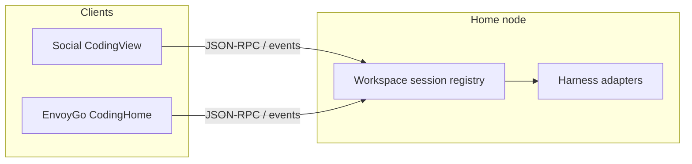

# EnvoyMesh — Dedicated Coding Tab Design

**Status:** Reviewed design (not yet implemented)  
**Date:** 2026-09-10  
**Audience:** Product + engineering  
**Related:** [product_intro.md](product_intro.md), Paseo research (paseo.sh / `../paseo`), Ext Agent presets in `packages/api/src/ext-agent.ts`

This document is the durable reference for introducing a first-class **Coding** top-level tab. It supersedes the working Cursor plan for day-to-day reading; update this file when decisions change.

---

## 0. Decisions locked

| Decision | Choice |
|----------|--------|
| Ship clients | **Social/desktop (+ Tauri) and EnvoyGo** both get Coding — same IA. Desktop may land first in the repo, but EnvoyGo is **not** an afterthought: remove Pi/EH from EnvoyGo Chat and ship a dedicated Coding tab |
| Chat keeps | **EnvoyAI** (OpenClaw) + human chats only for AI — **no Coding section** on Social **or EnvoyGo** |
| Chat loses | Entire Coding section; Pi and Envoy Harness threads **move into Coding** (desktop + phone) |
| Terminal stays | **General-purpose shell PTY only** (ops, servers, logs, Terminal Agent `/goal`) on desktop + EnvoyGo |
| Terminal loses | **Pi and Envoy Harness** — no Pi/EH create buttons, no Pi/EH TUI sessions in Terminal; those are **Coding harnesses only** |
| Coding UI | **One unified chrome** for every coding harness (stream adapter only changes) |
| Mobile UX reference | **Paseo mobile app** — especially workspace/agent list that **loads and resumes existing coding sessions** on the home daemon |
| Coding engines (first-class) | **Pi, Envoy Harness, Claude Code, Codex, OpenCode, Cursor, DeepSeek harness** — same Coding UX |
| Not Coding engines | HomeClaw / Hermes / OpenHuman (general assistants); EnvoyAI stays in Chat |
| Long tail | Optional later ACP-style catalog (Paseo has 30+); **not** required to ship Coding tab, but design allows expansion |

---

## 1. Product thesis

**Coding is a home-node control plane for repo work** — not a Chat thread and not a generic shell.

| Surface | Job |
|---------|-----|
| **Chat** | People + EnvoyAI (+ optional general Ext Agents: HomeClaw, Hermes, …). **No Pi / EH / coding harnesses here** — on Social **and** EnvoyGo. |
| **Terminal** | Real **shell** PTY for ops and any command. **No Pi / Envoy Harness** entries (those live only in Coding). |
| **Coding** | Task-centric: project → workspace → agent/shell/diff; **all** first-class coding harnesses (including Pi + EH) share one UI; **desktop + EnvoyGo** |

### Why (pain today)

Coding is fragmented across:

- Chat sidebar “Coding” (Pi, Envoy Harness threads) — Social [`ChatSidebar.tsx`](apps/social/src/components/views/ChatSidebar.tsx) and EnvoyGo chat list / AI rows
- Terminal (Pi TUI, EH TUI, shell) — Social [`TerminalSidebar.tsx`](apps/social/src/components/terminals/TerminalSidebar.tsx) / EnvoyGo [`terminal_create_actions.dart`](apps/envoygo/lib/screens/terminals/terminal_create_actions.dart)
- Settings Ext Agent (Claude Code, Codex, Cursor, …)
- Contact chat Ext Agent bridge

Users cannot run a full “fix bug in this repo” loop in one place. When Coding ships: **Chat’s Coding section is removed**; **Terminal loses Pi / Envoy create and sessions**; Pi and Envoy Harness live **only under Coding** (unified with Claude Code, Codex, OpenCode, Cursor, DeepSeek, …). Terminal remains for plain shells.

### EnvoyMesh vs Paseo

Take from Paseo: workspace container, session tabs, diff rail, composer tracks, queue/interrupt, inline permissions, multi-provider switcher, **mobile remote control of home daemon sessions**.

Differentiate:

- **Envoy Harness** as mesh-aware / review / team engine (EHUI, turn review, peer pool) — Paseo has no equivalent
- **Approvals / bonds / family coding gate** in the same permission UX
- Keep a **global Terminal** tab for **shells only** (Paseo folds terminal inside workspaces; we keep a separate tab but **without** coding harnesses)

“Better than Paseo” means measurable UX, not a clone:

1. One chrome for every harness (only the stream adapter changes) — including Pi and Envoy Harness
2. Status-first workspace list (running / needs you / ready to review)
3. Diff + permissions without leaving the task
4. Mesh-native EH features where other hosts only wrap CLIs
5. EnvoyGo Coding matches Paseo mobile’s strength: **open the phone and continue existing home sessions** without recreating work

---

## 1b. What Paseo supports (reference)

Source: [paseo.sh/docs/supported-providers](https://www.paseo.sh/docs/supported-providers) and `../paseo/public-docs/supported-providers.md` (as of 2026-09).

### Paseo — Native (out of the box once CLI installed)

| Provider | Notes |
|----------|--------|
| **Claude Code** | Anthropic coding agent |
| **Codex** | OpenAI workspace agent |
| **OpenCode** | Open-source multi-provider assistant |
| **Pi** | Minimal terminal coding agent |

### Paseo — ACP catalog (one-click install; long list)

Includes among many others: **Cursor**, CodeWhale (**DeepSeek** V4 / open models), Gemini CLI, GitHub Copilot, Cline, Kimi Code, Qwen Code, goose, Amp, TRAE CLI, Hermes Agent, Aider-adjacent tools, etc. Full list is version-pinned in Paseo’s in-app catalog (~30+ entries).

### EnvoyMesh Coding — target first-class set

Align with Paseo’s **native** core, plus our mesh harness and the majors you called out:

| EnvoyMesh Coding harness | Paseo analogue | EnvoyMesh today |
|--------------------------|----------------|-----------------|
| **Envoy Harness** | *(none — our differentiator)* | Built-in EH chat + TUI |
| **Pi** | Native Pi | Pi RPC + Pi TUI + Ext Agent `:8022` |
| **Claude Code** | Native Claude Code | Ext Agent `claudecode` `:8024` |
| **Codex** | Native Codex | Ext Agent `codex` `:8023` |
| **OpenCode** | Native OpenCode | **Add** Coding adapter |
| **Cursor** | ACP: Cursor | Ext Agent `cursor` `:8025` |
| **DeepSeek harness** | ACP: CodeWhale (DeepSeek-oriented) / or EH model | EH already runs DeepSeek **models**; add/choose a **DeepSeek coding CLI** (e.g. CodeWhale or vendor CLI) as a Coding harness when packaging — do not leave DeepSeek only as “pick model on EH” |

**All of the above use the same Coding tab UI/UX** (workspace, stream, composer, tracks, diff, permissions). Only the backend adapter differs.

**Expansion path (not blocking Coding ship):** a Paseo-like ACP / Ext Agent catalog for the long tail (Gemini, Copilot, Cline, Kimi, …) can plug into the same `CodingSession` contract later. v1 must not wait on wrapping every ACP entry.

---

## 2. Information architecture

### Top navigation

**Social** today ([`Header.tsx`](apps/social/src/components/Header.tsx)): `Social | Terminal | Knowledge | Chains | Settings | Profile`  
**Social** target: `Social | Coding | Terminal | Knowledge | Chains | Settings | Profile`

**EnvoyGo** owner today ([`owner_tabs.dart`](apps/envoygo/lib/navigation/owner_tabs.dart)): `Social | Terminal | Knowledge | Me`  
**EnvoyGo** target: `Social | Coding | Terminal | Knowledge | Me` (Coding at index 1)

Add Social `ViewName` `"coding"`. Legacy `"pi"` alias may redirect to Coding (or Terminal if raw TUI was intended — default **Coding** for how-to CTAs). Screen-level layouts: §§3–3b.

### Object model

```text
Project (registered folder / git repo on home node)
 └── Workspace (one task: title + cwd + isolation)
      ├── Agent session(s)   — harness profile + timeline
      ├── Task shell (opt.)  — PTY bound to workspace cwd
      ├── Changes / Diff     — uncommitted / turn review
      └── (later) PR / worktree setup
```

| Object | Meaning | Persistence note |
|--------|---------|------------------|
| **Project** | Absolute path on home | Unify EH project path + Ext Agent `projectPath` into one registry |
| **Workspace** | One task under a project | `{ id, projectId, title, cwd, isolation: local\|worktree, createdAt }` |
| **Session** | Runnable tab | EH `chatId`, Pi chat id, or Ext Agent conversation id mapped to `CodingSession` |
| **Harness profile** | Provider + defaults | Built-in + curated; probe/install state |

**Isolation:** v1 = `local` only (shared checkout). `worktree` = later phase (needs git worktree + setup hooks).

### Status model (workspace / session)

| Status | Meaning | UI |
|--------|---------|-----|
| `idle` | No running turn | Quiet |
| `running` | Agent turn in progress | Spinner / pulse |
| `needs_you` | Permission, plan, or question waiting | Badge on workspace |
| `ready_to_review` | Turn done with file changes | Distinct marker + open Changes |
| `error` | Failed / disconnected | Error affordance |

---

## 3. Detailed UI — Social (desktop / Tauri)

### Nav placement

| Today ([`Header.tsx`](apps/social/src/components/Header.tsx)) | Target |
|--------------------------------------------------------------|--------|
| Social \| Terminal \| Knowledge \| Chains \| Settings \| Profile | **Social \| Coding \| Terminal \| Knowledge \| Chains \| Settings \| Profile** |

- Add `ViewName = "coding"` in [`App.tsx`](apps/social/src/App.tsx).
- Header button `data-testid="nav-coding"`, label `nav.coding`.
- Legacy `"pi"` deep links that meant “coding chat” → Coding; Terminal CTAs that meant raw TUI stay Terminal.
- Keep-alive: same pattern as Terminal (`codingEverOpened` + hidden `main-view-slot`) so streams survive tab switches.

Deep link: `envoymesh:open-coding` with optional `{ projectId?, workspaceId?, sessionId?, harness?, startNew? }` (mirror [`open-terminal-nav.ts`](apps/social/src/lib/open-terminal-nav.ts)).

### Three-pane layout (default ≥1100px)

```text
┌────────────────┬─────────────────────────────────┬──────────────────┐
│ PROJECTS       │ Workspace header                │ CONTEXT RAIL     │
│                │ title · cwd · status · ⋮        │ Changes / Diff   │
│ ▼ my-app       │─────────────────────────────────│ tree + +/−       │
│   ● fix-login  │ Session tabs                    │                  │
│   ○ refactor   │ [Agent] [Shell] [+]             │ Permissions log  │
│ ▶ other-repo   │─────────────────────────────────│ (EH: EHUI dock)  │
│                │ Timeline / stream               │                  │
│ [+ Project]    │  … messages, tools, cards …     │ Tracks summary   │
│ [+ Workspace]  │─────────────────────────────────│                  │
│                │ Tracks pills (tasks · diff)     │                  │
│                │ Composer                        │                  │
│                │ [harness ▾] [Attach] [Send|Stop]│                  │
└────────────────┴─────────────────────────────────┴──────────────────┘
```

**CSS vocabulary:** reuse `.chat-view` / threads-shell grid (~280px | 1fr | 280px), not a new layout system. Narrow (&lt;1100px): collapse context rail → pills open popovers/sheets. Narrow (&lt;720px): hide project sidebar behind hamburger (same as mobile Social).

### Left rail — Projects / workspaces

| Element | Behavior |
|---------|----------|
| Project group | Collapsible; folder basename; `ProjectFolderLink` for open-in-OS |
| Workspace row | Title, relative time, **status dot** (see §2), harness glyph |
| Sort | Within project: `needs_you` → `error` → `ready_to_review` → `running` → `idle` |
| + Project | [`CodingProjectPickerModal`](apps/social/src/components/CodingProjectPickerModal.tsx) / [`HomeFolderPicker`](apps/social/src/components/HomeFolderPicker.tsx) |
| + Workspace | Title prompt + cwd default = project root; creates workspace + optional first session |
| Row menu | Rename, archive, delete (confirm), “Open shell in Terminal” (plain PTY only — never Pi/EH) |

**Empty left rail:** illustration + “Add a project folder on this computer” → picker.

### Center — Session

| Element | Behavior |
|---------|----------|
| Session tabs | One **Agent** session per harness instance; optional **Shell** tab (PTY cwd = workspace); `+` starts another agent session (cap documented) |
| Timeline | Normalized events (user / assistant / tool / permission / plan / turn_done / error). C1 rehosts [`EhTimelineFeed`](apps/social/src/components/ehui/EhTimelineFeed.tsx) + Pi adapter; later Ext Agent streams |
| Permission / plan cards | Inline in stream + [`EhComposerDockStack`](apps/social/src/components/ehui/EhComposerDockStack.tsx)-style docks above composer |
| Composer | Harness chip (Tier A+B), attachments ([`AgentAttachmentComposerLeading`](apps/social/src/components/AgentAttachmentComposerLeading.tsx)), queue when busy ([`useEhTurnQueue`](apps/social/src/hooks/useEhTurnQueue.ts) generalized), Stop / Interrupt |
| Tracks pills | Tasks · subagents · `+N −M` diff — tap opens rail or popover |

**Harness switch:** changing chip mid-workspace starts or focuses a session for that harness — **outer chrome never swaps**. EH-only: optional EHUI rail segment in context (not a different page).

### Right rail — Context

| Panel | Content |
|-------|---------|
| Changes | File tree + open file / turn review ([`EhTurnReviewModal`](apps/social/src/components/ehui/EhTurnReviewModal.tsx) / split diff) |
| Permissions | Recent allow/deny for this turn |
| EHUI (EH only) | Existing [`EnvoyHarnessEhuiRail`](apps/social/src/components/ehui/EnvoyHarnessEhuiRail.tsx) collapsed into this rail |

### Empty / gated states (Social)

| State | UI |
|-------|-----|
| Family `codingEnabled: false` | Locked empty: “Coding isn’t enabled for this profile” + Settings CTA |
| No projects | Primary CTA: Add project |
| Project, no workspaces | Primary CTA: New workspace |
| Workspace, no sessions | Primary CTA: Start with [default harness]; secondary: other harnesses |
| Home node offline | Banner: reconnect (same connection indicator pattern as elsewhere) |

### Social screen map (components to add / rehost)

| Piece | Path / action |
|-------|----------------|
| Shell | New `CodingView.tsx` |
| Sidebar | New `CodingSidebar.tsx` (pattern: [`ChatSidebar`](apps/social/src/components/views/ChatSidebar.tsx) / [`TerminalSidebar`](apps/social/src/components/terminals/TerminalSidebar.tsx)) |
| Session | New `CodingSessionPanel.tsx` wrapping adapters |
| C1 adapters | Rehost [`EnvoyHarnessPanel`](apps/social/src/components/views/EnvoyHarnessPanel.tsx); Pi RPC panel (not TUI) |
| Remove | Chat sidebar Coding section ([`ChatSidebar.tsx`](apps/social/src/components/views/ChatSidebar.tsx) ~Coding block); EH routing out of [`ChatView.tsx`](apps/social/src/components/views/ChatView.tsx) |

### Key Social flows

```text
New workspace
  Header Coding → + Workspace → pick/confirm cwd → create → Start harness sheet
    → Agent tab focused → type in composer

Resume
  Left rail → workspace with ● needs_you / running → center loads timeline + live events

Permission
  Card in stream + dock → Allow / Deny → status leaves needs_you

Pop out shell
  Shell tab ⋮ → Open in Terminal (same session id when possible)

Migrate from Chat
  Old EH thread key → resolve Coding workspace/session → navigate Coding
```

---

## 3b. Detailed UI — EnvoyGo (Flutter)

### Nav placement (locked)

Owner bottom nav today ([`owner_tabs.dart`](apps/envoygo/lib/navigation/owner_tabs.dart) / [`home_screen.dart`](apps/envoygo/lib/screens/home_screen.dart)):

```text
Social | Terminal | Knowledge | Me
```

Target:

```text
Social | Coding | Terminal | Knowledge | Me
```

- Insert `OwnerTabs.coding` at **index 1**; shift Terminal/Knowledge/Me.
- Label: `navCoding` (“Coding”); icon: `Icons.code` or `Icons.integration_instructions_outlined` (match EH glyph).
- **Family profile with `codingEnabled`:** show **Coding** tab (even if Terminal/Knowledge remain owner-only). Family without coding: no Coding tab.
- Unpaired / no home: Coding tab visible for owners but body = pair CTA (`pairingNeedHomeHint` pattern).

### Screen hierarchy (single-pane)

```text
CodingHomeScreen (tab root — list)
  ├─ push → CodingSessionScreen (agent stream + composer)
  │            ├─ sheet → Changes / Diff
  │            ├─ sheet → Permissions / Plan respond
  │            └─ sheet → Tracks (tasks / subagents)
  ├─ push → CodingNewSessionFlow (harness + folder)
  └─ (optional) push → TerminalDetailScreen for raw TUI — prefer “Open in Terminal tab”
```

No desktop-style three-column split. List is home; detail is one session.

### List screen — `CodingHomeScreen` (Paseo-style)

**Default when sessions exist:** status-grouped list of **existing** home sessions (not empty composer).

```text
AppBar: Coding · ConnectionIndicator
────────────────────────────────────
Search (optional, later)
────────────────────────────────────
NEEDS YOU
  ● fix-login · Envoy Harness · 2m
RUNNING
  ○ refactor · Pi · 4m
READY TO REVIEW
  ● auth-tests · Claude Code · 1h
IDLE / RECENT
  …
────────────────────────────────────
FAB: New session
```

| Element | Behavior |
|---------|----------|
| Row | Title, harness name, relative time, status dot (amber/blue/green/red/muted — §2) |
| Tap | Push `CodingSessionScreen` → subscribe + load timeline (**resume**, don’t recreate) |
| Pull-to-refresh | `sync` list from home (`coding.list*` or interim EH/Pi sync) |
| Swipe delete | Confirm → remove session (same as chat list EH delete) |
| FAB / AppBar + | Bottom sheet: New session → harness picker → [`HomeFolderBrowser`](apps/envoygo/lib/widgets/home_folder_browser.dart) |
| Sections | Order: Needs you → Failed → Ready to review → Running → Idle (Paseo bucket order) |

**C1b interim data:** merge `listEnvoyHarnessChats` + Pi/agent entries into this list under Coding chrome; C2 replaces with unified `coding.listSessions`.

**Empty list:** “No coding sessions on home” + tonal buttons: Start Envoy Harness · Start Pi · (later other harnesses). Unpaired: pair home CTA only.

### Session screen — `CodingSessionScreen`

```text
AppBar: workspace title · harness chip · ⋮ (cwd, open Changes, Stop)
Body:  timeline (scroll)
       [permission/plan cards inline]
Bottom: track pills (horizontal)
        composer (text + attach + send/stop)
```

| Concern | Reuse / pattern |
|---------|-----------------|
| EH agent | Rehost [`EnvoyHarnessChatScreen`](apps/envoygo/lib/screens/chat/envoy_harness_chat_screen.dart) under Coding route |
| Composer queue | [`EhTurnQueue`](apps/envoygo/lib/eh/eh_turn_queue.dart) |
| Changes | [`EhChangesBanner`](apps/envoygo/lib/widgets/eh/eh_changes_banner.dart) → [`eh_turn_review_sheet`](apps/envoygo/lib/widgets/eh/eh_turn_review_sheet.dart) |
| Permissions | Bottom sheet actions; sticky until answered (Paseo) |
| Keyboard | `resizeToAvoidBottomInset`; pills above IME |
| Pi agent (C1b) | Coding session via Pi RPC adapter under Coding chrome — **not** Terminal |
| Pi / EH TUI | **Removed from Terminal product UI** — do not offer in Terminal FAB / list |

### What moves out of Chat / Terminal vs stays

| Surface | After Coding ships |
|---------|-------------------|
| Chat list “Coding” section (EH + Pi row) | **Removed** from [`chat_list_screen.dart`](apps/envoygo/lib/screens/chat/chat_list_screen.dart) |
| EH chat threads | Live under **Coding** list only |
| Pi / EH **TUI** create (Terminal FAB / empty: New Envoy, New Pi) | **Removed** from [`terminal_create_actions.dart`](apps/envoygo/lib/screens/terminals/terminal_create_actions.dart) / [`TerminalHomeScreen`](apps/envoygo/lib/screens/terminals/terminal_list_screen.dart) |
| Terminal list rows with `role: pi` / `envoy-harness` | **Hidden or migrated** — do not show as Terminal sessions; open via Coding if still live |
| Shell PTY + Terminal Agent | **Terminal only** |
| Me → Coding agents settings | Keep [`PiSettingsScreen`](apps/envoygo/lib/screens/settings/pi_settings_screen.dart); point “Open Coding” |

### EnvoyGo screen map

| Piece | Path / action |
|-------|----------------|
| Tab | Extend `OwnerTabs` + `HomeScreen` IndexedStack |
| List | New `lib/screens/coding/coding_home_screen.dart` |
| Session | New `coding_session_screen.dart` **or** wrap existing EH screen |
| New flow | New sheet + reuse `HomeFolderBrowser` / create EH chat APIs |
| Remove | Coding section in `ChatListScreen` |
| i18n | `navCoding`, empty/gated strings in ARBs + `flutter gen-l10n` |

### Key EnvoyGo flows

```text
Resume from phone
  Open Coding tab → see desktop-started session in RUNNING / NEEDS YOU
    → tap → timeline + live eh:* (or coding.*) events

Start on phone, continue on desktop
  FAB → EH + folder → session id on home → appears in Social Coding sidebar

Needs you on the go
  Amber row → open → permission sheet → Allow → back to running

No home link
  Empty: Pair a computer (QR) — Coding does not run agents on-device
```

### Theme

Match [`AppTheme`](apps/envoygo/lib/theme/app_theme.dart): Material 3, Inter, primary `#1A73E8`, section headers like Chat, FAB primary, sheets with drag handle. Status dots are semantic colors (not decorative purple glow).

---

## 3c. Shared contract (both clients)

Both UIs bind to the **same** home-node objects and status enum (§2). Cross-client resume is a hard requirement.

| UI need | RPC / events (target) | C1 interim |
|---------|----------------------|------------|
| List | `coding.listProjects` / `listWorkspaces` / `listSessions` | EH `listEnvoyHarnessChats` (+ Pi agent list if any) |
| Start | `coding.startSession` | `createEnvoyHarnessChat` / Pi start |
| Send / cancel | `coding.send` / `coding.cancel` | `startEnvoyHarnessTurn` / `cancelEnvoyHarnessTurn` |
| Timeline | history + push | `getEnvoyHarnessChatHistory` + `eh:*` |
| Permissions | respond RPCs | `ehRespondToPermission` / Pi proposal |
| Diff / review | coding or EH review APIs | existing EH turn review |

**IDs:** stable `projectId` / `workspaceId` / `sessionId` on home. Until C2, map `eh:{chatId}` → provisional workspace/session so phone and desktop already share threads.



---

## 3d. Home link transports (EnvoyGo ↔ home node only)

**Decision: yes — support IP:port and SSH as optional add-ons for the EnvoyGo ↔ home-node pairing/connection.** They do **not** apply to mesh features that run on the phone.

EnvoyGo has **two separate networking planes**:

| Plane | What it is | Transports |
|-------|------------|------------|
| **Home link** | Pair + stay connected to the **home EnvoyMesh node** (thin client). Used by Home Social, Coding, Terminal-to-home, Home Browser, etc. | Default: WS via LAN / relay / libp2p circuit to home. **Add-ons:** direct `host:port` WS, SSH tunnel to home localhost WS. |
| **Phone mesh** | On-device / unpaired mesh (e.g. mobile node for On-this-phone chat, unpaired Discover, bonds while phone mesh is on) | **Always libp2p + relay.** No IP:port or SSH substitutes. |

IP:port and SSH only stabilize **plane 1** (phone → home). Everything that is “EnvoyMesh on EnvoyGo” as a peer still uses libp2p/relay.

| Home-link path | Role | Who it’s for |
|----------------|------|----------------|
| **libp2p + relay / circuit to home** | **Default / always available** — no public IP, works on cellular | Everyone |
| **Direct `host:port` (WebSocket to home)** | Prefer when reachable (LAN today via `lanWsUrl`; also public IP, Tailscale/VPN IP) | Users with LAN, public IP, or VPN |
| **SSH tunnel to home** | Power-user add-on: tunnel to home’s local WS/API (Paseo-style) | Developers who already SSH to the machine |

**Already true today:** pairing QR carries `wsUrl` / `lanWsUrl` / `relayWsUrl` — phone prefers LAN WS, falls back to relay ([`PairingPayload`](packages/api/src/ws-protocol.ts)). Gap: first-class **manual** public/`host:port` entry and **SSH** as documented, UI-supported home-link add-ons (not only what’s baked into the QR).

**Rules**
1. **Scope = home pairing/connection only.** Never route phone-mesh peer traffic over SSH or raw IP:port instead of libp2p.
2. **Identity still pairs cryptographically** (QR / token / device cert). Entering `ip:port` or SSH only sets a **home-link transport preference**.
3. **Preference order for home JSON-RPC:** reachable direct WS (`ip:port` / LAN / Tailscale) → SSH tunnel → relay / libp2p circuit to home.
4. **Never require** public IP or SSH for product features (including Coding). Default home link stays no-public-IP.
5. **Security:** direct bind stays token/session-authenticated; SSH uses the user’s existing SSH hardening; do not advertise open unauthenticated ports as “pair by IP.”
6. **Scope of work:** EnvoyGo home-link settings (+ QR fields), not Coding-tab-only and not phone-mesh. Suggested ship: after C1b, parallel with or before C2 resume polish.

```text
Plane 1 — Home link (add-ons allowed)
  EnvoyGo ──► prefer direct WS to home (LAN / public IP / Tailscale)
           ──► else SSH tunnel to home localhost WS
           ──► else relay / libp2p circuit to home
                ▼
           Home node JSON-RPC (Coding / Terminal / Home Social / …)

Plane 2 — Phone mesh (libp2p only)
  EnvoyGo mobile node ──► libp2p + relay ──► peers / Discover / On-this-phone
```

---

## 4. Provider tiers (unified Coding UX)

**Hard rule:** Pi and Envoy Harness are not special-cased UIs inside Coding. They are two adapters behind the same `CodingView` / composer / tracks / diff shell. Claude Code, Codex, OpenCode, Cursor, and DeepSeek harness use that same shell.

### Tier A — Always offered (built-in)

| Id | Role today | Coding role |
|----|------------|-------------|
| `envoy-harness` | [`EnvoyHarnessPanel.tsx`](apps/social/src/components/views/EnvoyHarnessPanel.tsx) | Mesh / review / team coding; may use DeepSeek (or other) **models** |
| `pi` | Pi RPC chat + Pi TUI | Local folder coding agent |

**Pi / EH duality (resolved):** Pi and Envoy Harness are **Coding harnesses only**. Product UI does **not** offer Pi/EH under Terminal. Coding uses the unified agent stream (RPC/chat adapters). Raw Pi/EH PTY processes may remain as **internal/legacy** node capabilities but are **not** exposed as Terminal create actions or Terminal sidebar rows.

### Tier B — First-class Coding harnesses (same UI; probe/install)

Must appear in the Coding harness switcher with install/probe state:

| Id | Paseo | EnvoyMesh today | Work |
|----|-------|-----------------|------|
| `claudecode` | Native | Ext Agent `:8024` | Wire into CodingSession |
| `codex` | Native | Ext Agent `:8023` | Wire into CodingSession |
| `opencode` | Native | Missing | Add adapter + probe |
| `cursor` | ACP catalog | Ext Agent `:8025` | Wire into CodingSession |
| `deepseek-harness` | ACP: CodeWhale (DeepSeek-oriented) | EH models only | Package a DeepSeek **coding CLI** harness + adapter; EH DeepSeek **models** remain on Envoy Harness sessions |

Reuse Ext Agent ports/daemons where they already exist — **do not** duplicate processes.

### Tier C — Expansion / long tail (later)

Paseo’s remaining ACP catalog (Gemini, Copilot, Cline, Kimi, Qwen, goose, …) and leftovers like Aider / MMX: same `CodingSession` contract when worth it. **Does not block** shipping Coding with Tier A+B.

### Unification: `CodingSession`

```ts
providerId:
  | "envoy-harness" | "pi"
  | "claudecode" | "codex" | "opencode" | "cursor" | "deepseek-harness"
  | string // Tier C later
events: user | assistant | tool | permission | plan | turn_done | error
```

UI binds to normalized events; adapters wrap EH / Pi / Ext Agent / new backends.

### Settings IA

- **Coding → Harnesses:** Tier A+B probe, enable, defaults
- **Settings → Ext Agent:** general assistants (HomeClaw, Hermes, …) + Tier C; Tier B primary path is Coding

### Contact chat

Once Coding ships: remove Pi / EH / Claude Code / Codex / Cursor / OpenCode / DeepSeek harness as **primary** contact Ext Agent destinations — deep-link **Open in Coding** instead. HomeClaw / Hermes may remain on contacts.

---

## 5. Boundaries

### Terminal keeps

- Global **shell** sessions, exec panes, Terminal Agent (`/goal`)
- Caps for shell PTYs (today’s shell cap); **no** product UI for `role: pi` / `role: envoy-harness`

### Terminal loses (both Social + EnvoyGo)

- Sidebar / FAB / empty-state actions: **New Envoy**, **New Pi**, “π Pi”, Envoy TUI
- Listing or creating Pi / EH TUI sessions in the Terminal tab
- Deep links that open Terminal **to start Pi/EH** — redirect to **Coding** instead

Touchpoints today to strip on ship:

- Social: [`TerminalSidebar.tsx`](apps/social/src/components/terminals/TerminalSidebar.tsx) Envoy / Pi buttons; [`TerminalView.tsx`](apps/social/src/components/views/TerminalView.tsx) `startPi` / ensure Envoy flows
- EnvoyGo: [`terminal_create_actions.dart`](apps/envoygo/lib/screens/terminals/terminal_create_actions.dart), [`terminal_list_screen.dart`](apps/envoygo/lib/screens/terminals/terminal_list_screen.dart) empty + FAB
- Nav: `openTerminal({ startPi: true })` → `envoymesh:open-coding` (or Coding with harness `pi`)

### Coding → Terminal

- **Embed** optional **shell** tab in a workspace (cwd = workspace) — plain shell only, not Pi/EH TUI
- **Pop out to Terminal** for that shell session (same session id when possible)

### Chat loses

- `showCodingSection` / Pi & EH thread rows
- `ChatView` routing to `EnvoyHarnessPanel` via `__envoy_harness__:` thread keys

### Chat keeps

- EnvoyAI
- Human DMs / rooms / family
- Optional general Ext Agents

### Deep links / migration UX

| Old | New |
|-----|-----|
| Chat → Coding section → EH chat | Coding → workspace/session |
| Chat → Pi | Coding → Pi session |
| Terminal → New Pi / New Envoy | Coding → start harness (`pi` / `envoy-harness`) |
| How-to “Open Chat coding” / “Open Terminal Pi” | “Open Coding” |
| `envoyHarnessThreadKey(chatId)` | Resolve to Coding workspace + session |
| `openTerminal({ startPi: true })` | `open-coding` with harness `pi` |

---

## 6. Backend / data

Prefer **promoting** existing stores over a greenfield DB.

| Concern | Approach |
|---------|----------|
| Projects | Registry of home absolute paths (merge EH + Ext Agent paths) |
| Workspaces | New JSON store under profile dir |
| Sessions | Map EH chats / Pi chats / Ext Agent convos → session records |
| Timeline | Per-provider adapter → normalized events |
| Diff | Start with EH git-diff / `EhSplitDiff`; then workspace `git status` helper |
| AuthZ | `familyProfileMayUseCoding` gates Coding tab (same as today’s Chat coding gate) |
| Security | Harnesses stay on **local tools / home node**; never raw libp2p from external CLIs ([`external-agent-gateway.ts`](apps/node/src/external-agent-gateway.ts) rule) |

Illustrative RPCs:

- `coding.listProjects` / `coding.registerProject`
- `coding.createWorkspace` / `coding.listWorkspaces`
- `coding.listSessions` / `coding.startSession`
- `coding.send` / `coding.cancel`
- Push events on existing node → Social channel

---

## 7. Migration sequence

1. **C1 Desktop shell** — Nav + `CodingView` with **unified chrome**; host Pi + Envoy Harness as first two adapters; **delete Social Chat Coding section**; **strip Pi/EH from Social Terminal**; redirects.
2. **C1b EnvoyGo shell** — Add Coding tab; **remove Pi / EH from EnvoyGo Chat and from Terminal** (FAB/empty/list); list + open sessions via home RPC (even if list is EH/Pi-only at first).
3. **C1c Home-link add-ons (optional parallel)** — Manual `host:port` WS + SSH tunnel for **EnvoyGo ↔ home only**; phone mesh stays libp2p+relay. Does not block Coding shell.
4. **C2 Workspace model** — Persist projects/workspaces; **same IDs on desktop + phone**; sidebar / mobile list; map EH chats → workspaces; **resume existing sessions** is a C2 exit criterion.
5. **C3 First-class harnesses** — Claude Code, Codex, OpenCode, Cursor in the same switcher (probe/install); DeepSeek harness when CLI choice is fixed — both clients.
6. **C4 UX+** — Diff rail / sheets, tracks, permission cards, queue/interrupt/steer; mobile sheets for Changes/permissions.
7. **Later** — Worktrees, PR panel, Tier C ACP catalog expansion.

No big-bang rewrite of Envoy Harness runtime — wrap it as an adapter behind the unified UI.

---

## 8. Phased delivery checklist

| Phase | Outcome | Exit criteria |
|-------|---------|---------------|
| **C0** | This design locked | Doc reviewed; defaults accepted |
| **C1** | Social Coding tab; Pi+EH unified; Chat Coding **gone**; Terminal **shell-only** | Cannot open Pi/EH from Social Chat **or** Terminal |
| **C1b** | EnvoyGo Coding tab; Pi/EH **gone** from Chat **and** Terminal | Phone Coding opens; chat/terminal have no Pi/EH create or rows |
| **C1c** | Home-link `host:port` + SSH add-ons | Prefer direct/SSH when set; mesh features still libp2p-only |
| **C2** | Shared workspace/session persistence | Desktop + phone see the **same** sessions; resume works |
| **C3** | Claude Code, Codex, OpenCode, Cursor (+ DeepSeek harness when CLI ready) | Same chrome on both clients; probe/install honest |
| **C4** | Diff + tracks + permissions + queue | No chrome swap; mobile sheets usable |

---

## 9. Non-goals (v1)

- Full IDE (LSP, Monaco multi-file editor)
- Shipping Paseo’s **entire** ACP catalog on day one (expansion is Tier C)
- Replacing or merging away the Terminal tab
- Moving EnvoyAI into Coding
- Hosted coding relay product
- Pixel-clone of Paseo (desktop *or* mobile) — **patterns** yes, visual clone no
- Worktree isolation (explicit later)
- Keeping a Chat “Coding” section on Social **or** EnvoyGo
- Keeping Pi / Envoy Harness create or sessions under the **Terminal** tab
- Phone-only coding without desktop (or vice versa) as the end state

---

## 10. Success criteria

- Full “fix bug in repo” loop **without opening Chat** (desktop and phone)
- Chat has **no** Coding / Pi / EH section on Social **or** EnvoyGo
- Terminal has **no** Pi / Envoy Harness create or sessions — shell (+ Terminal Agent) only
- **Resume:** from EnvoyGo Coding, user can open an **existing** home session started on desktop (and the reverse) without recreating it — Paseo-mobile parity
- Terminal still the place for non-coding shell work
- Harness switch across Pi / EH / Claude Code / Codex / OpenCode / Cursor / DeepSeek does not change Coding chrome (adapter only)
- Missing Tier B binaries show honest probe/install state
- Family profiles without coding permission do not see Coding (or see locked empty state)
- Documented parity story vs Paseo native providers + Envoy Harness differentiator

---

## 11. Implementation touchpoints (when building)

| Area | Paths |
|------|--------|
| Nav | `apps/social/src/App.tsx`, `apps/social/src/components/Header.tsx` |
| Remove Chat coding | `apps/social/src/components/views/ChatSidebar.tsx`, `ChatView.tsx` |
| New shell | `apps/social/src/components/views/CodingView.tsx` (+ sidebar / workspace) |
| Rehost | `EnvoyHarnessPanel.tsx`, Pi chat panel |
| Node / API | new `coding-*` modules or thin façade over EH + ext-agent; `packages/api` types |
| Ext Agent | `packages/api/src/ext-agent.ts`, `apps/node/src/ext-agent-adapter/` |
| i18n | `nav.coding`, empty states, harness labels (all locales) — Social + EnvoyGo l10n |
| EnvoyGo | Coding tab screens; remove Pi/EH from **chat list and Terminal**; resume list via JSON-RPC |
| Terminal strip | Social `TerminalSidebar` / `TerminalView`; EnvoyGo `terminal_create_actions` / terminal list empty+FAB |

---

## 12. Design review notes

**2026-09-10 (initial):** DeepSeek-as-model-only; Cursor demoted to Tier C; EnvoyGo deferred — **superseded**.

**2026-09-10 (revision — harness list + Paseo map):** First-class Claude Code, Codex, OpenCode, Cursor, DeepSeek harness; §1b Paseo providers.

**2026-09-10 (revision — EnvoyGo + Paseo mobile):**

1. EnvoyGo **must** remove Pi / EH from Chat and ship a **Coding** tab (same IA as desktop).
2. Mobile UX explicitly references **Paseo mobile**: list/resume **existing** home coding sessions is a hard success criterion (C2).
3. Shared workspace/session IDs across desktop and phone.
4. Phases: **C1b** for EnvoyGo shell; C5 merged into C1b–C4 (no “phone later maybe”).
5. Docs at repo root (`product_coding_tab_design.md`) because `/docs` is gitignored.

---

## 13. Open items (do not block C0–C1)

- Exact workspace id scheme vs existing `envoyHarnessThreadKey`
- OpenCode adapter effort estimate before C3
- Which DeepSeek coding CLI to package (`deepseek-harness`) — CodeWhale vs vendor CLI
- Whether existing live `role: pi` / `envoy-harness` PTYs on upgrade are auto-hidden, one-time migrated into Coding, or closed with a notice

**Resolved 2026-09-10:** EnvoyGo owner nav = `Social | Coding | Terminal | Knowledge | Me` (Coding at index 1). Family with `codingEnabled` gets Coding tab.

**Resolved 2026-09-10:** Pi and Envoy Harness are **not** in Terminal — Coding only. Terminal = shell (+ Terminal Agent). “Pop out to Terminal” applies to **workspace shell** tabs only, not Pi/EH TUI.

**2026-09-10 (revision — detailed UI):** §§3–3c expanded to screen-level Social three-pane + EnvoyGo list/session/sheets, shared RPC contract, component reuse maps, and locked nav.

**2026-09-10 (revision — Terminal shell-only):** Pi and Envoy Harness **removed from Terminal** on Social and EnvoyGo. They are Coding harnesses only; Terminal = shell PTY + Terminal Agent. C1/C1b exit criteria include stripping Terminal Pi/EH UI.