# EnvoyMesh — product introduction

Long-form article for **everyday users** and **developers**.  
Social short posts + posters: [`product_promote.md`](product_promote.md).

Website: https://www.homeclaw.cn/envoy · GitHub: https://github.com/allenpeng0705/EnvoyMesh

> **Envoy** = an agent that **represents you** (acts on your requests and intents).  
> **EnvoyMesh** = the private P2P mesh those envoys live on.  
> **Roadmap** = a fuller **AI robot** + **Agent Network** you control.  
> **今天 / Today:** home AI, EnvoyGo, family network, Ext Agents, terminals, Team Jobs, Envoy Harness.

---

# English

## Why “Envoy”? Why “EnvoyMesh”?

An **envoy** is someone sent to **represent you** — to speak, negotiate, and act on your behalf.

That is the real target of this system: not “another chat app with AI bolted on,” but an **AI robot / agent that can stand for you** — work for you, help you get things done from your **requests and intents**. Today that means EnvoyAI, Ext Agents, terminals, Envoy Harness, and Team Jobs on machines you control. The **roadmap** is toward a fuller **AI robot** and a true **Agent Network** that can carry your intent across people and computers you trust.

**EnvoyMesh** is the fabric those envoys live on: a mesh of peers (your home node, your phone via EnvoyGo, friends’ Envoys, family profiles) so representation stays **local-first, private, and peer-to-peer** — not locked inside one vendor’s cloud.

| Name | Meaning in product |
|------|--------------------|
| **Envoy** | An agent that represents *you* and acts on your intent |
| **EnvoyMesh** | The P2P network those envoys use to find each other and collaborate |
| **EnvoyGo** | Your pocket window back to the home Envoy — anywhere, no public IP |
| **EnvoyAI** | The built-in envoy on your home node (OpenClaw-based) |
| **Envoy Harness** | Coding / distributed harness so envoys can do real work under rules |

## Who this is for

| You are… | What you get |
|----------|----------------|
| **Everyday user** | Install desktop EnvoyMesh on a home computer, install **EnvoyGo** on your phone, talk to AI, chat with family, run terminals — without renting a cloud account or opening a public IP. |
| **Developer / power user** | Same product surface, plus Ext Agents, coding terminals (Codex / Cursor / Claude Code / …), **Envoy Harness**, Agent Network, and Team Jobs across machines you trust. |

## What is EnvoyMesh today?

**EnvoyMesh** is a local-first, peer-to-peer mesh: your **home computer** runs the full node (AI agents, vault, terminals, family network, mesh contacts). **EnvoyGo** is the thin mobile client that connects back to that home — anywhere, anytime. Every piece below is a step on the road to an Envoy that can **stand for you**.

There is no central “EnvoyMesh account server.” Identity is cryptographic; messages are signed; trust is something you choose (bonds / family), not something a platform assigns.

  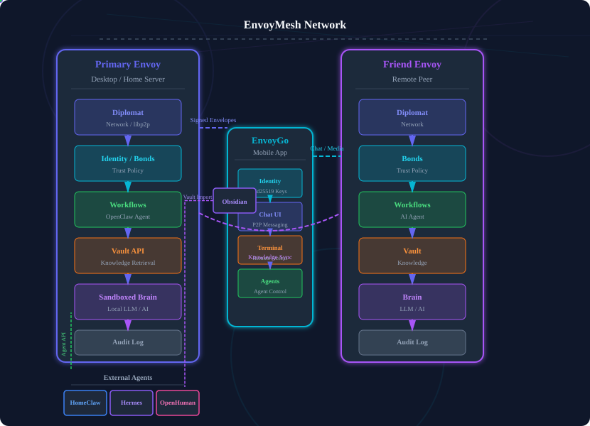

<em>Primary Envoy (desktop) · EnvoyGo (phone) · Friend Envoy · external agents · Obsidian vault</em>

---

## 1. EnvoyGo — your home AI, anywhere (no public IP)

Most “remote AI” setups force you into one of these:

- Put the agent on a cloud host, or  
- Expose your home machine with a **public IP** / port forward, or  
- Wire a third-party **channel** (Telegram / Discord / etc.) so OpenClaw or another agent can talk to you.

**EnvoyMesh is different.** The agent stays on **your** computer. **EnvoyGo** pairs to that home node over a private path (WebSocket and/or libp2p circuit relay). You chat with the same EnvoyAI / Ext Agents, open files, and run terminals from the phone — **without a public IP** and **without bolting on messaging channels** just so the agent can reach you.

  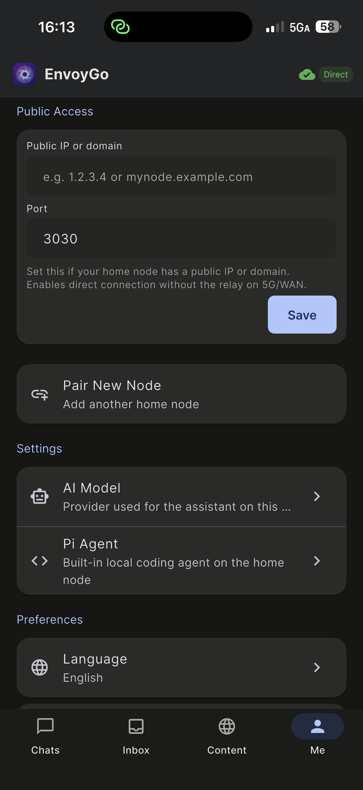
  &nbsp;
  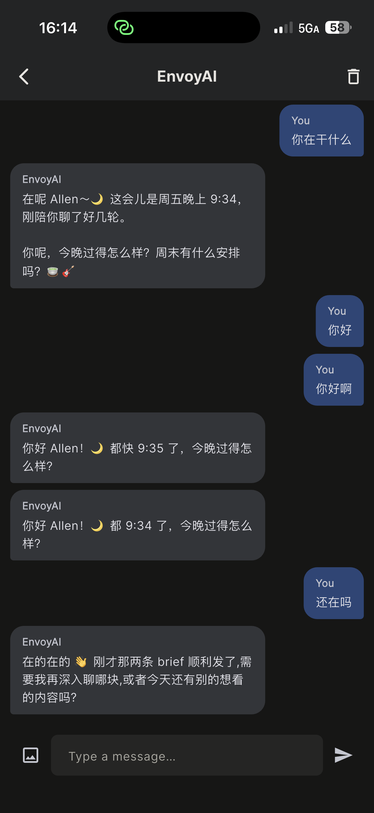

<em>EnvoyGo: reach home · talk to EnvoyAI on the go</em>

**For normal users:** install desktop once at home, install EnvoyGo, scan the pairing QR — done.  
**For developers:** same pairing model; your tools and agents stay local; the phone is only a remote UI.

Download EnvoyGo: [App Store](https://apps.apple.com/app/id6795717774) · [Google Play](https://play.google.com/store/apps/details?id=com.envoymesh.envoygo)

**Download EnvoyMesh desktop** (Mac / Windows / Linux) from the product site — same page has EnvoyGo store links and QR codes:  
**https://www.homeclaw.cn/envoy**

---

## 2. Built-in EnvoyAI + Ext Agents (try many runtimes, including remotely)

### EnvoyAI (built-in)

**EnvoyAI** is the built-in assistant on your home node. It is **OpenClaw-based**: local gateway, local skills, mesh-aware tools — designed to live on your machine, not as a rented SaaS chat box.

  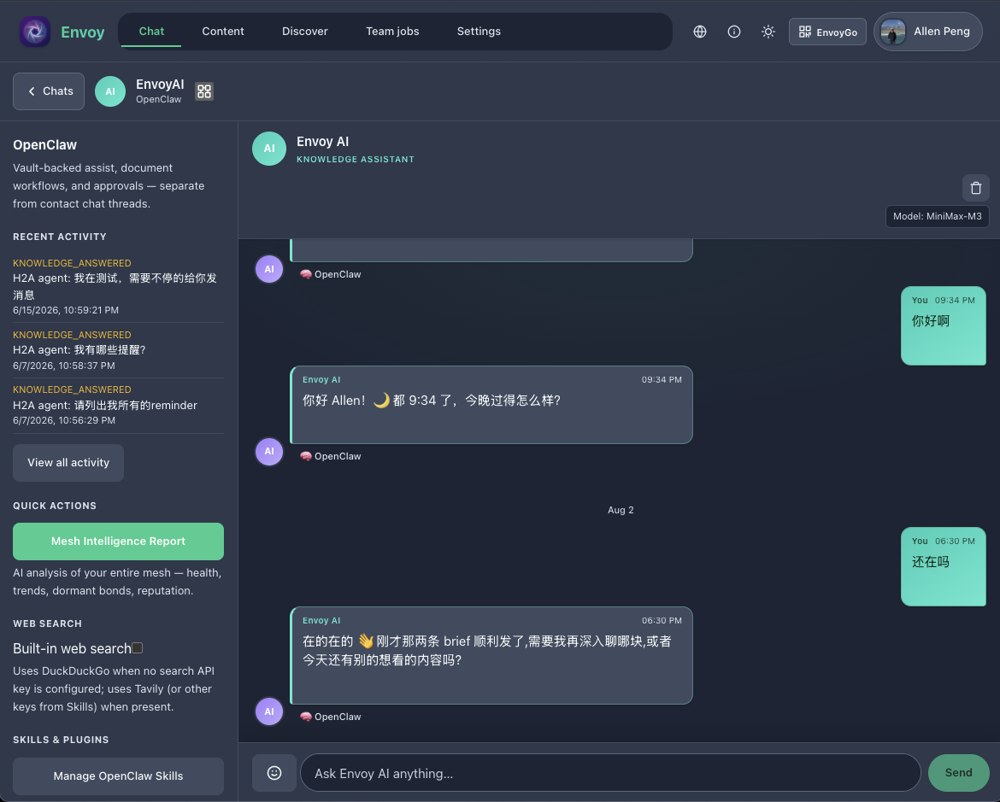

### Ext Agent

**Ext Agent** lets you plug in other agent runtimes into the same EnvoyMesh UI and talk to them from desktop **or EnvoyGo**. Supported / commonly used options include:

- **Hermes**
- **OpenHuman**
- **Codex**
- **Claude Code**
- **Minimax**
- **Cursor**
- **HomeClaw**

You can try different agents without rebuilding your life around each vendor’s channel story — and because EnvoyGo talks to the **home node**, those Ext Agents can be used **remotely** the same way EnvoyAI can.

  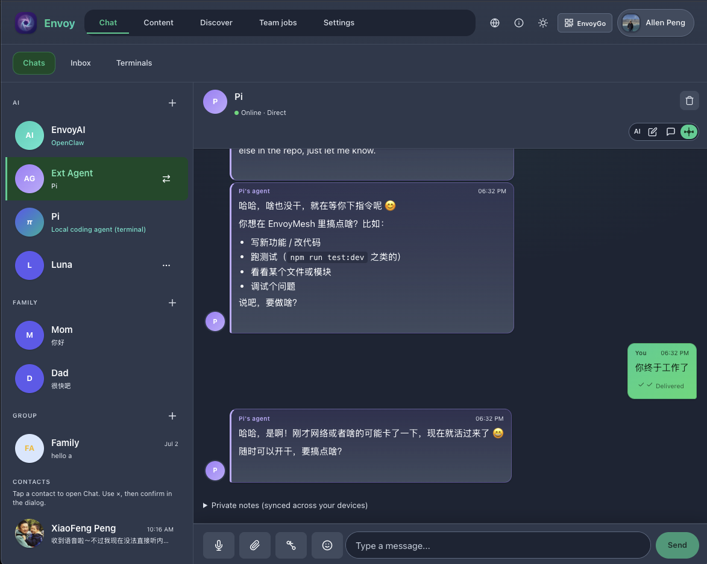

  

<em>Ext Agent on desktop and on EnvoyGo</em>

---

## 3. Terminals — agents and any command, from the phone

EnvoyMesh includes a **terminal** surface on the home node. You can run:

- Everyday shell commands on the home machine  
- Coding / agent CLIs such as **Codex**, **Cursor agent**, **Claude Code**, and related tools  
- Other long-running agent or ops sessions you care about

With **EnvoyGo**, those terminals are reachable **anytime, anywhere** (again: no public IP required). That means you can kick off or watch a coding-agent session on the home computer while you are away — through the same secure home link, not through a random exposed SSH port.

  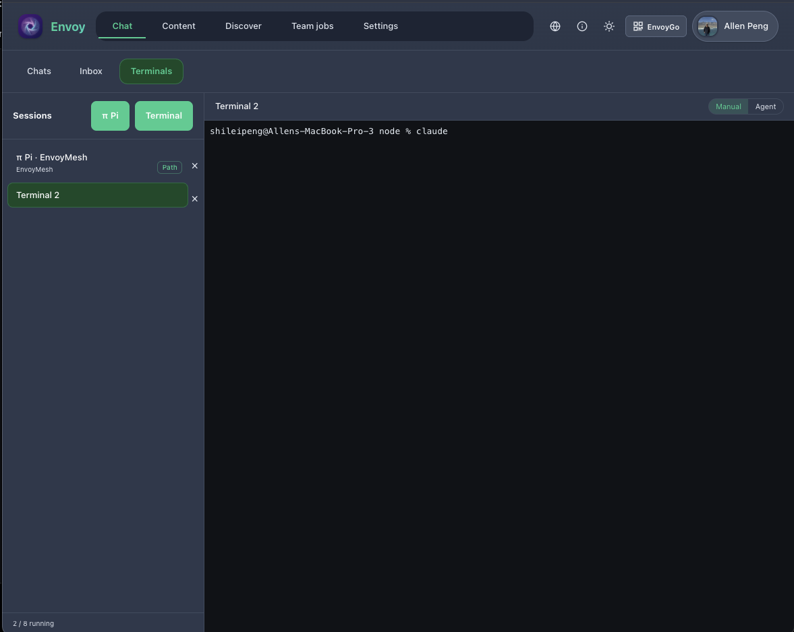

  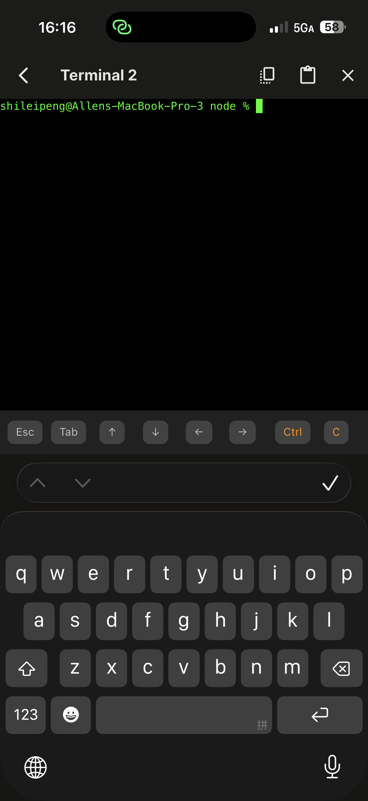
  &nbsp;
  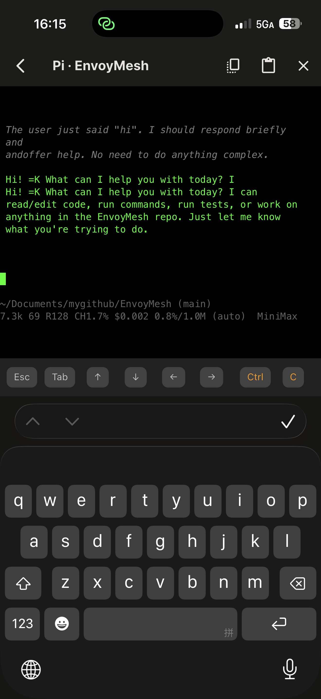

<em>Desktop terminals · EnvoyGo terminal access</em>

**For developers:** treat EnvoyGo as a pocket remote for home coding agents and ops.  
**For normal users:** you still get a simple path — chat and family first; terminals are there when you need them.

---

## 4. Family Network — your own secure social circle + shared AI, separate profiles

A home EnvoyMesh node can become a **Family Network**:

- Family members pair with **EnvoyGo** (or desktop)  
- Each person gets a **separate profile** and private threads  
- Everyone can use the household **EnvoyAI** (and related home capabilities) without sharing one messy login  
- Chats and personal data stay **separated**; the home computer holds the data — not a social-media cloud

You are not “joining someone else’s platform.” You are running a **small private network** for the people you actually know.

  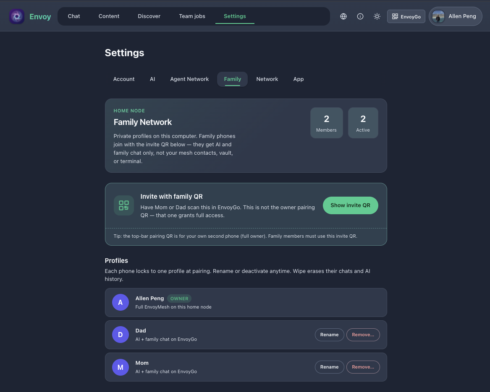

---

## 5. Agent Network & Team Jobs — one task across many machines

Beyond one home and one family, EnvoyMesh supports an **Agent Network**: agents on different computers (yours, a friend’s, a bonded contact’s) can collaborate.

**Team Jobs** let you plan multi-step work and assign pieces by **role** and **skill** — so different agents do what they are good at, then results come back with attribution. Work stays on the nodes that opted in; you stay in control of trust and budget.

**Envoy Harness** (`envoy-harness`) is the coding / distributed harness path: rule- and policy-aware collaboration so a distributed agent network can finish real tasks across your own mesh — not a single chat box pretending to be a team.

  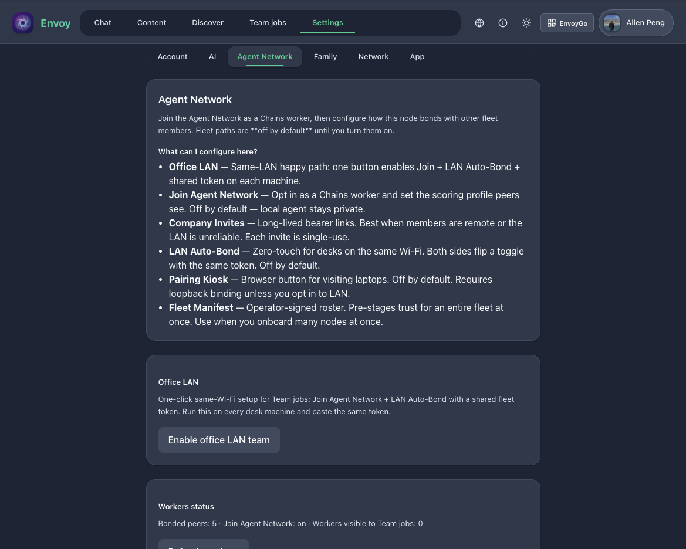

  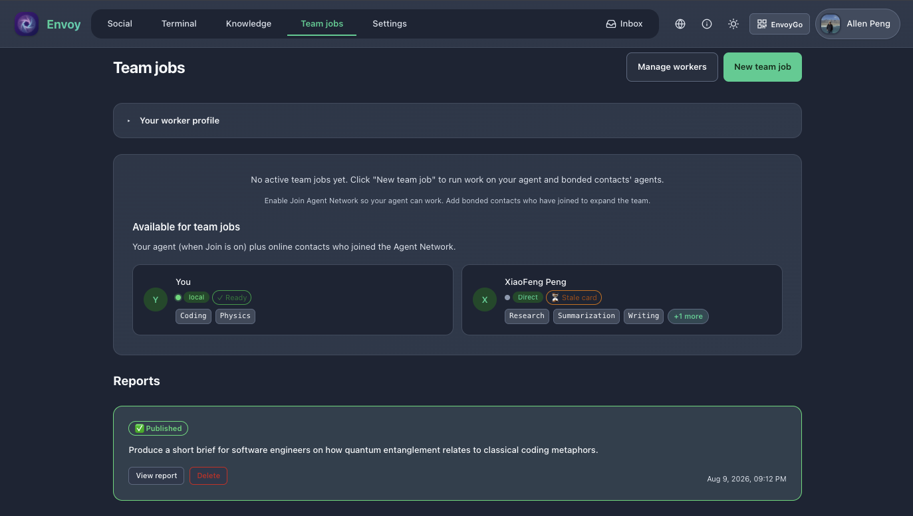

  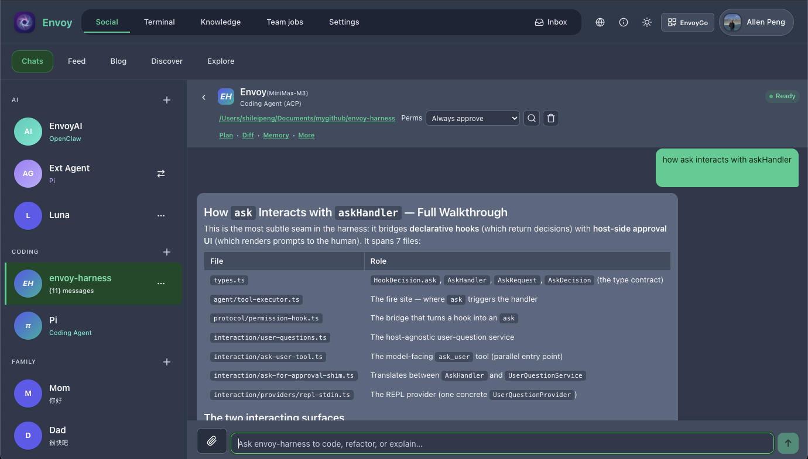

<em>Agent Network · Team Jobs · Envoy Harness</em>

**For normal users:** start with family + EnvoyAI; grow into Team Jobs when friends’ nodes are bonded.  
**For developers:** Envoy Harness + Agent Network is the path for distributed roles, skills, and multi-machine jobs.

---

## Getting started

### Everyday users

1. Open **https://www.homeclaw.cn/envoy** and download **EnvoyMesh desktop** (Mac / Windows / Linux).  
2. Install **EnvoyGo** from App Store / Google Play (or use the QR codes on that same page).  
3. Pair the phone to the home node (QR).  
4. Chat with **EnvoyAI**, invite family, optionally add Ext Agents.

### Developers

1. Clone EnvoyMesh; run `./scripts/setup.sh` or `.\scripts\setup.ps1` (setup clones sibling **envoy-harness** when missing).  
2. `npm run node:dev` + `npm run social:dev`, or build a desktop package.  
3. See [`QuickStart.md`](QuickStart.md), [`packaging.md`](packaging.md), [`docs/envoy-harness-integration-EnvoyMesh.md`](docs/envoy-harness-integration-EnvoyMesh.md).

  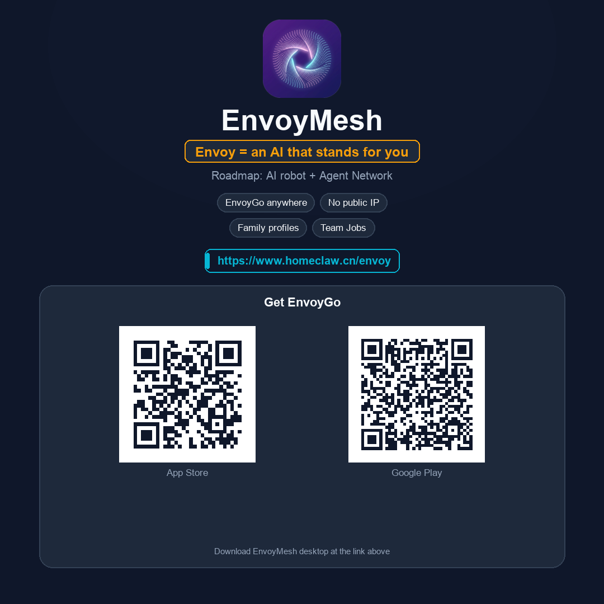

---

# 中文

## 为什么叫「Envoy」？为什么叫「EnvoyMesh」？

**Envoy（特使 / 使者）** 的本意是：被派出去**代表你**——替你说话、协商、办事。

这正是这套系统的真正目标：不是「又一个挂了 AI 的聊天软件」，而是一台能**代表你**的 **AI 机器人 / 智能体**——根据你的**请求与意图**去工作、帮你把事情做完。今天，这体现为家里节点上的 EnvoyAI、Ext Agent、终端、Envoy Harness，以及 Team Jobs。**路线图**指向更完整的 **AI 机器人**，以及真正能跨人、跨机器承载你意图的 **Agent Network（智能体网络）**。

**EnvoyMesh** 是这些「特使」所栖身的网络：你家主节点、手机上的 EnvoyGo、朋友的 Envoy、家庭成员档案组成点对点网格，让「代表你」这件事始终是**本地优先、私密、对等**的——而不是锁死在某一家云厂商里。

| 名称 | 在产品里的含义 |
|------|----------------|
| **Envoy** | 代表*你*、按你的意图行动的智能体 |
| **EnvoyMesh** | 这些 Envoy 用来发现彼此、协作的点对点网络 |
| **EnvoyGo** | 口袋里连回家中 Envoy 的窗口——随时随地，无需公网 IP |
| **EnvoyAI** | 家里节点上的内置特使（基于 OpenClaw） |
| **Envoy Harness** | 编程 / 分布式执行框架，让特使在规则下做实事 |

## 写给谁看

| 你是… | 能得到什么 |
|--------|------------|
| **普通用户** | 在家里电脑安装 EnvoyMesh 桌面端，手机安装 **EnvoyGo**，聊天、用 AI、和家人组网——不用租云账号，也不用公网 IP。 |
| **开发者 / 进阶用户** | 同样的产品能力，外加 Ext Agent、编程终端（Codex / Cursor / Claude Code 等）、**Envoy Harness**、智能体网络与跨机器的 Team Jobs。 |

## EnvoyMesh 今天能做什么？

**EnvoyMesh** 是本地优先的点对点网格：**家里电脑**跑完整节点（AI 智能体、知识库、终端、家庭网络、网格联系人）。**EnvoyGo** 是轻量手机端，随时连回这台家里节点。下面每一项，都是迈向「能代表你的 Envoy」路上的一步。

没有中心化的「EnvoyMesh 账号服务器」。身份是密码学的，消息是签名的；信任来自你选择的绑定 / 家庭关系，而不是平台分配的账号等级。

  

<em>主 Envoy（桌面）· EnvoyGo（手机）· 朋友 Envoy · 外部智能体 · Obsidian 保险箱</em>

---

## 1. EnvoyGo — 随时随地用家里的 AI（无需公网 IP）

常见「远程用 AI」做法往往是：

- 把智能体放到云主机，或  
- 给家里机器开 **公网 IP** / 端口映射，或  
- 给 OpenClaw 等智能体再接一层 **频道**（Telegram / Discord 等）才能跟你对话。

**EnvoyMesh 不一样。** 智能体留在**你自己的电脑**上。**EnvoyGo** 通过私人通道（WebSocket 和/或 libp2p 中继电路）配对回家。手机上聊的是同一套 EnvoyAI / Ext Agent，还能开文件、开终端——**不需要公网 IP**，也**不必为了「能连上你」再挂一堆聊天频道**。

  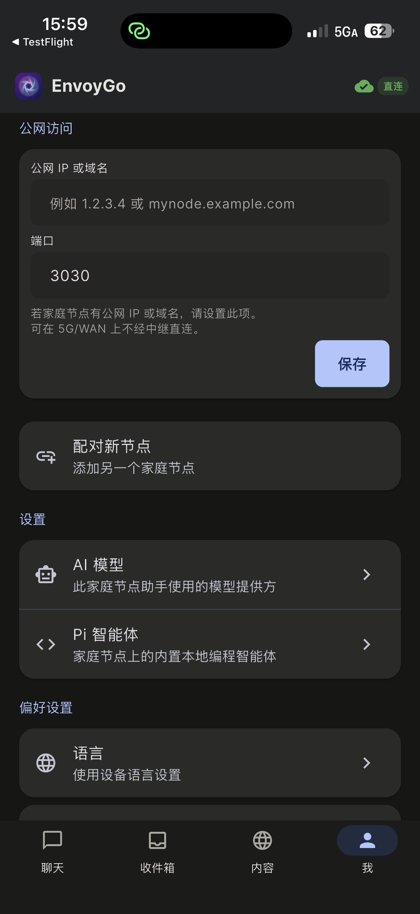
  &nbsp;
  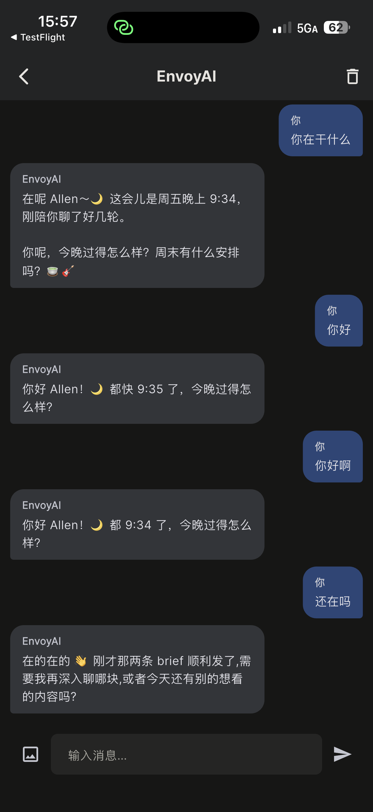

<em>EnvoyGo：连回家 · 出门也能用 EnvoyAI</em>

**普通用户：** 家里装一次桌面端，手机装 EnvoyGo，扫码配对即可。  
**开发者：** 同一套配对模型；工具与智能体留在本地，手机只是远程界面。

下载 EnvoyGo：[App Store](https://apps.apple.com/app/id6795717774) · [Google Play](https://play.google.com/store/apps/details?id=com.envoymesh.envoygo)

**下载 EnvoyMesh 桌面端**（Mac / Windows / Linux）请打开产品站——同一页也有 EnvoyGo 商店链接与二维码：  
**https://www.homeclaw.cn/envoy**

---

## 2. 内置 EnvoyAI + Ext Agent（多种智能体，也能远程用）

### EnvoyAI（内置）

**EnvoyAI** 是家里节点上的内置助手，基于 **OpenClaw**：本地网关、本地技能、面向网格的工具——跑在你的机器上，而不是租来的云聊天框。

  

### Ext Agent

**Ext Agent** 把其它智能体运行时接到同一套 EnvoyMesh 界面，桌面和 **EnvoyGo** 都能用。常见支持 / 可用选项包括：

- **Hermes**
- **OpenHuman**
- **Codex**
- **Claude Code**
- **Minimax**
- **Cursor**
- **HomeClaw**

你可以方便地试用不同智能体，而不必为每个厂商单独搭一套频道故事；而 EnvoyGo 连的是**家里节点**，这些 Ext Agent 也能像 EnvoyAI 一样**远程使用**。

  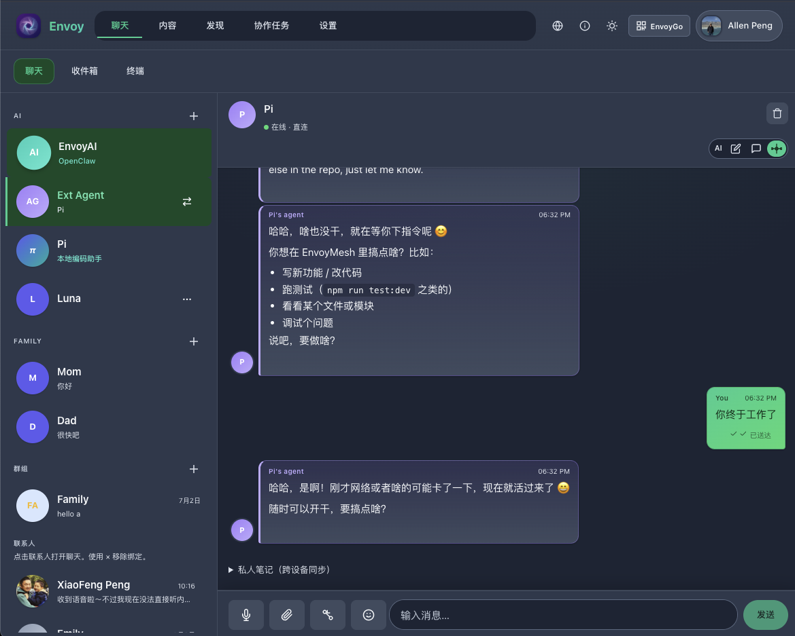

  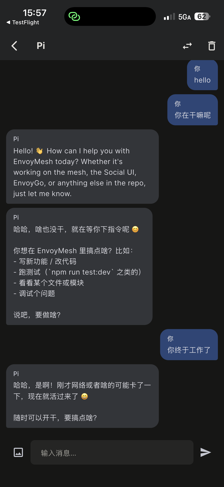

<em>桌面与手机上的 Ext Agent</em>

---

## 3. 终端 — 跑智能体或任意命令，手机也能开

EnvoyMesh 在家里节点提供 **终端** 能力，可以：

- 在家里机器上执行日常 shell 命令  
- 运行 **Codex**、**Cursor agent**、**Claude Code** 等编程 / 智能体 CLI  
- 其它你关心的长时间智能体或运维会话

通过 **EnvoyGo**，这些终端可以**随时随地**打开（同样：**无需公网 IP**）。也就是说，出门也能在家里电脑上启动或查看编程智能体会话——走的是安全的回家链路，而不是随便暴露一个 SSH 端口。

  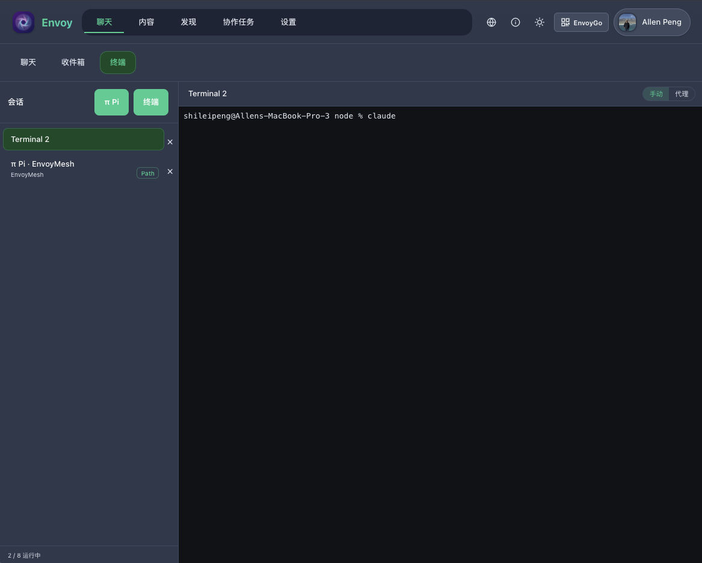

  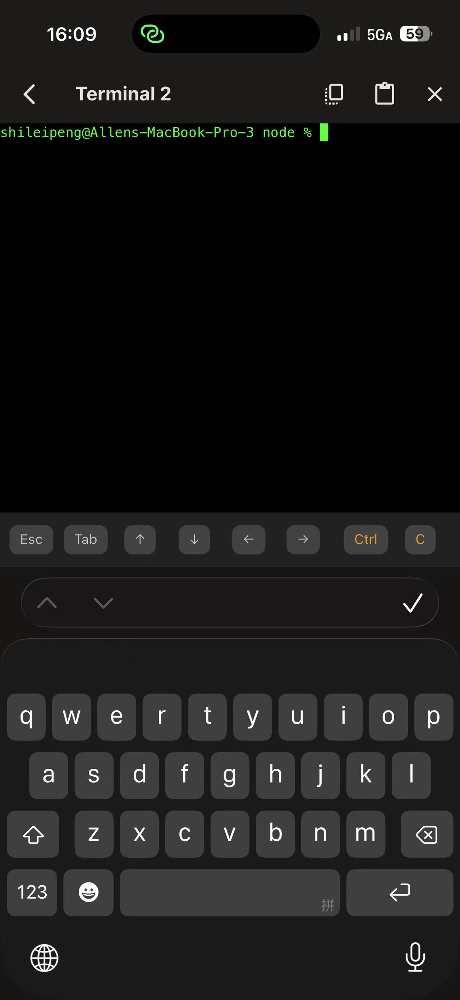
  &nbsp;
  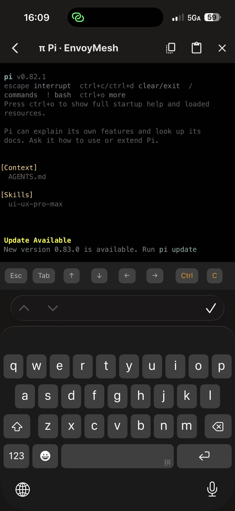

<em>桌面终端 · EnvoyGo 远程终端</em>

**开发者：** 把 EnvoyGo 当成口袋里的「回家编程 / 运维遥控」。  
**普通用户：** 日常先聊天和家庭网络；需要时再打开终端。

---

## 4. 家庭网络 — 自建安全社交圈 + 共享 AI、独立档案

一台家里的 EnvoyMesh 节点可以变成 **家庭网络**：

- 家人用 **EnvoyGo**（或桌面）配对加入  
- 每人有**独立个人档案**和私密会话  
- 大家都能用家里的 **EnvoyAI** 等能力，却不必共用一个混乱账号  
- 聊天与个人数据**彼此分开**；数据在家里电脑上，而不是社交平台云端

你不是「加入别人的平台」，而是为自己认识的人跑一张**小型私人网络**。

  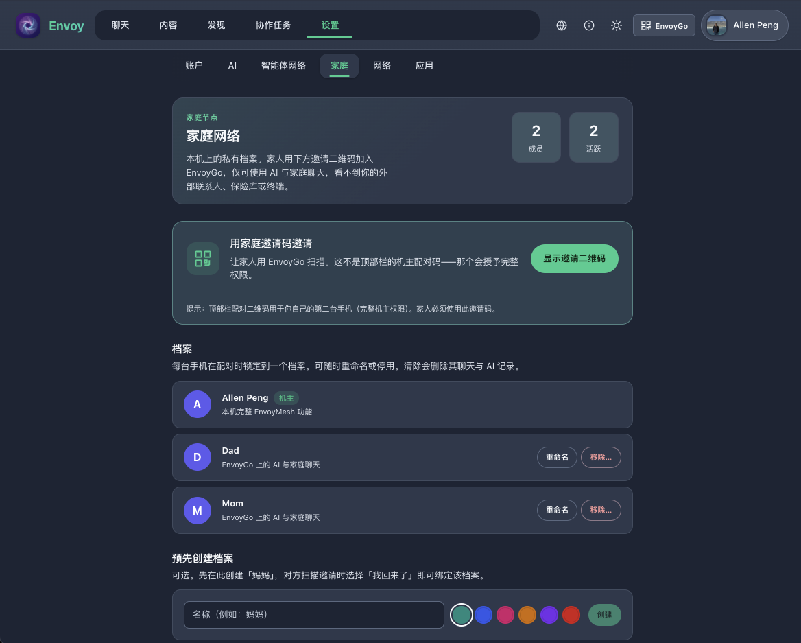

---

## 5. 智能体网络与 Team Jobs — 一台任务，多台电脑一起做

在「一个家」之外，EnvoyMesh 支持 **Agent Network（智能体网络）**：不同电脑上的智能体（你的、朋友的、已绑定联系人的）可以协作。

**Team Jobs（团队任务）** 让你按**角色**和**技能**拆分多步工作——不同智能体做擅长的部分，结果带归属地回流。任务跑在自愿加入的节点上；信任与预算仍由你掌控。

**Envoy Harness**（`envoy-harness`）是面向编程 / 分布式协作的路径：基于规则与策略，让分布式智能体网络在你自己的网格里真正把任务做完——而不是一个「假装成团队」的单聊窗口。

  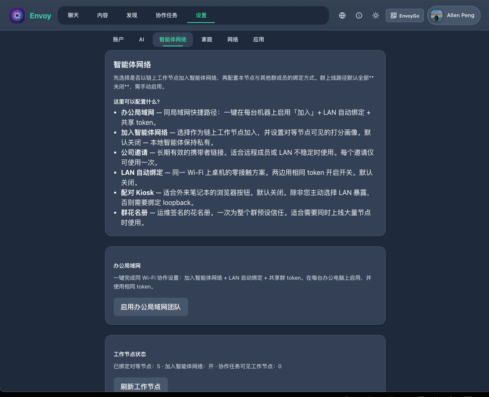

  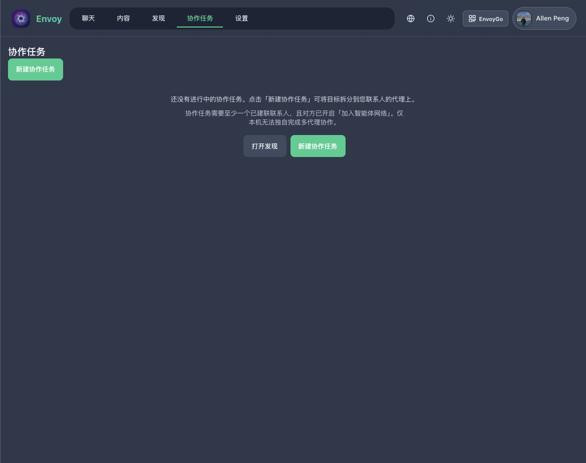

  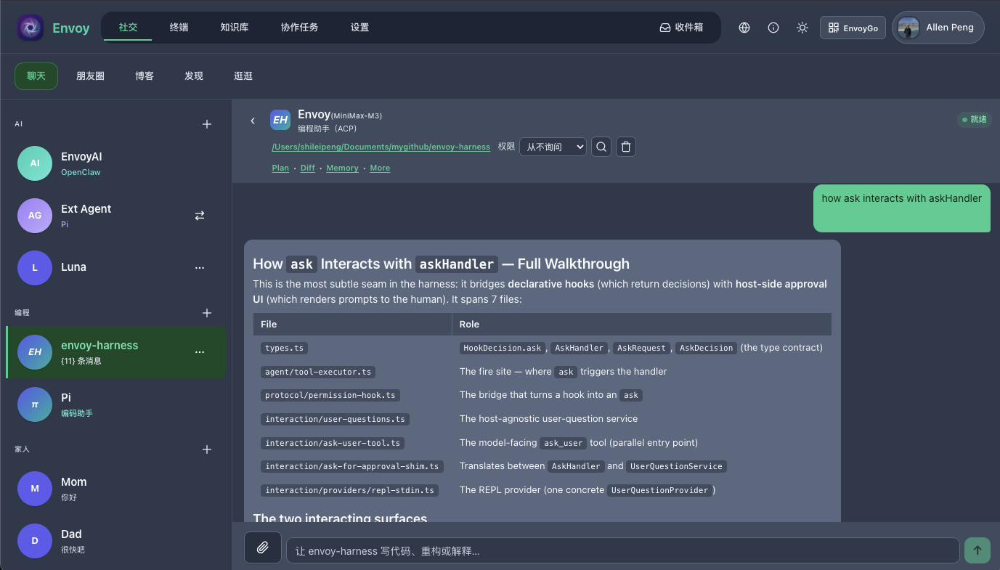

<em>智能体网络 · Team Jobs · Envoy Harness</em>

**普通用户：** 从家庭 + EnvoyAI 开始；朋友节点绑定后再用 Team Jobs。  
**开发者：** Envoy Harness + Agent Network 是跨机器分工、按技能协作的路径。

---

## 如何开始

### 普通用户

1. 打开 **https://www.homeclaw.cn/envoy**，下载 **EnvoyMesh 桌面端**（Mac / Windows / Linux）。  
2. 从 App Store / Google Play 安装 **EnvoyGo**（或扫同一页上的二维码）。  
3. 扫码把手机配对到家里节点。  
4. 与 **EnvoyAI** 对话、邀请家人，需要时再加 Ext Agent。

### 开发者

1. 克隆 EnvoyMesh；运行 `./scripts/setup.sh` 或 `.\scripts\setup.ps1`（若缺少并列仓库 **envoy-harness**，setup 会自动克隆构建）。  
2. `npm run node:dev` + `npm run social:dev`，或打包桌面安装包。  
3. 详见 [`QuickStart.md`](QuickStart.md)、[`packaging.md`](packaging.md)、[`docs/envoy-harness-integration-EnvoyMesh.md`](docs/envoy-harness-integration-EnvoyMesh.md)。

  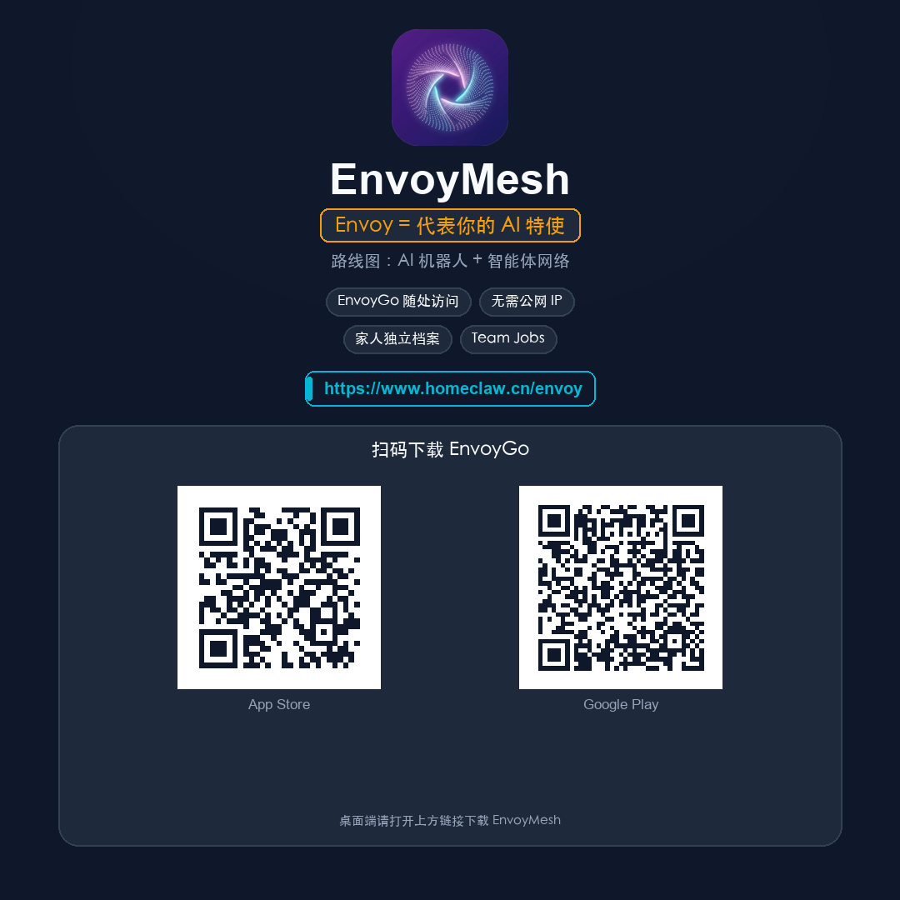

